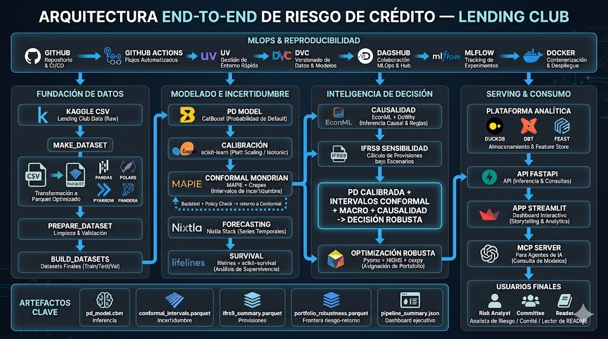

# Lending Club End-to-End Risk Intelligence Platform

Credit risk thesis platform organized around pipeline-first execution families:
`core_canonical`, `search_*`, `paper*_e2e`, `diagnostics_governance`, and `research_labs`.

[](https://github.com/EigenCharlie/Lending-Club-End-to-End/actions/workflows/ci.yml)
[](https://lending-club-showcase.streamlit.app/)
[](https://dagshub.com/EigenCharlie94/Lending-Club-End-to-End)


## Official Surfaces

- Quarto book is the official, citable, up-to-date source of truth for the project.
- The local Streamlit app is an optional companion lab for interaction that is not worth duplicating in Quarto.
- The public Streamlit showcase is a historical snapshot and is no longer the primary product surface.

Historical public showcase:

`https://lending-club-showcase.streamlit.app/`

## Project Scope

This repository is built as a reproducible, research-to-production-style workflow over Lending Club historical loans, with Quarto as the official editorial layer and Streamlit as a reduced local companion for interactive analysis.

Core methodological chain:

```text
Monotonic CatBoost PD -> Auto Calibration (Platt/Isotonic/Venn-Abers) -> Fairness on Approval Decisions
-> Mondrian Conformal Intervals -> Governance / MRM Diagnostics
-> IFRS9 Scenario Sensitivity -> Robust Portfolio Optimization
```

## Why It Matters

1. Point estimates alone are insufficient for risk-sensitive decisions.
2. Conformal prediction introduces finite-sample uncertainty quantification.
3. Robust optimization converts uncertainty into actionable portfolio constraints.
4. IFRS9 sensitivity links predictive risk to accounting impact.
5. Governance layers like fairness, C2ST, monotonicity audits, and PD validation interpretation make the stack defendable rather than merely predictive.
6. Causal policy analysis remains a research-grade intervention lane beyond correlation.

## Current Champion (Paper Estrella, 2026-04-06)

| Component | Status |
|---|---|
| PD model | Monotonic CatBoost (HPO local trial 56) + Venn-Abers calibrator — AUC 0.7124, Brier 0.1546, ECE 0.0064 |
| Conformal | `score_decile_mondrian` (rank1 reopen) — coverage 92.97%, Winkler 1.111 |
| Portfolio | `bound_aware_276k_economic_champion` — `rt=0.175, gamma=0.45, blended_uncertainty`, return $170,464.54 |
| Robust region | 45/45 policies pass `alpha=0.01` exactly on full 276K OOT |
| Run tag | `paper-thesis-final-economic-2026-04-06` |
| Source of truth | `models/final_project_promotion.json`, `models/champion_portfolio_policy.json` |
| Audit dossier | `docs/research/paper_estrella_audit_2026-05-04.md` |

The `theorem-tight` (gamma=0.55) and `balanced` (rt=0.17) policies inside the same robust region are documented internal comparators, not official champions.

## Architecture (Quarto-First)

| Layer | Role |
|---|---|
| Quarto | Official narrative, figures, tables, and defendable results |
| Streamlit | Local companion lab for interaction, simulation, and exploratory slicing |
| DuckDB | Local analytical engine for queries and derived marts |
| dbt | Data lineage/tests/docs over analytical models |
| Feast | Feature-store consistency narrative |
| FastAPI | Optional service layer for API-style consumption |
| DVC + DagsHub | Artifact versioning and remote synchronization |
| MLflow (DagsHub) | Experiment tracking suite (`lending_club/*`) |



## Repository Map

```text
api/                 FastAPI endpoints
configs/             YAML runtime configuration
data/                Raw/interim/processed assets
dbt_project/         dbt models/tests/docs artifacts
docs/                Runbooks, architecture, and thesis notes
feature_repo/        Feast entities/views/services
models/              Serialized models and policy artifacts
notebooks/           Research notebooks (01-09 + side projects)
reports/             Audits and notebook image exports
scripts/             Pipeline stages and orchestration scripts
src/                 Reusable package modules
streamlit_app/       Multipage Streamlit application
tests/               Automated test suite
```

## Quick Start

```bash
# 1) Install dependencies in the canonical env
export UV_PROJECT_ENVIRONMENT=lending-club-venv
uv sync --extra dev
test -e .venv || ln -s lending-club-venv .venv

# 2) Build the dedicated causal env once
bash scripts/causal/setup_causal_env.sh .venv-causal

# 3) Place Kaggle CSV in data/raw/
# Loan_status_2007-2020Q3.csv

# 4) Run the canonical full pipeline (incremental, DVC-managed)
uv run dvc repro

# 5) Run the frozen operational rebuild
uv run python scripts/run_canonical_rebuild.py --run-tag canonical-local-smoke

# 6) Run the focused PD search lane when needed
uv run python scripts/search/run_pd_search.py --run-tag champion-local-max --sampling-profile mega64plus

# 7) Run research-only complementary insight generation
uv run python scripts/labs/run_research_labs.py --run-tag insights-local --profile canonical

# 8) Run local companion lab
uv run streamlit run streamlit_app/app.py
```

Notes:
- `uv run dvc repro` is the canonical thesis-grade rebuild path.
- `uv run python scripts/run_smoke_pipeline.py` is the lightweight smoke pipeline.
- `scripts/end_to_end_pipeline.py` and `scripts/run_long_pipeline.py` remain as compatibility entrypoints only.
- The preferred public entrypoints live under `scripts/`, `scripts/search`, `scripts/papers`, `scripts/diagnostics`, and `scripts/labs`.
- `bash scripts/causal/run_causal_pipeline.sh --treatment int_rate` is the canonical standalone causal runner when you only need the causal layer.
- `uv run python scripts/run_time_series_vnext.py --config configs/time_series_vnext.yaml` is the research-only TS/IFRS9 redesign lane; it must not overwrite canonical `time_series` artifacts.

## Reproducibility and MLOps

```bash
# DVC pipeline graph
uv run dvc dag

# Check local/cloud consistency
uv run dvc status --json
uv run dvc status -c --json

# Push artifacts to DagsHub remote
uv run dvc push -r dagshub
```

For a heavyweight champion search run with resumability and run tagging, use:

```bash
bash scripts/start_long_run.sh <run_tag> --comparison-baseline-run-tag <baseline_run_tag>
```

One-shot integrations setup:

```bash
bash scripts/configure_integrations.sh
```

MLflow backfill from existing artifacts:

```bash
set -a && source .env && set +a
uv run python scripts/log_mlflow_experiment_suite.py
```

## Historical Streamlit Showcase

The public Streamlit showcase is intentionally frozen as a historical snapshot. The local Streamlit app should evolve independently from that deploy target.

If you need to rebuild the historical showcase bundle anyway:

```bash
uv run python scripts/export_streamlit_artifacts.py
uv run python scripts/prepare_streamlit_deploy.py --clean --strict
```

Detailed guide:

`docs/history/DEPLOY_STREAMLIT_FREE.md`

## Time Series Status

The canonical time-series lane remains operational for point forecasting and IFRS9 overlay, but its interval layer is still not promoted.

- Canonical lane: `scripts/forecast_default_rates.py` -> `models/time_series_status.json`
- Research redesign lane: `scripts/run_time_series_vnext.py` -> `models/time_series_vnext_status.json`
- Current decision: keep canonical point forecast, keep TS->IFRS9 overlay, keep vNext sample paths and ECL translation as research, and do not promote the interval layer yet

The latest decision package for this redesign lives in:

- `models/time_series_vnext_status.json`
- `models/time_series_policy_review.json`
- `docs/TIME_SERIES_VNEXT_DECISION_2026-04-02.md`

## Quality Gates

```bash
uv run ruff check src/ scripts/ tests/
uv run ruff format --check src/ scripts/ tests/
uv run pytest -q
```

CI workflow:

`.github/workflows/ci.yml`

## Key Documents

1. `SESSION_STATE.md` - canonical status, snapshots, recovery logs
2. `docs/CANONICAL_DOCUMENTATION_AND_QUARTO_TRACEABILITY_2026-03-30.md` - canonical editorial ledger for live techniques, claims, and Quarto mapping
3. `docs/RUNBOOK.md` - end-to-end reproducibility runbook
4. `docs/INTEGRATIONS_SETUP.md` - GitHub/DagsHub/DVC/MLflow setup
5. `docs/PROJECT_JUSTIFICATION.md` - methodological rationale
6. `docs/QUARTO_BOOK_BLUEPRINT.md` - Quarto-first editorial contract for the book
7. `docs/DOCUMENTATION_MAP.md` - active vs historical documentation map

## License

MIT
