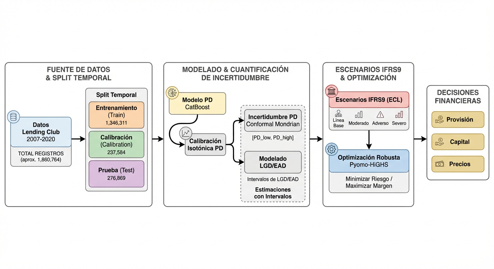
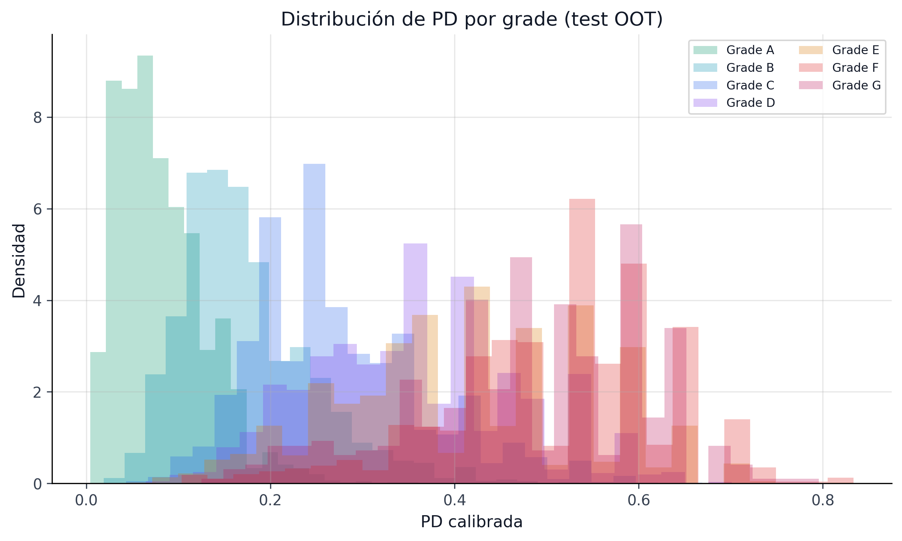
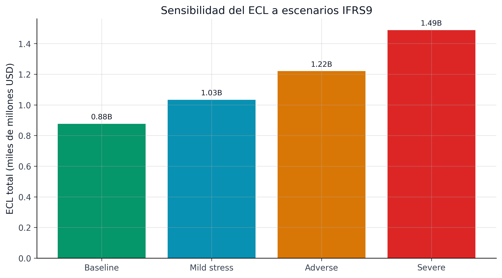
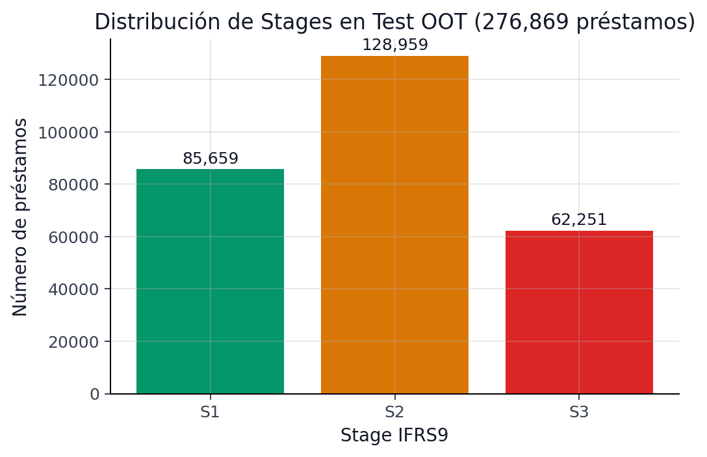

Este capítulo presenta una vista consolidada de los resultados clave del proyecto. Cada métrica proviene de artefactos congelados del baseline operativo y enlaza al capítulo donde se explica en detalle.

```{python}
#| label: setup-executive
#| include: false

import sys
from pathlib import Path

sys.path.insert(0, str(Path.cwd().parent if Path.cwd().name == "book" else Path.cwd()))
from book._helpers.load_artifacts import load_json, try_load_json, format_pct, format_number, format_money

import pandas as pd
```

## KPIs del Pipeline

La foto ejecutiva ya no corresponde a un score PD “clásico” aislado. El stack vigente es un **champion monotónico** con calibración probabilística, fairness sobre decisiones de aprobación, incertidumbre conformal y una capa de gobernanza/MRM mucho más rica que la del baseline original.

```{python}
#| label: tbl-executive-signals
#| tbl-cap: "Señales ejecutivas del stack vigente"

summary = load_json("pipeline_summary")
registry = load_json("champion_registry", directory="models")
fairness = load_json("fairness_audit_status", directory="models")
monotonicity = load_json("monotonicity_audit_status", directory="models")
pd_validation = load_json("pd_validation_interpretation_status", directory="models")
ifrs9_diag = load_json("ifrs9_diagnostics_status", directory="models")
encoding = load_json("encoding_stability_status", directory="models")

signal_rows = [
    {"Capa": "Champion PD", "Estado": "vigente", "Lectura": "CatBoost monotónico + Venn-Abers como champion oficial.", "Evidencia": registry.get("run_tag", "N/D")},
    {"Capa": "Discriminación", "Estado": f"AUC {summary.get('pd_auc', 0):.3f}", "Lectura": "El ranking sigue competitivo bajo split temporal estricto.", "Evidencia": "pipeline_summary.json"},
    {"Capa": "Calibración", "Estado": f"ECE {summary.get('pd_ece', 0):.4f}", "Lectura": "La PD calibrada sigue siendo usable para policy, provisión y monitoreo.", "Evidencia": "pipeline_summary.json"},
    {"Capa": "Fairness", "Estado": f"{fairness.get('n_passed', 0)}/{fairness.get('n_attributes', 0)} PASS", "Lectura": "La auditoría oficial ya se lee sobre decisiones de aprobación.", "Evidencia": "fairness_audit_status.json"},
    {"Capa": "Monotonicidad", "Estado": "PASS" if monotonicity.get("overall_pass") else "FAIL", "Lectura": "El champion promovido mantiene coherencia estructural en la auditoría monotónica.", "Evidencia": "monotonicity_audit_status.json"},
    {"Capa": "PD validation", "Estado": str(pd_validation.get("severity", "N/D")).upper(), "Lectura": "El gap global es chico, pero hay desvíos persistentes por cohortes.", "Evidencia": "pd_validation_interpretation_status.json"},
    {"Capa": "IFRS9 diagnostics", "Estado": "PASS" if ifrs9_diag.get("overall_pass") else "DIAGNOSTIC FAIL", "Lectura": "La sensibilidad ya se entiende mejor, pero la estabilidad temporal sigue abierta.", "Evidencia": "ifrs9_diagnostics_status.json"},
    {"Capa": "Encoding stability", "Estado": "PASS" if encoding.get("overall_pass") else "FAIL", "Lectura": "La capa estructural de WOE/buckets no justifica reabrir el contrato de features.", "Evidencia": "encoding_stability_status.json"},
]

pd.DataFrame(signal_rows)
```

```{python}
#| label: tbl-kpis
#| tbl-cap: "Métricas clave del pipeline end-to-end"

import pandas as pd

summary = load_json("pipeline_summary")
pd_model = summary.get("pd_model", {})
conformal = summary.get("conformal", {})
pipeline = summary.get("pipeline", {})
survival = summary.get("survival", {})

kpis = {
    "AUC (test OOT)": f"{pd_model.get('final_auc', 0):.4f}",
    "Gini": f"{pd_model.get('final_gini', 0):.4f}",
    "Brier Score": f"{pd_model.get('final_brier', 0):.4f}",
    "ECE (calibración)": f"{pd_model.get('final_ece', 0):.4f}",
    "Método de calibración": pd_model.get("calibration_method", "N/A"),
    "Cobertura conformal 90%": format_pct(conformal.get("coverage_90", 0)),
    "Cobertura conformal 95%": format_pct(conformal.get("coverage_95", 0)),
    "Ancho medio intervalo": f"{pipeline.get('interval_width_mean', 0):.4f}",
    "RSF c-index": f"{survival.get('rsf_concordance', 0):.4f}",
    "Cox c-index": f"{survival.get('cox_concordance', 0):.4f}",
    "ECL esperada": format_money(pipeline.get("ecl_expected", 0)),
    "ECL conservadora": format_money(pipeline.get("ecl_conservative", 0)),
    "Retorno robusto": format_money(pipeline.get("robust_return", 0)),
    "Préstamos financiados (robusto)": format_number(pipeline.get("robust_funded", 0)),
    "Price of Robustness": format_money(pipeline.get("price_of_robustness", 0)),
}

df_kpis = pd.DataFrame(list(kpis.items()), columns=["Métrica", "Valor"])
df_kpis
```

## Qué hace moderno al pipeline actual

El libro empezó explicando un problema clásico de riesgo crediticio: estimar PD, calibrar y traducirla a decisiones. Hoy el proyecto sigue resolviendo ese problema, pero con una arquitectura más moderna y más defendible:

- el **champion** ya incorpora restricciones monotónicas con racional económico;
- la **equidad** se audita sobre decisiones de aprobación, no sobre un corte interno de modelado;
- la **gobernanza** ya no se queda en PSI o fairness agregado, sino que incorpora C2ST, backtesting PD, interpretación por cohortes, auditoría monotónica e IFRS9 diagnostics;
- el proyecto separa mejor lo **operacional** de lo **research-grade**, sin esconder las limitaciones abiertas.

Ese cambio importa porque mueve la conversación desde “el modelo predice razonablemente bien” hacia “el sistema se deja defender con evidencia metodológica, operativa y regulatoria”.

## De la métrica técnica a la decisión de negocio

| Señal técnica | Qué nos dice de verdad | Implicación de negocio / regulación |
|---|---|---|
| AUC 0.713 | El ranking de riesgo discrimina razonablemente entre buenos y malos préstamos | El score sirve para priorizar originación, pricing y vigilancia, pero no debe leerse como verdad exacta caso a caso |
| ECE 0.006 | La PD calibrada está muy cerca de la frecuencia observada | Las provisiones, los umbrales y los cortes de política se apoyan en probabilidades mejor alineadas con la realidad |
| Cobertura conformal > 92% @ 90% | La banda de incertidumbre cumple su promesa a nivel operativo | La decisión puede reconocer explícitamente cuándo el riesgo viene con más ambigüedad |
| Ancho medio del intervalo | Mide cuánta incertidumbre práctica acompaña a cada PD | Dos préstamos con la misma PD puntual pueden merecer acciones distintas si uno tiene banda mucho más ancha |
| Retorno robusto y price of robustness | Cuantifican el costo de protegerse contra escenarios plausibles | Comité de riesgo puede discutir resiliencia vs retorno con un número explícito, no con intuiciones |
| ECL por escenario | Muestra sensibilidad prudencial del balance | IFRS9 deja de verse como un cálculo único y pasa a leerse como rango bajo hipótesis macro |
| Fairness y MRM en PASS | El sistema no solo predice; también explicita qué capas están en warning o en diagnóstico | La conversación cambia de “modelo bueno” a “modelo defendible y monitoreable” |

: Traducción de métricas técnicas a lectura ejecutiva {#tbl-technical-to-business}

## Arquitectura del Pipeline

El proyecto implementa un pipeline **predict-then-optimize** que conecta seis disciplinas. En esta landing la vista ejecutiva prioriza dos piezas legibles: un diagrama editorial de alto nivel y la evidencia visual de artefactos ya congelados.

{#fig-decision-flow fig-alt="Diagrama editorial del pipeline completo con preparación de datos, modelado PD, calibración, conformal, optimización robusta, IFRS9 y gobernanza."}

{#fig-pipeline-pd-grade fig-alt="Distribución de PD calibrada por grade en el set OOT del pipeline."}

{#fig-pipeline-ecl-scenarios fig-alt="Comparación del ECL total por escenario baseline, mild stress, adverse y severe."}

La secuencia @fig-decision-flow, @fig-pipeline-pd-grade y @fig-pipeline-ecl-scenarios resume la lógica completa del sistema: primero el flujo conceptual, después la distribución real del riesgo modelado y, finalmente, la traducción de ese riesgo a provisiones.

| Disciplina | Qué aporta | Qué entrega aguas abajo |
|---|---|---|
| Ingesta y calidad de datos | Dataset limpio, anti-leakage, splits temporales | Inputs confiables para modelado y monitoreo |
| Modelado PD | Ranking de riesgo y PD calibrada | Probabilidad usable para pricing, provisión y selección |
| Predicción conformal | Banda de incertidumbre por préstamo y por grupo | Señal para robustez, vigilancia prudencial y lectura de confianza |
| Optimización de portafolio | Regla de asignación bajo restricciones y peor caso plausible | Selección de préstamos, capital y retorno robusto |
| IFRS9 / survival / forecasting | Lectura temporal del riesgo y escenarios de provisión | ECL, staging y sensibilidad macro |
| Gobernanza y explainability | Controles, fairness, estabilidad y trazabilidad | Defendibilidad ante auditoría, comité y publicación |

: Qué aporta cada disciplina al pipeline integrado {#tbl-discipline-handshake}

::: {.callout-note}
## Calidad técnica vs impacto económico y regulatorio
No todas las métricas viven en el mismo plano.

- **Calidad técnica**: AUC, calibración, cobertura, drift, fairness, estabilidad explicativa.
- **Impacto económico**: retorno, préstamos financiados, regret, valor causal research, price of robustness.
- **Impacto regulatorio**: ECL, staging, sensibilidad a escenario, MRM, trazabilidad.

La decisión ejecutiva correcta surge cuando esas tres capas se leen juntas. Un modelo con buen AUC pero mala calibración o con provisiones frágiles sigue siendo una mala solución para riesgo.
:::

## Distribución por Stages IFRS9

```{python}
#| include: false

import matplotlib.pyplot as plt

sys.path.insert(0, str(Path.cwd().parent if Path.cwd().name == "book" else Path.cwd()))
from book._helpers.plot_helpers import apply_style, PALETTE

apply_style()

stages = pipeline.get("stages", {})
labels = list(stages.keys())
values = list(stages.values())
colors = [PALETTE["success"], PALETTE["warning"], PALETTE["danger"]]

fig, ax = plt.subplots(figsize=(6, 4))
bars = ax.bar(labels, values, color=colors)
for bar, val in zip(bars, values):
    ax.text(bar.get_x() + bar.get_width() / 2, bar.get_height() + 1000,
            f"{val:,}", ha="center", va="bottom", fontsize=10)
ax.set_xlabel("Stage IFRS9")
ax.set_ylabel("Número de préstamos")
ax.set_title("Distribución de Stages en Test OOT (276,869 préstamos)")
fig.tight_layout()

cwd = Path.cwd()
project_root = next(
    (candidate for candidate in [cwd, *cwd.parents] if (candidate / "_quarto.yml").exists()),
    cwd,
)

out_path = project_root / "assets/figures/notebooks/stage_distribution.png"
out_path.parent.mkdir(parents=True, exist_ok=True)
fig.savefig(out_path, dpi=180, bbox_inches="tight")
plt.close(fig)
```

{#fig-stage-distribution fig-alt="Gráfico de barras con la distribución de préstamos por Stage 1, Stage 2 y Stage 3 en el set de test IFRS9."}

::: {.callout-note}
## ¿Qué son los Stages IFRS9?
- **Stage 1**: Préstamos sin deterioro significativo. Se provisionan con PD a 12 meses.
- **Stage 2**: Préstamos con incremento significativo de riesgo crediticio (SICR). Se provisionan con PD de por vida.
- **Stage 3**: Préstamos en default o credit-impaired. PD ≈ 1.0.

El 47% del portafolio de test cae en Stage 2, reflejando que el período 2018--2020 incluye incrementos significativos de riesgo. Ver el capítulo de IFRS9 para detalles.
:::

## Innovación central

La contribución principal del proyecto es el puente formal entre **predicción conformal** y **optimización robusta**:

| Componente | Técnica | Resultado clave |
|------------|---------|-----------------|
| Predicción | CatBoost calibrado con Venn-Abers | AUC 0.713, ECE 0.006 |
| Incertidumbre | Mondrian Conformal (MAPIE 1.3.0) | Cobertura 92.6% @ 90% target |
| Decisión | Optimización robusta + cierre bound-aware | región robusta `45/45` en 276k OOT; economic champion oficial ~\$170K |
| Aprendizaje | SPO+ loss (PyEPO) | 49.1% reducción de regret |
| Regulatorio | ECL bajo 4 escenarios (con CIF) | \$0.87B -- \$1.48B rango |
| Gobernanza | Fairness + MRM + Conformal Policy | 6/6 tests de equidad pasados |

: Resumen de componentes del pipeline {#tbl-innovation}

## Capas metodológicas activas que no estaban en la versión clásica

```{python}
#| label: tbl-modern-layers
#| tbl-cap: "Capas modernas activas del pipeline más allá del score PD tradicional"

modern_layers = [
    {
        "Técnica": "Champion monotónico",
        "Qué agrega": "Coherencia económica local, mejor defensa regulatoria y upstream estable para conformal/portfolio",
        "Evidencia viva": "champion_registry.json + monotonicity_audit_status.json",
    },
    {
        "Técnica": "Fairness sobre aprobación",
        "Qué agrega": "Semántica alineada con la decisión real de negocio",
        "Evidencia viva": "fairness_audit_status.json + threshold_semantics.json",
    },
    {
        "Técnica": "C2ST con drivers",
        "Qué agrega": "Diagnóstico de representatividad más fino que PSI aislado",
        "Evidencia viva": "governance_status.json",
    },
    {
        "Técnica": "PD validation interpretation",
        "Qué agrega": "Lectura material de cohortes y persistencia, no solo p-values",
        "Evidencia viva": "pd_validation_interpretation_status.json",
    },
    {
        "Técnica": "IFRS9 diagnostics",
        "Qué agrega": "Estabilidad temporal, potencia ADF y lectura de incertidumbre macro",
        "Evidencia viva": "ifrs9_diagnostics_status.json",
    },
    {
        "Técnica": "Portfolio bound-aware closure",
        "Qué agrega": "Sincroniza el teorema con el funded set real y revela una región robusta completa",
        "Evidencia viva": "final_project_promotion.json + final_project_summary.parquet",
    },
    {
        "Técnica": "Encoding/binning stability",
        "Qué agrega": "Gobernanza estructural del contrato de features",
        "Evidencia viva": "encoding_stability_status.json",
    },
]

pd.DataFrame(modern_layers)
```

## Linaje operativo congelado

| Capa | Artefactos clave | Productores | Consumidores |
|---|---|---|---|
| Datos | `train.parquet`, `calibration.parquet`, `test.parquet` | `src/data/*` | PD, conformal, causal, IFRS9 |
| Modelado | `pd_canonical.cbm`, `model_comparison.json` | `scripts/train_pd_model.py` | conformal, explainability, reporting |
| Incertidumbre | `conformal_intervals_mondrian.parquet`, `conformal_policy_status.json` | `scripts/generate_conformal_intervals.py`, `scripts/validate_conformal_policy.py` | portfolio, IFRS9, papers |
| Decisión | `portfolio_allocations.parquet`, `champion_portfolio_policy.json` | `scripts/optimize_portfolio.py` | executive map, papers |
| Gobierno | `mrm_validation_report.json`, `fairness_audit_status.json` | `scripts/generate_mrm_report.py`, `scripts/run_fairness_audit.py` | capítulo 40, agenda, appendix |

: Linaje operativo de artefactos congelados {#tbl-operational-lineage}

## Fuente maestra del proyecto

El repositorio ya no tiene un único artefacto que “explique todo”. Para evitar ambigüedades, el libro debe tratar como fuentes maestras cuatro piezas con roles distintos:

| Artefacto | Qué fija | Cómo debe leerse |
|---|---|---|
| `models/champion_registry.json` | champion PD, base regulatoria, fairness/governance | upstream canónico del proyecto |
| `models/champion_portfolio_policy.json` | champion portfolio final paper/thesis | policy final promovida para tesis/paper |
| `models/final_project_promotion.json` | decisión editorial final y promotion basis | puente entre base canónica y cierre económico unificado |
| `data/processed/final_project_summary.parquet` | progresión completa del cierre | evidencia comparativa consolidada |

: Ledger mínimo de source-of-truth del proyecto {#tbl-source-of-truth}

::: {.callout-note}
## Cómo resolver aparentes contradicciones entre artefactos
Si dos artefactos parecen contar historias distintas, la regla correcta es esta:

- `champion_registry.json` manda sobre la **base operativa/canónica**;
- `final_project_promotion.json` manda sobre la **promoción final paper/thesis**;
- `champion_portfolio_policy.json` materializa la **policy final promovida**;
- `final_project_summary.parquet` explica **cómo llegamos** desde la base al cierre económico unificado.

Esta jerarquía editorial evita confundir el selector económico de un run con la promoción final del proyecto.
:::

## Métricas de investigación

```{python}
#| label: tbl-research-metrics
#| tbl-cap: "Métricas clave para los papers de investigación"

causal = summary.get("causal", {})

research = {
    "SPO+ regret reduction": "49.1% vs two-stage",
    "BMA vs CP width": "CP 19.3% más estrecho",
    "CIF lifetime PD correction": "KM sobreestima 26.7%",
    "CIF exceso de reserva": "$125.8M",
    "SICR trigger óptimo": "t*=0.30, F1=0.2515",
    "ECL band (TS intervals)": "$288.5M (267% del punto)",
    "Stage cost óptimo": "pd_thr=0.15, $97.3M",
    "ATE (int_rate)": f"{causal.get('ate', 0):.5f}",
    "Valor policy causal (research)": format_money(causal.get("total_net_value", 0)),
}

df_research = pd.DataFrame(list(research.items()), columns=["Métrica", "Valor"])
df_research
```

## Señales de Control Abiertas

```{python}
#| label: tbl-control-metrics
#| tbl-cap: "Señales de control y gobernanza que acompañan los resultados de negocio"

conformal_status = load_json("conformal_policy_status", search_models=True)
fairness_status = load_json("fairness_audit_status", search_models=True)
mrm_path = Path.cwd()
project_root = next(
    (candidate for candidate in [mrm_path, *mrm_path.parents] if (candidate / "_quarto.yml").exists()),
    mrm_path,
)
import json

mrm_report_path = project_root.parent / "reports" / "mrm" / "mrm_validation_report.json"
mrm_report = json.loads(mrm_report_path.read_text(encoding="utf-8")) if mrm_report_path.exists() else {}
compliance = mrm_report.get("compliance_summary", {})

controls = {
    "Conformal overall_pass": str(conformal_status.get("overall_pass")),
    "Conformal strict_overall_pass": str(conformal_status.get("strict_overall_pass")),
    "Alertas estadísticas conformal": str(conformal_status.get("warning_alerts", 0)),
    "Fairness overall_pass": str(fairness_status.get("overall_pass")),
    "Atributos fairness aprobados": f"{fairness_status.get('n_passed', 0)} / {fairness_status.get('n_attributes', 0)}",
    "MRM overall_pass": str(mrm_report.get("overall_pass")),
    "Subsistemas MRM en PASS": f"{compliance.get('n_passing', 0)} / {compliance.get('n_subsystems', 0)}",
}

pd.DataFrame(list(controls.items()), columns=["Señal", "Valor"])
```

## Mapa de navegación

| Si te interesa... | Ve a... |
|---|---|
| Cómo se construyó el modelo PD | Capítulo 18: Modelado de PD |
| Cómo funcionan los intervalos conformal | Capítulo 23: Predicción Conformal |
| Cómo se optimiza el portafolio | Capítulo 34: Optimización de Portafolio |
| Cómo se calculan las provisiones IFRS9 | Capítulo 40: IFRS9 y Gobernanza |
| El paper de IFRS9 End-to-End | Parte IV: Paper 2 |
| El laboratorio vivo de decisión secuencial | Parte IV: Paper 4 |
| CRPTO/Paper IJDS | Proyecto dedicado externo: `C:/Users/carlos/Documents/Paper_CRPTO` |
| Cobertura Mondrian por subgrupo | Capítulo 7: Predicción Conformal |
