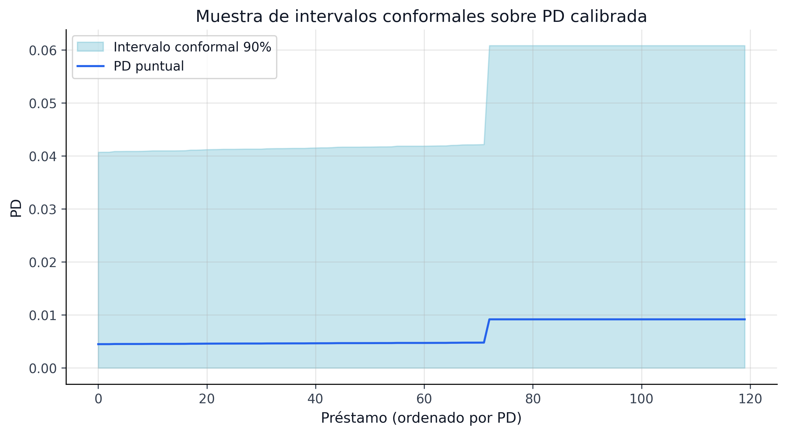

::: {.whole-game-intro}
<span class="whole-game-question">Pregunta central</span>

¿Cómo se convierte un CSV crudo de Lending Club en una decisión de portafolio, provisión y gobernanza defendible? Esta parte existe para mostrar la cadena completa antes de entrar a los detalles de cada bloque.

Ejemplo concreto: un préstamo entra como fila cruda del marketplace, pasa por limpieza, recibe features, se transforma en una PD calibrada, luego en un intervalo conformal, después en un conjunto de incertidumbre y finalmente en una policy de aceptación, capital y provisión. Este capítulo dibuja esa ruta y explica por qué cada transición importa.
:::

El pipeline sigue una adaptación del marco CRISP-DM extendido con optimización robusta, IFRS9 y gobernanza de modelos. La idea no es “hacer más pasos”, sino introducir controles de leakage, trazabilidad y reutilización de artefactos en cada transición:

{#fig-pipeline-architecture fig-alt="Diagrama del pipeline end-to-end con datos, modelado, conformal, optimización, IFRS9 y gobernanza."}

{#fig-pipeline-interval-sample fig-alt="Muestra de intervalos conformales sobre PD calibrada en el pipeline end-to-end."}

La figura @fig-pipeline-interval-sample aporta la segunda capa de lectura: al diagrama editorial de arquitectura le sigue el objeto que realmente se propaga aguas abajo hacia portafolio e IFRS9, es decir, el intervalo de predicción conformal.

| Paso del pipeline | Artefacto principal | Problema que resuelve |
|---|---|---|
| Ingesta y limpieza | `lending_club_cleaned.parquet` | Convertir el CSV crudo en una base utilizable, con estados resueltos y tipos consistentes |
| Splits temporales | `train.parquet`, `calibration.parquet`, `test.parquet` | Evitar leakage temporal y reservar una ventana honesta para calibración y evaluación OOT |
| Feature engineering | `loan_master.parquet` + contrato Pandera | Traducir columnas crudas en señales reutilizables y auditables |
| Modelado PD | `pd_canonical.cbm`, `model_comparison.json` | Obtener una PD calibrada y defendible como insumo base |
| Predicción conformal | `conformal_intervals_mondrian.parquet` | Convertir la PD puntual en una banda de incertidumbre útil para decisión |
| Optimización | `portfolio_allocations.parquet`, `champion_portfolio_policy.json` | Elegir préstamos y capital bajo una lectura robusta del riesgo |
| IFRS9 y gobernanza | `ifrs9_*.parquet`, `mrm_validation_report.json` | Traducir el riesgo a provisiones, controles y trazabilidad prudencial |

: Paso, artefacto y problema resuelto en la cadena end-to-end {#tbl-pipeline-step-artifact}

| Plataforma | Rol en el pipeline | Por qué aparece aquí y no solo en Streamlit |
|---|---|---|
| DuckDB | Consulta rápida sobre parquet y staging analítico local | Hace posible trabajar con millones de préstamos sin montar una base externa |
| dbt-duckdb | Transformaciones SQL versionadas y testeables | Convierte parte del ETL en contratos legibles por auditoría |
| Feast | Catálogo y serving de features reutilizables | Separa la definición de features de su consumo posterior |
| DVC | Versionado y linaje de artefactos pesados | Permite hablar de “artefacto canónico” con procedencia explícita |

: Bloques de plataforma que sostienen el pipeline {#tbl-pipeline-platform}

::: {.callout-note}
## Cómo leer esta parte
Si vienes de negocio, quédate con la tabla `paso → artefacto → problema`. Si vienes de ingeniería, quédate con la separación `src/` / `scripts/` / `configs/`. Si vienes de investigación, quédate con la idea de que el intervalo conformal es el puente entre predicción y decisión.
:::

## Navegación curada

```{=html}
<div class="chapter-landing-grid">
  <div class="chapter-card">
    <h4><a href="04a-data-ingestion-lineage.html">12. Ingesta y Linaje</a></h4>
    <p>Dataset, limpieza, remoción de leakage, construcción de LGD y datasets analíticos.</p>
  </div>
  <div class="chapter-card">
    <h4><a href="04b-temporal-splitting.html">13. Splitting Temporal</a></h4>
    <p>Diseño out-of-time, rol dual del set de calibración y validación de fechas de corte.</p>
  </div>
</div>
```


