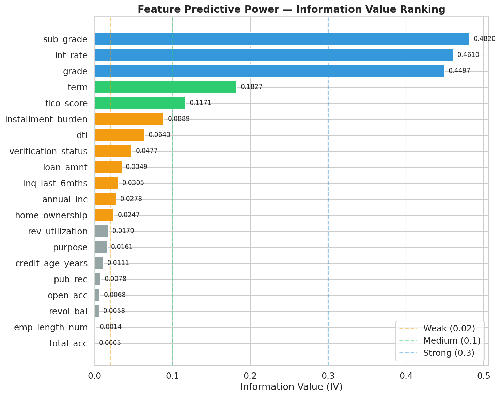
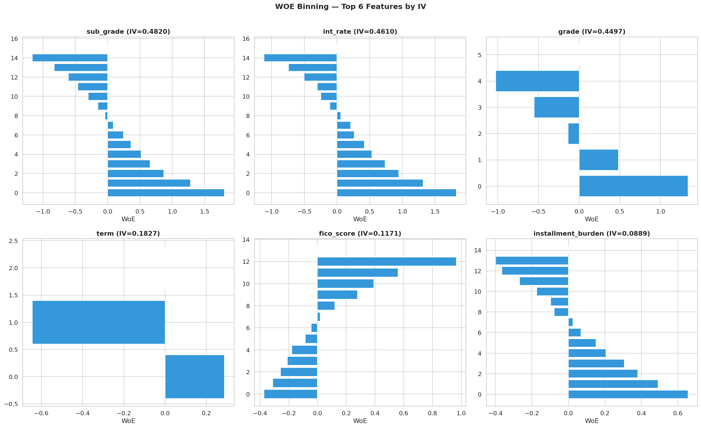

## WOE, IV y OptBinning {#sec-woe-iv}

### Motivación del Encoding WOE

Las variables categóricas en credit scoring --- como el grado de riesgo, el propósito del préstamo o el tipo de vivienda --- no pueden usarse directamente en modelos lineales ni en algunos modelos de ensemble. El **Weight of Evidence** (WOE) es la transformación estándar en la industria bancaria porque produce una codificación numérica con propiedades deseables:

1. **Monotonicidad**: La relación entre la variable WOE y el log-odds de default es lineal por construcción, lo que facilita la interpretación y la validación regulatoria.
2. **Poder predictivo cuantificable**: El **Information Value** (IV) asociado mide directamente cuánta información aporta cada variable para discriminar defaults de no-defaults (ver @sec-ml-foundations para las fórmulas).
3. **Tratamiento natural de categorías raras**: El binning agrupa categorías con pocos casos, evitando estimaciones inestables.

::: {.callout-note}
## WOE vs. One-Hot Encoding vs. Target Encoding
- **One-Hot**: Crea $k-1$ columnas binarias para $k$ categorías. Explota la dimensionalidad para variables con muchas categorías (Lending Club tiene 35 sub-grados).
- **Target Encoding**: Reemplaza categorías por la media del target. Sufre de **data leakage** si no se implementa con regularización cuidadosa.
- **WOE**: Reemplaza categorías por el log-odds ratio, calculado sobre bins óptimos. Es el estándar regulatorio porque produce una transformación interpretable, monótona y sin leakage cuando se calcula solo sobre el set de entrenamiento.

CatBoost maneja categorías nativamente sin necesidad de WOE, pero las variables WOE se incluyen igualmente porque: (a) son necesarias para el baseline de regresión logística, (b) sirven como features adicionales para CatBoost, y (c) se usan como confusores en la estimación causal.
:::

### OptBinning: Binning Óptimo por Programación Matemática

El cálculo de WOE requiere primero agrupar los valores de la variable en **bins** (intervalos para numéricas, grupos para categóricas). La calidad de los bins determina la calidad del WOE resultante. Los enfoques tradicionales (equal-width, equal-frequency, chi-squared merging) son heurísticos y no garantizan optimalidad.

**OptBinning** resuelve el problema de binning como un programa de optimización con restricciones (constraint programming, solver `cp`), garantizando bins que maximizan el IV sujeto a restricciones regulatorias:

- **Monotonía**: El WOE debe ser monótono creciente o decreciente a través de los bins.
- **Número máximo de bins**: Típicamente 5--10 para interpretabilidad.
- **Tamaño mínimo de bin**: Cada bin debe contener al menos un porcentaje mínimo de observaciones.

La implementación en `src/features/feature_engineering.py` utiliza OptBinning con caching:

```python
from optbinning import OptimalBinning

optb = OptimalBinning(
    name=feature,
    dtype="numerical" | "categorical",
    solver="cp",  # constraint programming
)
optb.fit(X_train[feature], y_train)
woe_values = optb.transform(X[feature], metric="woe")
```

Los objetos OptBinning ajustados se persisten en `models/woe_optbinning_{feature}.pkl` para reutilización en inferencia. Adicionalmente, el pipeline exporta las **tablas de binning** como CSV a `reports/binning_tables/{feature}_bins.csv`, proporcionando una traza de auditoría completa que documenta los límites de cada bin, el WOE asignado, la tasa de eventos y el IV por bin --- un requisito de gobernanza para validación de modelos (SR 11-7).

### Variables WOE del Proyecto

No todas las variables categóricas merecen una transformación WOE. En el proyecto priorizamos las que reaparecen en más de una capa del pipeline: modelado de PD, particiones conformales, lectura regulatoria e incluso control causal. La tabla siguiente resume justamente ese criterio de reutilización, no solo su conveniencia estadística.

El proyecto calcula WOE para tres variables categóricas clave:

```{python}
#| label: tbl-woe-variables
#| tbl-cap: "Variables transformadas con WOE encoding"

import pandas as pd

woe_vars = [
    {"Variable original": "grade", "Variable WOE": "grade_woe",
     "Categorías": "A, B, C, D, E, F, G (7 grados)",
     "Uso downstream": "Confusor causal, partición Mondrian, IFRS9 staging"},
    {"Variable original": "purpose", "Variable WOE": "purpose_woe",
     "Categorías": "debt_consolidation, credit_card, home_improvement, etc. (14 categorías)",
     "Uso downstream": "Confusor causal, feature PD"},
    {"Variable original": "home_ownership", "Variable WOE": "home_ownership_woe",
     "Categorías": "MORTGAGE, RENT, OWN, OTHER (4 categorías)",
     "Uso downstream": "Confusor causal, feature PD"},
]

pd.DataFrame(woe_vars)
```

### Ranking por Information Value

El IV de cada variable se calcula como subproducto del binning óptimo y sirve como criterio de selección de features. La interpretación estándar (ver @tbl-iv-interpretation) guía la decisión de qué variables retener:

::: {.callout-tip}
## Regla práctica de IV
Variables con IV > 0.50 son sospechosas de contener leakage --- su poder predictivo es "demasiado bueno para ser verdad". En el pipeline de limpieza del capítulo de ingesta y linaje, las 35 columnas de leakage fueron removidas *antes* del cálculo de WOE, por lo que las variables restantes tienen IV en rangos plausibles. Las variables WOE de grade, purpose y home_ownership tienen IV típicamente en el rango 0.10--0.40, indicando poder predictivo medio a fuerte.
:::

El IV también se usa como criterio de ordenamiento en los notebooks de análisis exploratorio (NB02), donde las variables se rankean por IV descendente para identificar las más informativas antes de la selección final de features.

::: {.figure-stack}

{#fig-iv-ranking fig-alt="Ranking Information Value de variables del pipeline de features."}

La figura @fig-iv-ranking permite aterrizar el criterio de selección en el problema real de Lending Club: no todas las columnas aportan lo mismo, y varias de las señales fuertes coinciden con intuiciones clásicas de riesgo, como grado, tasa y proxies de carga financiera.

{#fig-woe-top6 fig-alt="WOE binning top 6 de variables relevantes para el score de riesgo."}

:::

La figura @fig-woe-top6 muestra algo que suele perderse cuando solo vemos tablas: el binning no se usa por estética, sino para convertir relaciones ruidosas en una señal más ordenada y más fácil de explicar ante negocio o validación de modelo.
