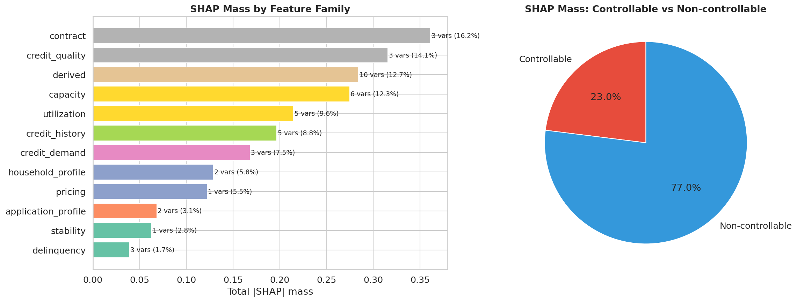

## Features Derivadas: Ratios, Flags e Interacciones {#sec-derived-features}

### Filosofía de Diseño

Las variables crudas del dataset de Lending Club capturan valores absolutos (monto del préstamo, ingreso anual, saldo revolving), pero las decisiones de crédito se basan en **proporciones relativas**. Un préstamo de \$20,000 tiene riesgo muy diferente para un prestatario con \$50,000 de ingreso anual (ratio 0.40) que para uno con \$200,000 (ratio 0.10). Las features derivadas capturan estas relaciones relativas que son más informativas para el modelado.

El pipeline de derivación en `src/features/feature_engineering.py` crea cuatro tipos de features:

### Ratios Financieros

```{python}
#| label: tbl-ratio-features
#| tbl-cap: "Ratios financieros derivados"

import pandas as pd

ratios = [
    {"Feature": "loan_to_income", "Fórmula": "loan_amnt / annual_inc",
     "Interpretación": "Carga del préstamo relativa al ingreso. Valores > 0.50 indican alto apalancamiento"},
    {"Feature": "installment_burden", "Fórmula": "installment / (annual_inc / 12)",
     "Interpretación": "Cuota mensual como fracción del ingreso mensual"},
    {"Feature": "rev_utilization", "Fórmula": "revol_util / 100",
     "Interpretación": "Utilización de líneas revolving (0–1). Valores > 0.80 son señal de estrés"},
    {"Feature": "revol_bal_to_income", "Fórmula": "revol_bal / annual_inc",
     "Interpretación": "Deuda revolving relativa al ingreso"},
    {"Feature": "open_acc_ratio", "Fórmula": "open_acc / total_acc",
     "Interpretación": "Proporción de cuentas activas. Valores altos indican búsqueda activa de crédito"},
    {"Feature": "il_ratio", "Fórmula": "Ratio de deuda installment sobre total",
     "Interpretación": "Concentración en deuda de cuotas fijas vs. revolving"},
    {"Feature": "high_util_pct", "Fórmula": "Porcentaje de líneas con utilización > 80%",
     "Interpretación": "Diversificación del estrés crediticio entre líneas"},
]

pd.DataFrame(ratios)
```

### Transformaciones Logarítmicas

Las variables financieras tienen distribuciones fuertemente sesgadas a la derecha (muchos prestatarios con ingresos modestos, pocos con ingresos muy altos). Las transformaciones logarítmicas estabilizan la varianza y reducen la influencia de valores extremos:

| Feature | Fórmula | Justificación |
|---------|---------|---------------|
| `log_annual_inc` | $\log(1 + \text{annual\_inc})$ | Ingreso tiene cola derecha pesada |
| `log_revol_bal` | $\log(1 + \text{revol\_bal})$ | Saldo revolving varía de \$0 a > \$100K |

: Transformaciones logarítmicas {#tbl-log-features}

El $+1$ evita el $\log(0)$ para prestatarios sin saldo revolving.

### Flags Binarias

Las flags capturan la presencia o ausencia de señales de riesgo discretas:

```{python}
#| label: tbl-flag-features
#| tbl-cap: "Features binarias (flags) de señal de riesgo"

flags = [
    {"Feature": "has_delinq_2yrs", "Condición": "delinq_2yrs > 0",
     "Señal": "Morosidad reciente en los últimos 2 años"},
    {"Feature": "has_pub_rec", "Condición": "pub_rec > 0",
     "Señal": "Registro público derogatorio (quiebra, juicio)"},
    {"Feature": "has_bankruptcy", "Condición": "pub_rec_bankruptcies > 0",
     "Señal": "Quiebra personal previa"},
    {"Feature": "has_recent_inq", "Condición": "inq_last_6mths > 0",
     "Señal": "Consulta de crédito en últimos 6 meses (búsqueda activa)"},
    {"Feature": "has_mortgage", "Condición": "mort_acc > 0",
     "Señal": "Tiene hipoteca (indicador de estabilidad financiera)"},
    {"Feature": "many_recent_opens", "Condición": "open_acc > umbral",
     "Señal": "Muchas cuentas abiertas recientemente"},
    {"Feature": "recent_chargeoff", "Condición": "chargeoff_within_12_mths > 0",
     "Señal": "Pérdida crediticia reciente (12 meses)"},
    {"Feature": "early_delinq", "Condición": "delinq_2yrs > 0",
     "Señal": "Historial temprano de morosidad"},
]

pd.DataFrame(flags)
```

::: {.callout-note}
## Flags vs. variables continuas
Las flags pueden parecer redundantes con las variables continuas subyacentes (por ejemplo, `has_delinq_2yrs` vs. `delinq_2yrs`). Sin embargo, para modelos lineales como la regresión logística, la flag captura el *salto discreto* en riesgo entre "cero delinquencias" y "al menos una", que es la discontinuidad más informativa. CatBoost puede descubrir esta discontinuidad automáticamente, pero incluir la flag explícitamente facilita la interpretabilidad y la consistencia entre modelos.
:::

### Features Temporales

```{python}
#| label: tbl-temporal-features
#| tbl-cap: "Features temporales derivadas"

temporal = [
    {"Feature": "credit_history_months", "Fórmula": "(issue_d - earliest_cr_line).days / 30",
     "Interpretación": "Antigüedad del historial crediticio en meses"},
    {"Feature": "credit_age_years", "Fórmula": "credit_history_months / 12",
     "Interpretación": "Versión en años para interpretabilidad"},
    {"Feature": "fico_score", "Fórmula": "(fico_range_low + fico_range_high) / 2",
     "Interpretación": "Punto medio del rango FICO reportado"},
    {"Feature": "delinq_severity", "Fórmula": "Combinación de morosidades por tipo",
     "Interpretación": "Índice compuesto de severidad de morosidad"},
    {"Feature": "delinq_recency", "Fórmula": "Inverso de meses desde última morosidad",
     "Interpretación": "Más alto = morosidad más reciente"},
]

pd.DataFrame(temporal)
```

### Buckets e Interacciones

Las variables de **bucket** discretizan continuas en categorías interpretables:

- `int_rate_bucket`: very_low (0--8%), low (8--12%), medium (12--16%), high (16--20%), very_high (>20%)
- `dti_bucket`: low (0--10), moderate (10--20), high (20--30), very_high (30--40), extreme (>40)
- `fico_bucket`: Discretización del score FICO en bandas

Las **interacciones** capturan efectos multiplicativos:

| Feature | Componentes | Intuición |
|---------|------------|-----------|
| `int_rate_bucket__grade` | int_rate_bucket × grade | Captura si la tasa es alta *para su grado* |
| `loan_to_income_sq` | loan_to_income² | Efecto no lineal convexo del apalancamiento |
| `fico_x_dti` | fico_score × dti | Interacción entre calidad crediticia y carga de deuda |

: Features de interacción {#tbl-interaction-features}

::: {.callout-tip}
## ¿Son necesarias las interacciones para CatBoost?
CatBoost y otros modelos de ensemble basados en árboles descubren interacciones automáticamente durante el entrenamiento. Sin embargo, proporcionar interacciones explícitas tiene dos beneficios: (1) facilita la interpretabilidad vía SHAP (la importancia de `fico_x_dti` se lee directamente), y (2) beneficia al modelo de regresión logística baseline que no captura interacciones automáticamente.
:::

### Composición del Feature Set Final

En conjunto, los ratios, flags, transformaciones logarítmicas e interacciones capturan tres dimensiones complementarias del riesgo crediticio de un prestatario. La primera dimensión es **carga financiera**: ratios como `loan_to_income`, `installment_burden` y `revol_bal_to_income` miden cuánto del ingreso disponible está comprometido con deuda --- a mayor carga, menor capacidad de absorber shocks. La segunda dimensión es **estabilidad crediticia**: features como `credit_history_months`, `has_delinq_2yrs` y `has_bankruptcy` capturan la profundidad y calidad del historial --- un historial largo sin incidentes es la señal más fuerte de bajo riesgo. La tercera dimensión es **comportamiento reciente de búsqueda de crédito**: `has_recent_inq`, `open_acc_ratio` y `many_recent_opens` detectan patrones de solicitud activa que, en la literatura de credit scoring, se asocian con estrés financiero incipiente. Estas tres dimensiones cubren la mayor parte de la señal de creditworthiness disponible en datos de buró, y su combinación permite que el modelo capture perfiles de riesgo que una sola variable no podría representar.

La @fig-feature-family-decomposition muestra la distribución de las 42 features del contrato canónico por familia de origen. La mezcla resultante combina señales crudas del buró con ratios derivados, flags binarios y codificaciones WOE, lo que le da al modelo múltiples vistas complementarias del mismo prestatario.

{#fig-feature-family-decomposition fig-alt="Gráfico de barras mostrando la composición del feature set por familia: numéricas, categóricas, flags, ratios, interacciones."}

### Qué cambió en el rerun V2

El rerun V2 reabrió esta capa de feature engineering con una decisión importante: distinguir entre **feature universe** y **contrato champion**. Antes, parte de la narrativa del proyecto mezclaba ambos niveles; después de la refactorización quedaron separados:

- `44` features core CatBoost en el manifest V2, de las cuales `42` quedan en el contrato champion final tras el filtro `stable_core`;
- `47` para el baseline logístico;
- `49` features challenger-only;
- `164` columnas en el manifest total, incluyendo metadata, targets, WOE, candidatos bureau y señales auxiliares.

Además del set derivado clásico, el universo candidato absorbió una familia nueva de variables de buró de alta cobertura (`bc_util`, `bc_open_to_buy`, `percent_bc_gt_75`, `acc_open_past_24mths`, `tot_cur_bal`, `total_bc_limit`, `avg_cur_bal`, `mths_since_recent_bc`, entre otras). No todas entraron al champion final, pero sí quedaron auditadas y disponibles para challengers y análisis research.

```{python}
#| label: tbl-feature-families-v2
#| tbl-cap: "Familias de features en el manifest V2"

import sys
from pathlib import Path

sys.path.insert(0, str(Path.cwd().parent if Path.cwd().name == "book" else Path.cwd()))
from book._helpers.load_artifacts import try_load_parquet

import pandas as pd

manifest = try_load_parquet("feature_manifest_v2")
if not manifest.empty:
    fam = (
        manifest["family"]
        .value_counts(dropna=False)
        .rename_axis("Familia")
        .reset_index(name="Conteo")
    )
else:
    fam = pd.DataFrame()
fam
```

El aprendizaje importante no es que “más variables siempre mejoran”. Es que el proyecto ahora puede demostrar qué quedó en el champion, qué quedó como challenger y qué quedó fuera por sparsity o por bajo valor editorial. Esa trazabilidad era una de las metas centrales del rerun.
