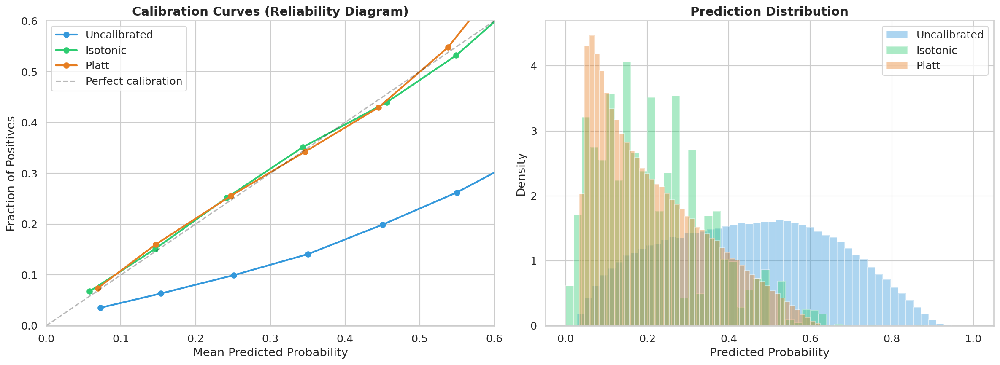

## Selección de Calibración {#sec-calibration-selection}

### Por qué Importa la Calibración

Un modelo puede tener excelente discriminación (AUC alto) y, sin embargo, producir probabilidades sistemáticamente incorrectas. El AUC mide únicamente si el modelo **ordena** correctamente a los prestatarios por riesgo --- no dice nada sobre si los valores absolutos de PD son confiables. En credit scoring, esta distinción es crítica.

Considere dos modelos con AUC idéntico de 0.71:

- **Modelo A**: Asigna PD = 0.40 a un grupo donde la tasa real de default es 15%.
- **Modelo B**: Asigna PD = 0.15 al mismo grupo.

Ambos modelos ordenan a los prestatarios igualmente bien, pero solo el Modelo B produce probabilidades que se pueden usar directamente en decisiones económicas. Las consecuencias de una mala calibración se propagan a través del pipeline:

| Uso downstream | Impacto de mala calibración |
|----------------|----------------------------|
| **ECL = PD × LGD × EAD** | Provisiones infladas o subestimadas |
| **IFRS9 staging** | Asignación incorrecta a Stage 1/2 (depende de niveles absolutos de PD) |
| **Optimización de portafolio** | Costos de default distorsionados $\Rightarrow$ allocaciones subóptimas |
| **Intervalos conformales** | PD calibrada es el input de MAPIE; calibración pobre $\Rightarrow$ intervalos descentrados |

: Impacto de la calibración en el pipeline {#tbl-calibration-impact}

::: {.callout-warning}
## AUC invariante, ECL no
El AUC es invariante a transformaciones monótonas del score: calibrar las probabilidades **no puede mejorar ni empeorar** la discriminación. Pero el Brier Score, el ECE y las decisiones económicas (ECL, staging, portafolio) dependen directamente de los valores absolutos. Un modelo con AUC = 0.71 y Brier = 0.205 puede transformarse en uno con AUC = 0.71 y Brier = 0.154 simplemente mediante calibración post-hoc --- sin reentrenar el modelo base.
:::

### Formalización: Calibración Perfecta

Un modelo está **perfectamente calibrado** si, para cualquier probabilidad predicha $p$:

$$
\mathbb{P}(\text{default} = 1 \mid \hat{p}(x) = p) = p, \quad \forall\, p \in [0, 1]
$$ {#eq-perfect-calibration}

En la práctica, esta condición se relaja a intervalos (*bins*): agrupamos las predicciones en $B$ bins y verificamos que la frecuencia observada de default en cada bin coincida con la probabilidad promedio predicha.

La métrica estándar es el **Expected Calibration Error (ECE)**:

$$
\text{ECE} = \sum_{b=1}^{B} \frac{|S_b|}{N} \left| \text{acc}(S_b) - \text{conf}(S_b) \right|
$$ {#eq-ece}

donde $S_b$ es el conjunto de observaciones en el bin $b$, $\text{acc}(S_b)$ es la frecuencia real de default, y $\text{conf}(S_b)$ es la media de las probabilidades predichas en ese bin.

::: {.callout-warning}
## Limitaciones del ECE como métrica de calibración

El ECE depende del número y tipo de bins elegidos, lo que introduce artefactos [@vaicenavicius2019; @kumar2019]. Vaicenavicius et al. [-@vaicenavicius2019] demostraron que los estimadores de ECE basados en binning son **sesgados e inconsistentes**, y Kumar et al. [-@kumar2019] mostraron que el ECE puede hacerse arbitrariamente pequeño mediante binning adversarial. Por esta razón, en nuestra política de selección el ECE es únicamente un criterio **secundario**: el Brier Score (proper scoring rule con descomposición interpretable) y el Z-statistic de Spiegelhalter (test formal de calibración) son las métricas primarias de decisión.

La misma cautela aplica a los reliability diagrams: una curva por bins es una visualización útil, no una prueba definitiva. Para comparar modelos cercanos conviene acompañarla con intervalos o suavizados y con una lectura separada de calibración, resolución y dispersión de scores. Incluso el Brier puede empatar modelos por rutas distintas; por eso su descomposición se usa como diagnóstico y no como selector único del champion [@murphy1973; @heblingvieira2026_brier_yates].
:::

### Cuatro Métodos de Calibración {#sec-calibration-methods}

El pipeline evalúa cuatro métodos de calibración post-hoc, cada uno con diferentes propiedades teóricas y prácticas.

#### 1. Platt Scaling (Calibración Sigmoide)

Platt Scaling [@platt1999] ajusta una regresión logística sobre los scores del modelo base:

$$
P_{\text{cal}}(y=1 \mid s) = \frac{1}{1 + \exp(-(a \cdot s + b))}
$$ {#eq-platt-scaling}

donde $s$ es el score bruto del modelo y $(a, b)$ son los parámetros ajustados por máxima verosimilitud sobre el set de calibración.

**Ventajas**: Simple (2 parámetros), estable con muestras moderadas, preserva AUC exactamente (transformación monótona).

**Limitaciones**: Asume una relación sigmoide entre score y probabilidad. Si el score ya está aproximadamente calibrado (como ocurre con CatBoost que usa `Logloss`), la transformación sigmoide puede ser redundante.

::: {.callout-note}
## Nota: la regresión logística no está "naturalmente calibrada"

Una creencia extendida en ML aplicado es que la regresión logística produce probabilidades calibradas "por defecto" al optimizar log-loss. Bai, Lee y Liang [-@bai2021] demostraron que esto es incorrecto: la regresión logística por máxima verosimilitud tiene un sesgo de sobreconfianza estructural de orden $\Theta(d/n)$, donde $d$ es el número de features y $n$ el tamaño de muestra. Este sesgo empuja las probabilidades predichas hacia los extremos (0 y 1), produciendo sobreconfianza incluso bajo condiciones ideales. Nuestro baseline LR con $d \approx 30$ features y $n \approx 1.3M$ observaciones opera en un régimen donde $d/n \approx 0$ y el sesgo es mínimo, pero en dimensiones más altas la calibración post-hoc sería imprescindible incluso para LR.
:::

#### 2. Regresión Isotónica

La regresión isotónica ajusta una función monótona no decreciente por partes constantes que minimiza el error cuadrático:

$$
\hat{f} = \arg\min_{f \in \mathcal{F}_{\text{iso}}} \sum_{i=1}^{n} (y_i - f(s_i))^2
$$ {#eq-isotonic}

donde $\mathcal{F}_{\text{iso}}$ es el conjunto de funciones monótonas no decrecientes.

**Ventajas**: No paramétrico --- no asume forma funcional. Puede capturar relaciones no lineales arbitrarias entre score y probabilidad.

**Limitaciones**: Mayor riesgo de sobreajuste con muestras pequeñas (la función por partes constantes puede memorizar ruido). Con $n = 47{,}516$ a $190{,}064$ observaciones en nuestros folds, este riesgo es limitado pero no nulo.

#### 3. Beta Calibration

Beta calibration [@kull2017] define el operador de calibración usando una familia de tres parámetros $(a, b, c)$:

$$
T_{\text{beta}}(\hat{p}) = \frac{1}{1 + \frac{1}{e^c} \cdot \left(\frac{\hat{p}}{1 - \hat{p}}\right)^{-(a-b)} \cdot \left(\frac{1}{\hat{p}}\right)^a}
$$ {#eq-beta-calibration}

**Ventajas**: Generaliza Platt Scaling (que es el caso especial $a = b$). El tercer parámetro $c$ permite corregir distorsiones **asimétricas** --- donde el modelo es sobreconfiado en un extremo pero subconfiado en el otro. Es particularmente efectivo para tree ensembles cuyas distribuciones de scores tienen picos bimodales cerca de 0 y 1.

**Limitaciones**: Requiere un set de calibración ligeramente más grande ($m \geq 200$) que Platt ($m \geq 100$) por tener un parámetro adicional.

#### 4. Venn-Abers Predictors

Los Venn-Abers predictors [@vovk2014] son una extensión de la regresión isotónica que produce **intervalos de probabilidad** con garantías de validez. El procedimiento es:

1. Para cada observación de test, ajustar **dos** regresiones isotónicas sobre el set de calibración: una asumiendo que la observación es positiva ($y=1$) y otra asumiendo que es negativa ($y=0$).
2. Esto produce dos probabilidades calibradas: $p_0$ y $p_1$.
3. La predicción final es la media ponderada: $\hat{p} = \frac{p_1}{p_0 + p_1}$.

**Ventajas**: Produce multi-probabilidades con garantías de validez bajo la asunción de intercambiabilidad. Es el método más conservador de los tres.

**Limitaciones**: Computacionalmente más costoso (dos ajustes isotónicos por predicción). La garantía de validez es más débil que la de predicción conformal (aplica a la calibración del predictor, no a la cobertura de intervalos).

::: {.callout-note}
## Relación con predicción conformal
Venn-Abers y la predicción conformal comparten raíces teóricas en el framework de Vovk et al. [-@vovk2005]. Ambos requieren intercambiabilidad (*exchangeability*) de los datos. Sin embargo, cumplen funciones diferentes y capturan tipos de incertidumbre distintos:

- **Ancho VA ($p_1 - p_0$)**: Mide la **incertidumbre epistémica de calibración** --- qué tan estable es la estimación de probabilidad dado el set de calibración disponible. Decrece como $O(1/\sqrt{m})$ con el tamaño del set de calibración $m$. Intervalos VA anchos indican que el set de calibración no tiene evidencia suficiente para fijar la probabilidad.
- **Ancho conformal ($\text{PD}_{\text{high}} - \text{PD}_{\text{low}}$)**: Mide la **incertidumbre predictiva total** --- incluye tanto la variabilidad aleatoria como la incertidumbre del modelo. Tiene cobertura finita garantizada.

En nuestro pipeline, Venn-Abers opera primero (calibración) y luego MAPIE opera sobre las PDs calibradas (conformización). Ambos anchos son señales complementarias: un préstamo puede tener VA width bajo (la calibración es estable) pero conformal width alto (el modelo tiene alta incertidumbre predictiva para ese perfil de riesgo).
:::

### Política de Selección Temporal {#sec-calibration-policy}

La selección del calibrador **no está hardcodeada** --- es el resultado de una política de validación temporal multi-métrica que se ejecuta en cada entrenamiento canónico. El archivo de configuración (`configs/pd_model.yaml`) especifica:

```yaml
calibration:
  method: auto  # temporal multi-metric policy selects best
  candidates: [platt, isotonic, venn_abers, beta]
```

La política `auto` implementa el siguiente protocolo:

#### Expanding Window Temporal Cross-Validation

El set de calibración (237,584 observaciones) se divide en 4 folds temporales de 47,516 observaciones cada uno. La validación usa una **ventana expandible**: en cada fold, el calibrador se ajusta con todos los folds anteriores y se evalúa en el fold actual.

```
Fold 1: Fit [F1]             → Eval [F2]     (n_fit = 47,516)
Fold 2: Fit [F1, F2]         → Eval [F3]     (n_fit = 95,032)
Fold 3: Fit [F1, F2, F3]     → Eval [F4]     (n_fit = 142,548)
Fold 4: Fit [F1, F2, F3, F4] → Eval holdout  (n_fit = 190,064)
```

Esta estrategia respeta la estructura temporal de los datos y simula el escenario de producción donde el calibrador se ajusta con datos acumulados.

#### Criterios de Selección (Multi-Métrica)

Un candidato es **factible** si cumple:

1. **AUC drop < 0.0015**: La calibración no debe degradar la discriminación. Un drop mayor sugiere que la transformación no es monótona en la práctica (posible por errores numéricos o sobreajuste).

De los candidatos factibles, se selecciona el mejor según:

2. **Minimizar Brier Score medio** (métrica primaria): Proper scoring rule que mide la calidad global de las probabilidades con descomposición interpretable (REL/RES/UNC).
3. **Minimizar ECE medio** (métrica secundaria): Mide la calibración por bins. Se usa como desempate, no como criterio primario, dadas las limitaciones del ECE como estimador.
4. **Estabilidad**: Baja varianza de Brier + ECE entre folds. Se define como $\text{stability} = \text{Var}(\text{Brier}) + \text{Var}(\text{ECE})$ a través de los folds.

Adicionalmente, el pipeline reporta la **tasa de degradación** de cada candidato: la fracción de folds en los que el Brier Score calibrado es *peor* que el no calibrado. Manokhin y Grønhaug [-@manokhin2024] demostraron que la regresión isotónica degrada el log-loss en 18% de los casos, Platt Scaling en 23%, mientras que Venn-Abers mejora en 96% de los pares modelo-dataset con degradación máxima < 1%. El log-loss también se reporta como proper scoring rule complementaria al Brier Score.

### Resultados de la Selección

```{python}
#| label: tbl-calibration-candidates
#| tbl-cap: "Comparación de candidatos de calibración (validación temporal, 4 folds)"

import sys
from pathlib import Path

sys.path.insert(0, str(Path.cwd().parent if Path.cwd().name == "book" else Path.cwd()))
from book._helpers.load_artifacts import load_json

import pandas as pd

comparison = load_json("model_comparison")
cal_report = comparison.get("calibration_selection_report", {})
candidates = cal_report.get("candidates", [])

METHOD_DISPLAY = {"platt": "Platt", "isotonic": "Isotónica", "venn_abers": "Venn-Abers", "beta": "Beta"}

rows = []
for c in candidates:
    rows.append({
        "Método": METHOD_DISPLAY.get(c["method"], c["method"]),
        "Brier (media)": f"{c['mean_brier']:.4f}",
        "Log-loss (media)": f"{c.get('mean_log_loss', float('nan')):.4f}" if "mean_log_loss" in c else "N/D",
        "ECE (media)": f"{c['mean_ece']:.4f}",
        "AUC drop (media)": f"{c['mean_auc_drop']:.5f}",
        "Degradación": f"{c.get('degradation_rate', 0):.0%}" if "degradation_rate" in c else "N/D",
        "Estabilidad": f"{c['stability']:.2e}",
        "Factible": "Sí" if c["mean_auc_drop"] < cal_report.get("auc_drop_limit", 0.0015) else "No",
    })

df_cal = pd.DataFrame(rows)
df_cal
```

Los cuatro métodos son factibles (AUC drop < 0.0015 en todos los casos). Las diferencias en Brier Score son del orden de $10^{-5}$ --- prácticamente indistinguibles. La selección se decide por el criterio `feasible_multi_metric` que combina Brier, ECE y estabilidad.

```{python}
#| label: tbl-calibration-folds
#| tbl-cap: "Detalle por fold del calibrador seleccionado (Venn-Abers)"

winner_method = cal_report.get("selected_method", "venn_abers")
winner = next((c for c in candidates if c["method"] == winner_method), None)

if winner:
    fold_rows = []
    for f in winner["folds"]:
        fold_rows.append({
            "Fold": f["fold"],
            "n_fit": f"{f['n_fit']:,}",
            "n_eval": f"{f['n_eval']:,}",
            "AUC raw": f"{f['raw_auc']:.4f}",
            "AUC cal": f"{f['cal_auc']:.4f}",
            "AUC drop": f"{f['auc_drop']:.5f}",
            "Brier": f"{f['brier']:.4f}",
            "Log-loss": f"{f.get('log_loss', float('nan')):.4f}" if "log_loss" in f else "N/D",
            "ECE": f"{f['ece']:.4f}",
        })
    pd.DataFrame(fold_rows)
```

Observaciones clave del detalle por fold:

- El **AUC drop** es consistentemente < 0.0002 en cada fold, muy por debajo del límite de 0.0015. La calibración Venn-Abers preserva la discriminación.
- El **Brier Score** varía entre 0.1521 y 0.1647 a través de los folds, reflejando la estabilidad del método a medida que el set de ajuste crece de 47K a 190K observaciones.
- El **ECE** se mantiene entre 0.019 y 0.025 a través de los folds, sin señales de sobreajuste o degradación temporal.

### Métricas Finales del Modelo Calibrado (Test OOT) {#sec-calibrated-metrics}

```{python}
#| label: tbl-final-calibrated-metrics
#| tbl-cap: "Métricas del modelo CatBoost calibrado con Venn-Abers (test OOT, 276,869 préstamos)"

final = comparison.get("final_test_metrics", {})
raw_model = next((m for m in comparison.get("models", []) if m["model"] == "CatBoost (tuned)"), {})

metrics_rows = [
    {"Métrica": "AUC-ROC", "Sin calibrar": f"{raw_model.get('auc', 'N/A'):.4f}",
     "Calibrado (Venn-Abers)": f"{final.get('auc_roc', 'N/A'):.4f}",
     "Cambio": "Invariante"},
    {"Métrica": "Gini", "Sin calibrar": f"{raw_model.get('gini', 'N/A'):.4f}",
     "Calibrado (Venn-Abers)": f"{final.get('gini', 'N/A'):.4f}",
     "Cambio": "Invariante"},
    {"Métrica": "Brier Score", "Sin calibrar": f"{raw_model.get('brier', 'N/A'):.4f}",
     "Calibrado (Venn-Abers)": f"{final.get('brier_score', 'N/A'):.4f}",
     "Cambio": f"{((final.get('brier_score', 0) - raw_model.get('brier', 0)) / raw_model.get('brier', 1)) * 100:.1f}%"},
    {"Métrica": "Log-loss", "Sin calibrar": "N/A (no reportado)",
     "Calibrado (Venn-Abers)": f"{final.get('log_loss', 'N/A'):.4f}" if isinstance(final.get('log_loss'), (int, float)) else "N/D",
     "Cambio": "---"},
    {"Métrica": "ECE", "Sin calibrar": "N/A (no reportado)",
     "Calibrado (Venn-Abers)": f"{final.get('ece', 'N/A'):.4f}",
     "Cambio": "---"},
    {"Métrica": "D² Brier", "Sin calibrar": f"{raw_model.get('d2_brier', 'N/A'):.4f}",
     "Calibrado (Venn-Abers)": f"{final.get('d2_brier_score', 'N/A'):.4f}",
     "Cambio": "Negativo → Positivo"},
    {"Métrica": "KS Statistic", "Sin calibrar": "N/A",
     "Calibrado (Venn-Abers)": f"{final.get('ks_statistic', 'N/A'):.4f}",
     "Cambio": "---"},
]

pd.DataFrame(metrics_rows)
```

El impacto de la calibración es dramático:

- **Brier Score**: De 0.2095 a 0.1546, una reducción del 26.2%. La calibración mejora la calidad de las probabilidades sin reentrenar el modelo.
- **ECE**: 0.0064 --- la frecuencia observada de default en cada bin de probabilidad difiere en promedio solo 0.64 puntos porcentuales de la probabilidad predicha. Esto es excelente para uso en ECL e IFRS9.
- **D² Brier**: De -0.2217 (peor que el predictor naive) a +0.0986 (mejor que el predictor naive). La calibración transforma un modelo que, en términos de probabilidad absoluta, era **peor que predecir siempre la tasa base**, en uno que genuinamente agrega valor probabilístico.
- **AUC**: 0.7128 $\rightarrow$ 0.7127, variación en la cuarta decimal. La calibración no afecta la discriminación, como esperamos teóricamente.

### Descomposición del Brier Score

El Brier Score admite una descomposición que separa la **discriminación** de la **calibración** [@murphy1973]:

$$
\text{BS} = \underbrace{\frac{1}{N}\sum_{b=1}^{B} n_b (\bar{p}_b - \bar{o}_b)^2}_{\text{Calibración (REL)}} - \underbrace{\frac{1}{N}\sum_{b=1}^{B} n_b (\bar{o}_b - \bar{o})^2}_{\text{Resolución (RES)}} + \underbrace{\bar{o}(1 - \bar{o})}_{\text{Incertidumbre (UNC)}}
$$ {#eq-brier-decomposition}

donde $\bar{p}_b$ es la probabilidad media predicha en el bin $b$, $\bar{o}_b$ es la frecuencia observada de default en el bin, y $\bar{o}$ es la frecuencia marginal de default.

- **REL (reliability)**: Penaliza la distancia entre frecuencias predichas y observadas. La calibración reduce este término.
- **RES (resolution)**: Recompensa la capacidad de distinguir grupos con diferentes tasas de default. Depende de la discriminación del modelo.
- **UNC (uncertainty)**: Constante que depende solo de la frecuencia marginal de default.

La mejora de Brier de 0.2095 a 0.1546 se debe casi enteramente a la reducción del término de **reliability** (REL), mientras que la resolución se mantiene constante --- exactamente lo que esperamos de una calibración post-hoc que no altera el ranking del modelo.

El rerun V2 dejó además dos mejoras de gobernanza que antes estaban solo parcialmente absorbidas:

- la **descomposición de Murphy/Brier** ahora se persiste como artefacto explícito (`brier_score_decomposition.json`);
- el **Murphy diagram** dejó de ser una idea disponible solo en utilidades internas y pasó a producirse como evidencia editorial real del calibrador ganador.

Esa mejora importa porque permite explicar la calibración no solo con un score agregado, sino con una lectura más rica de reliability versus resolution.

Una advertencia adicional evita una mala lectura frecuente: minimizar Brier no equivale automáticamente a escoger el mejor modelo de crédito. Si un modelo concentra predicciones cerca de la tasa base puede verse competitivo en error cuadrático y aun así carecer de rango útil para segmentar riesgo o construir escalas. Por eso este libro mantiene la selección multi-criterio: Brier y log-loss para calidad probabilística, Gini/ROC para ranking, ECE y pruebas acumuladas para calibración, y métricas económicas para decisiones.

::: {.callout-tip}
## Interpretación práctica del ECE
Un ECE de 0.0064 significa que, si el modelo asigna PD = 0.20 a un grupo de préstamos, la tasa real de default en ese grupo será aproximadamente 19.4% a 20.6%. Para cálculos de ECL bajo IFRS9, esta precisión es más que suficiente --- la incertidumbre en LGD y EAD típicamente domina sobre la incertidumbre en PD calibrada.
:::

### Por qué Venn-Abers y no Platt {#sec-why-venn-abers}

En este punto ya no buscamos “el calibrador más elegante” en abstracto, sino el más defendible para un pipeline que luego alimenta conformal, IFRS9 y optimización. Por eso la comparación entre Venn-Abers y Platt debe leerse como una decisión de gobernanza técnica: dos métodos casi empatados, pero con ventajas distintas cuando los conectamos al resto de la arquitectura.

::: {.callout-note}
## Selección del calibrador: Venn-Abers
Platt Scaling y Venn-Abers tienen rendimiento prácticamente idéntico en este dataset: la diferencia en Brier es del orden de $5 \times 10^{-5}$ y en ECE del orden de $10^{-3}$. La política `feasible_multi_metric` seleccionó Venn-Abers por tres razones:

1. **Multi-probabilidades con validez**: Venn-Abers produce un intervalo $[p_0, p_1]$ alrededor de la probabilidad calibrada, proporcionando una medida de incertidumbre inherente al proceso de calibración.
2. **Consistencia teórica**: Al estar basado en el framework de Vovk et al., Venn-Abers tiene garantías de validez bajo intercambiabilidad --- la misma asunción que subyace a la predicción conformal que se aplica downstream.
3. **Mejor Brier marginal**: Aunque la diferencia es mínima ($1.6 \times 10^{-4}$), Venn-Abers tiene el menor Brier medio entre los tres candidatos.

**Importante**: Este resultado puede cambiar en futuras ejecuciones del pipeline. El config dice `method: auto` y el artefacto `model_comparison.json` es la fuente de verdad, no el método hardcodeado. Si los datos cambian o se agregan folds, la política podría seleccionar Platt o Isotónica.
:::

### Guía de Decisión: Elección del Calibrador {#sec-calibration-decision}

El siguiente diagrama resume la lógica de decisión para elegir un calibrador, basada en las propiedades teóricas y empíricas de cada método:

```{mermaid}
%%| label: fig-calibration-decision
%%| fig-cap: "Árbol de decisión para selección de calibrador"
flowchart TD
    A["¿Se requieren garantías<br/>formales de calibración?"] -->|Sí| VA["**Venn-Abers**<br/>Único con garantías secuenciales"]
    A -->|No| B["¿Tamaño del set<br/>de calibración m?"]
    B -->|"m < 200"| PLATT["**Platt Scaling**<br/>2 parámetros, estable"]
    B -->|"200 ≤ m < 1000"| BETA["**Beta Calibration**<br/>3 parámetros, asimétrica"]
    B -->|"m ≥ 1000"| C["¿Distribución de scores<br/>simétrica o asimétrica?"]
    C -->|Simétrica| ISO["**Isotónica**<br/>No paramétrica, flexible"]
    C -->|Asimétrica| BETA2["**Beta Calibration**<br/>Maneja asimetría"]
    VA --> D["Validar con Brier + Z + log-loss<br/>vs modelo sin calibrar"]
    PLATT --> D
    BETA --> D
    ISO --> D
    BETA2 --> D
```

En nuestro pipeline, la decisión se automatiza: la política `auto` evalúa los cuatro candidatos sobre folds temporales y selecciona el que minimiza Brier Score sujeto a la restricción de AUC drop < 0.0015. Esta automatización es preferible a una elección manual porque (a) el dataset puede cambiar entre ejecuciones y (b) las diferencias entre calibradores son frecuentemente del orden de $10^{-4}$ en Brier, difíciles de distinguir visualmente.

### Implementación en el Pipeline

La calibración se implementa en dos módulos:

- **`src/models/calibration.py`**: Funciones de ajuste para Platt (`calibrate_platt`), Isotónica (`calibrate_isotonic`), Beta (`calibrate_beta`), y evaluación (`expected_calibration_error`, `evaluate_calibration`).
- **`scripts/train_pd_model.py`**: Orquestación de la política de selección temporal con expanding window.

El calibrador seleccionado se persiste como `models/pd_canonical_calibrator.pkl` y se registra en el contrato canónico (`models/pd_model_contract.json`). Todos los scripts downstream --- generación de intervalos conformales (@sec-split-conformal), optimización de portafolio (@sec-robust-portfolio), cálculo de ECL (@sec-ecl-calculation) --- consumen el calibrador a través del contrato, sin necesidad de conocer qué método fue seleccionado.

```{python}
#| label: tbl-calibrator-contract
#| tbl-cap: "Artefactos del calibrador en el contrato canónico"

from book._helpers.load_artifacts import try_load_json

contract = try_load_json("pd_model_contract", directory="models", default={})

contract_rows = [
    {"Artefacto": "Modelo base", "Ruta": contract.get("model_path", "N/A")},
    {"Artefacto": "Calibrador", "Ruta": contract.get("calibrator_path", "N/A")},
    {"Artefacto": "Método seleccionado",
     "Ruta": comparison.get("best_calibration", "N/A")},
    {"Artefacto": "Razón de selección",
     "Ruta": cal_report.get("selection_reason", "N/A")},
]

pd.DataFrame(contract_rows)
```

### Validación Estadística de la Calibración

Las métricas como ECE y Brier Score cuantifican la calibración de forma agregada. El pipeline complementa esto con tests formales usando MAPIE 1.3.0, que evalúan la **trayectoria de las diferencias acumuladas** entre probabilidades predichas y frecuencias observadas.

```{python}
#| label: tbl-calibration-stat-tests
#| tbl-cap: "Tests estadísticos de calibración: KS, Kuiper y Spiegelhalter (test OOT, n=276,869)"

from book._helpers.load_artifacts import try_load_json
import pandas as pd

cal_tests = try_load_json("statistical_calibration_tests", default={})

def fmt_pval(v):
    if v is None:
        return "N/D"
    if v < 0:
        return "< 0 (underflow numérico)"
    if v < 1e-10:
        return f"< 1e-10"
    return f"{v:.4f}"

rows = []
for model_key, label in [("calibrated", "Calibrado (Venn-Abers)"), ("uncalibrated", "Sin calibrar (CatBoost raw)")]:
    m = cal_tests.get(model_key, {})
    rows.append({
        "Modelo": label,
        "KS p-value": fmt_pval(m.get("ks_pvalue")),
        "Kuiper p-value": fmt_pval(m.get("kuiper_pvalue")),
        "Spiegelhalter p-value": fmt_pval(m.get("spiegelhalter_pvalue")),
        "Length scale σ": f"{m.get('length_scale_sigma', 0):.6f}" if m.get("length_scale_sigma") else "N/D",
    })

pd.DataFrame(rows)
```

::: {.callout-warning}
## Por qué ambos modelos "rechazan" — y por qué eso no invalida el resultado

Con $n = 276{,}869$, los tests de KS y Kuiper tienen poder estadístico tan alto que **detectan cualquier desviación**, por mínima que sea, de la calibración perfecta. Un ECE de 0.006 (excelente para uso operativo) aún produce un p-value < 0.001 simplemente porque la muestra es enorme.

La métrica realmente informativa en este contexto es el **length scale σ** de las diferencias acumuladas: mide la magnitud de la desviación, no solo si existe. El modelo calibrado tiene σ = 0.000743 vs σ = 0.000860 sin calibrar — una reducción del 14%. Ambos son pequeños en términos absolutos, pero el calibrado es consistentemente mejor.

**Conclusión práctica**: No interpretar el rechazo del test KS como "el modelo no está calibrado". Interpretar la diferencia de σ entre calibrado y sin calibrar como evidencia de que la calibración Venn-Abers reduce la desviación sistemática, compatible con el ECE de 0.0064 observado.
:::

### Evidencia Visual: Curvas de Calibración

La @fig-calibration-curves muestra las curvas de calibración (reliability diagrams) de los tres métodos candidatos. Una calibración perfecta seguiría la diagonal: la probabilidad predicha de 0.20 debería corresponder a un 20% de defaults observados. El método ganador se acerca más a esa diagonal en todo el rango de probabilidades.

{#fig-calibration-curves fig-alt="Reliability diagram comparando métodos de calibración contra la diagonal perfecta."}

::: {.callout-warning}
## El calibrador es un artefacto crítico
El calibrador se aplica a **todas** las predicciones downstream del modelo. Si el archivo `.pkl` se corrompe o se pierde, las predicciones del modelo revertirán a los scores brutos sin calibrar --- con Brier de 0.205 en lugar de 0.154. El pipeline verifica la existencia del calibrador al inicio de cada script y falla con un error explícito si no lo encuentra. DVC rastrea este artefacto junto con el modelo base.
:::
