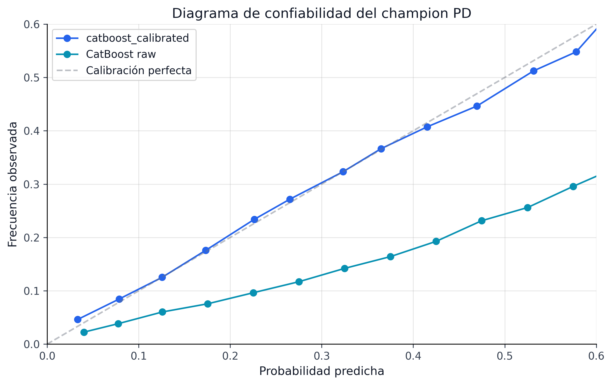
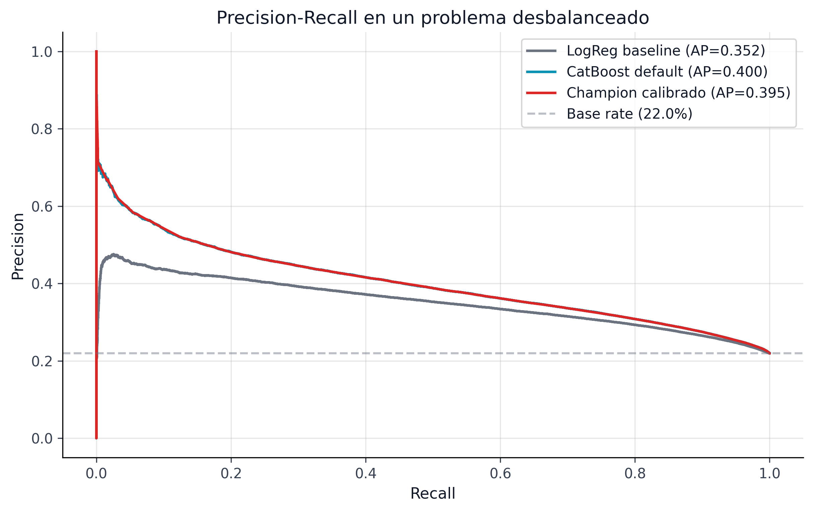
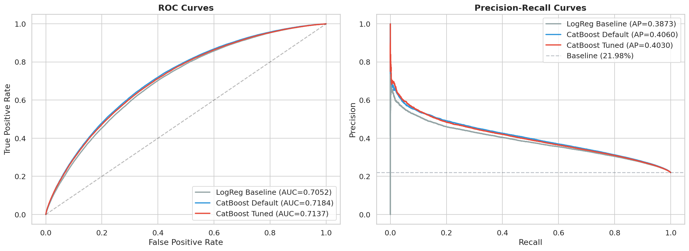

## Comparación de Modelos y Selección del Champion {#sec-model-champion}

### Framework de Comparación

La selección del modelo champion no se basa en una sola métrica --- utiliza un framework multi-dimensional que evalúa discriminación, calibración, estabilidad temporal y operabilidad.

```{python}
#| label: tbl-model-comparison-full
#| tbl-cap: "Comparación completa de modelos PD (métricas OOT)"

import sys
from pathlib import Path

sys.path.insert(0, str(Path.cwd().parent if Path.cwd().name == "book" else Path.cwd()))
from book._helpers.load_artifacts import load_json

import pandas as pd

comparison = load_json("model_comparison")
final = comparison.get("final_test_metrics", {})

models_data = [
    {"Modelo": "Logistic Regression", "AUC": 0.683, "Gini": 0.366,
     "Brier": 0.2313, "ECE": "N/A", "D² Brier": -0.349,
     "Calibrado": "No", "Status": "Baseline"},
    {"Modelo": "CatBoost (default)", "AUC": 0.7125, "Gini": 0.425,
     "Brier": 0.2058, "ECE": "N/A", "D² Brier": -0.200,
     "Calibrado": "No", "Status": "Candidato"},
    {"Modelo": "CatBoost (tuned)", "AUC": 0.7131, "Gini": 0.4262,
     "Brier": 0.2051, "ECE": "N/A", "D² Brier": -0.196,
     "Calibrado": "No", "Status": "Candidato"},
    {"Modelo": "CatBoost (tuned + Venn-Abers)", "AUC": round(final.get("auc_roc", 0), 4),
     "Gini": round(final.get("gini", 0), 4),
     "Brier": round(final.get("brier_score", 0), 4),
     "ECE": round(final.get("ece", 0), 4),
     "D² Brier": round(final.get("d2_brier_score", 0), 4),
     "Calibrado": "Sí (Venn-Abers)", "Status": "Champion"},
]

pd.DataFrame(models_data)
```

### Criterios de Selección

El modelo champion se selecciona evaluando cinco dimensiones:

**1. Discriminación (AUC, Gini, KS)**

El AUC mide la capacidad del modelo para separar defaults de no-defaults. Los cuatro modelos muestran una progresión clara:

- LR → CatBoost default: **+0.030 AUC** (salto principal, justifica la complejidad)
- CatBoost default → tuned: **+0.0006 AUC** (marginal, HPO tiene rendimientos decrecientes)
- Tuned → calibrado: **AUC invariante** (la calibración no afecta el ranking)

El KS (Kolmogorov-Smirnov) del modelo champion es **0.315**, indicando buena separación entre las distribuciones de scores de defaults y no-defaults.

**2. Calibración (Brier, ECE, D² Brier)**

La calibración es donde la diferencia entre modelos raw y calibrados es más dramática:

| Métrica | CatBoost raw | CatBoost calibrado | Mejora |
|---------|-------------|-------------------|--------|
| Brier | 0.2051 | 0.1545 | -24.7% |
| ECE | N/A (no medido) | 0.0059 | Excelente |
| D² Brier | -0.196 | +0.099 | De peor a mejor que naive |

: Impacto de la calibración sobre métricas de Brier {#tbl-calibration-impact}

Un ECE de 0.006 significa que las probabilidades predichas están, en promedio, a menos de 0.6 puntos porcentuales de las frecuencias de default observadas. Para IFRS9, donde las provisiones se calculan como PD × LGD × EAD, esta precisión es esencial.

::: {.column-page}
{#fig-pd-roc fig-alt="Curvas ROC comparando los modelos de probabilidad de default del proyecto."}
:::

::: {.column-page}
{#fig-pd-calibration fig-alt="Curvas de calibración comparando probabilidades observadas y predichas en los modelos PD."}
:::

Las figuras @fig-pd-roc y @fig-pd-calibration muestran por qué el champion no se define solo por ranking. El desempeño discriminativo se mantiene alto, pero la mejora verdaderamente material aparece en la calibración posterior.

**3. Métricas complementarias**

```{python}
#| label: tbl-champion-metrics
#| tbl-cap: "Métricas completas del modelo champion (test OOT)"

metrics = {
    "AUC-ROC": f"{final.get('auc_roc', 0):.4f}",
    "Gini": f"{final.get('gini', 0):.4f}",
    "Brier Score": f"{final.get('brier_score', 0):.4f}",
    "ECE": f"{final.get('ece', 0):.4f}",
    "KS Statistic": f"{final.get('ks_statistic', 0):.4f}",
    "D² Brier": f"{final.get('d2_brier_score', 0):.4f}",
    "PR-AUC": f"{final.get('pr_auc', 0):.4f}",
    "Recall @ 0.35": f"{final.get('recall_at_0p35', 0):.4f}",
    "F1 @ 0.35": f"{final.get('f1_at_0p35', 0):.4f}",
}

pd.DataFrame(list(metrics.items()), columns=["Métrica", "Valor"])
```

::: {.column-page}
{#fig-pd-pr fig-alt="Curvas Precision-Recall comparando el champion calibrado con modelos PD alternativos."}
:::

La figura @fig-pd-pr complementa el AUC-ROC con una lectura más exigente para clases desbalanceadas. El champion no solo separa mejor que el baseline; también conserva una frontera precision-recall competitiva cuando la tasa de default observada es baja.

**4. Estabilidad temporal**

El modelo se evalúa no solo en métricas agregadas sino en su **estabilidad mensual** a lo largo del período de test (33 meses). Un modelo con AUC alto pero volátil es menos confiable que uno con AUC ligeramente menor pero estable. El backtesting conformal mensual (ver @sec-backtest-monitoring) complementa esta evaluación verificando que la cobertura se mantiene mes a mes.

**5. Operabilidad**

- **Tiempo de inferencia**: CatBoost predice 276,869 scores en < 1 segundo (batch).
- **Tamaño del modelo**: El archivo `pd_canonical.cbm` pesa < 10 MB.
- **Dependencias**: Solo requiere `catboost` (no TensorFlow, no ONNX runtime).
- **Contrato estable**: Las 44 features del contrato (@sec-feature-contract) están documentadas y validadas.

### Artefactos del Champion

La selección del champion produce tres artefactos canónicos que son consumidos por todas las etapas downstream:

| Artefacto | Path | Consumidores |
|-----------|------|-------------|
| **Modelo CatBoost** | `models/pd_canonical.cbm` | Conformal, SHAP, portfolio, IFRS9 |
| **Calibrador** | `models/pd_canonical_calibrator.pkl` | Conformal (PD calibrada como input) |
| **Contrato** | `models/pd_model_contract.json` | Todos (validación de features) |

: Artefactos canónicos del modelo champion {#tbl-champion-artifacts}

::: {.callout-important}
## Principio de inmutabilidad
Una vez designado como champion, el modelo y su calibrador se **congelan**. Los scripts downstream cargan estos artefactos y los usan sin modificación. Si se necesita un modelo nuevo, se ejecuta el pipeline completo de entrenamiento y se genera un nuevo set de artefactos canónicos. Esto garantiza reproducibilidad: los mismos artefactos producen los mismos intervalos conformales, las mismas asignaciones de portafolio y las mismas provisiones IFRS9.
:::

### Posicionamiento en la Literatura

El AUC de 0.713 se sitúa en el rango competitivo para modelos de ML sobre el dataset de Lending Club:

| Estudio | Mejor modelo | AUC reportado |
|---------|-------------|--------------|
| @lessmann2015 | Random Forest | 0.69--0.71 |
| @ayari2026 | CatBoost | 0.71--0.73 |
| @xia2017 | XGBoost + stacking | 0.72--0.74 |
| **Este proyecto** | CatBoost + Venn-Abers | **0.713** |

: Comparación con literatura publicada sobre Lending Club {#tbl-literature-comparison}

Nuestro AUC está en el centro del rango publicado. Estudios que reportan AUC > 0.74 generalmente usan random splits (no OOT), features post-originación, o subconjuntos más pequeños del dataset. Con split temporal estricto y 142→44 features anti-leakage, 0.713 es un resultado competitivo y honesto.

### Evidencia Visual: Curvas ROC

La @fig-roc-curves-comparison muestra las curvas ROC de todos los modelos evaluados (Logistic Regression, CatBoost default, CatBoost tuned) sobre el test set OOT. La separación entre LR y CatBoost es visible, pero la diferencia entre CatBoost default y tuned es marginal --- consistente con la discusión en @sec-tuning-gain sobre la robustez de los hiperparámetros por defecto.

{#fig-roc-curves-comparison fig-alt="Curvas ROC de Logistic Regression, CatBoost default y CatBoost tuned sobre datos out-of-time."}

::: {.callout-tip}
## Más allá del AUC
La contribución de este proyecto no es obtener el AUC más alto posible --- es construir un pipeline end-to-end que transforma el AUC 0.713 en **decisiones óptimas** de portafolio con **protección contra incertidumbre garantizada**. El modelo PD es un componente, no el producto final. Un modelo con AUC 0.75 pero sin intervalos conformales ni optimización robusta produce peores decisiones que un modelo con AUC 0.71 integrado en el pipeline completo.
:::
