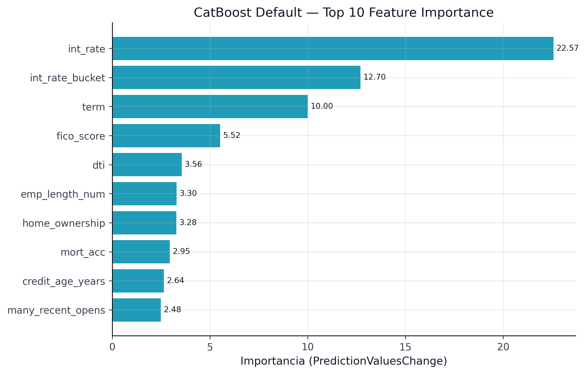



El modelo de Probabilidad de Default (PD) es la pieza predictiva del pipeline histórico. Este capítulo documenta la estrategia ejecutada: desde el baseline interpretable de regresión logística hasta CatBoost optimizado con Optuna, pasando por la selección automática del calibrador y la etiqueta local `champion`. Esa etiqueta describe un freeze de artefactos del repositorio padre, no una selección vigente ni una recomendación de despliegue.

La estrategia de modelado sigue un principio de **complejidad incremental**:

{fig-alt="Top 10 de importancia de variables del modelo de probabilidad de default congelado históricamente."}

La ROC legacy se conserva en `book/assets/` y se omite de la landing: su título
presenta “modelos PD candidatos” y “OOT” sin declarar score legacy ni la
reutilización de la partición temporal.

```{python}
#| label: tbl-model-overview
#| tbl-cap: "Resumen de modelos PD evaluados"

import sys
from pathlib import Path

sys.path.insert(0, str(Path.cwd().parent if Path.cwd().name == "book" else Path.cwd()))
from book._helpers.load_artifacts import load_json

import pandas as pd

comparison = load_json("model_comparison")
models = comparison.get("models", [])

cols = ["model", "auc", "gini", "brier", "d2_brier"]
df_models = pd.DataFrame(models)[[c for c in cols if c in pd.DataFrame(models).columns]]
df_models.columns = ["Modelo", "AUC", "Gini", "Brier", "D² Brier"][:len(df_models.columns)]
df_models
```

Cada modelo se comparó sobre la partición temporal etiquetada `test OOT` (2018--2020), separada de entrenamiento y validación dentro del diseño histórico. Como el corte se definió y analizó retrospectivamente sobre datos ya observados, las métricas son evidencia temporal interna; no constituyen una prueba prospectiva ni externa.

La idea editorial de esta landing es simple: primero ver si el ranking funciona, luego verificar si la probabilidad quedó bien calibrada. En riesgo crediticio, un modelo con buen ranking pero mala calibración sigue siendo una base frágil para provisiones, umbrales y decisiones downstream.

```{=html}
<div class="chapter-landing-grid">
  <div class="chapter-card"><h4><a href="06a-logistic-regression-baseline.html">19. LR Baseline</a></h4><p>Lower bound interpretable y preprocesamiento mínimo.</p></div>
  <div class="chapter-card"><h4><a href="06b-catboost-tuned.html">20. CatBoost Tuned</a></h4><p>HPO, manejo nativo de categorías y freeze predictivo local.</p></div>
  <div class="chapter-card"><h4><a href="06c-calibration-selection.html">21. Calibración</a></h4><p>Platt, Isotonic y Venn-Abers bajo validación temporal.</p></div>
  <div class="chapter-card"><h4><a href="06d-model-comparison-champion.html">22. Champion</a></h4><p>Etiqueta histórica, contrato de procedencia y métricas temporales retrospectivas.</p></div>
</div>
```

::: {.callout-tip .chapter-close}
## Qué debes quedarte

El freeze local etiquetó CatBoost calibrado como `champion`; sus métricas en una
partición temporal retrospectiva no seleccionan el modelo vigente ni prueban
desempeño prospectivo.

## Esto conecta con…

Los scores alimentaron intervalos de $Y$ y simuladores de optimización. Esa
composición no crea intervalos para PD latente ni garantías de decisión.

## Dónde se reutiliza esta señal o artefacto

`model_comparison.json` y `pd_training_record.pkl` preservan procedencia para
explicabilidad, checks MRM y backtesting; no fijan claims actuales de los papers.
:::
