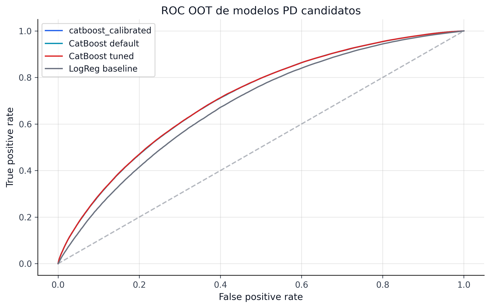

El modelo de Probabilidad de Default (PD) es el corazón predictivo del pipeline. Este capítulo documenta la estrategia completa de modelado: desde el baseline interpretable de regresión logística hasta el modelo CatBoost optimizado con Optuna, pasando por la selección automática del calibrador y la designación del modelo champion.

La estrategia de modelado sigue un principio de **complejidad incremental**:

{fig-alt="Top 10 de importancia de variables del modelo champion de probabilidad de default."}

{fig-alt="Curvas ROC comparando los modelos principales de probabilidad de default."}

```{python}
#| label: tbl-model-overview
#| tbl-cap: "Resumen de modelos PD evaluados"

import sys
from pathlib import Path

sys.path.insert(0, str(Path.cwd().parent if Path.cwd().name == "book" else Path.cwd()))
from book._helpers.load_artifacts import load_json

import pandas as pd

comparison = load_json("model_comparison")
models = comparison.get("models", [])

df_models = pd.DataFrame(models)[["model", "calibrated", "auc", "gini", "brier", "d2_brier"]]
df_models.columns = ["Modelo", "Calibrado", "AUC", "Gini", "Brier", "D² Brier"]
df_models
```

Cada modelo se evalúa exclusivamente sobre el set de test OOT (2018--2020), nunca sobre datos de entrenamiento o validación. Las métricas reflejan rendimiento prospectivo genuino.

La idea editorial de esta landing es simple: primero ver si el ranking funciona, luego verificar si la probabilidad quedó bien calibrada. En riesgo crediticio, un modelo con buen ranking pero mala calibración sigue siendo una base frágil para provisiones, umbrales y decisiones downstream.

```{=html}
<div class="chapter-landing-grid">
  <div class="chapter-card"><h4><a href="06a-logistic-regression-baseline.html">19. LR Baseline</a></h4><p>Lower bound interpretable y preprocesamiento mínimo.</p></div>
  <div class="chapter-card"><h4><a href="06b-catboost-tuned.html">20. CatBoost Tuned</a></h4><p>HPO, manejo nativo de categorías y champion predictivo.</p></div>
  <div class="chapter-card"><h4><a href="06c-calibration-selection.html">21. Calibración</a></h4><p>Platt, Isotonic y Venn-Abers bajo validación temporal.</p></div>
  <div class="chapter-card"><h4><a href="06d-model-comparison-champion.html">22. Champion</a></h4><p>Selección final, contrato canónico y métricas OOT.</p></div>
</div>
```


