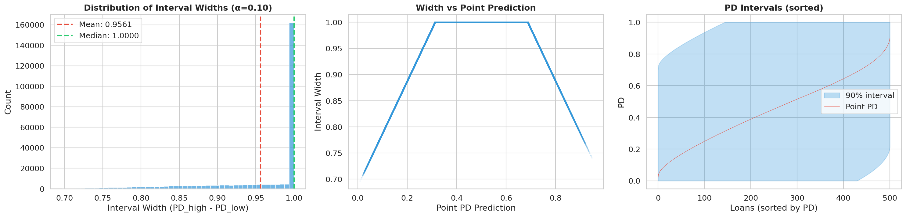

## CQR y Benchmark de Variantes {#sec-cqr-variants}

### Más Allá del Split Conformal Estándar

El split conformal con residuos absolutos produce intervalos de **ancho constante** para todas las observaciones dentro de un grupo. El **Conformalized Quantile Regression** (CQR) [@romano2019] produce intervalos **adaptativos** que se ensanchan donde el modelo es más incierto:

$$
C_\alpha(x) = [\hat{q}_{\alpha/2}(x) - \hat{q}, \hat{q}_{1-\alpha/2}(x) + \hat{q}]
$$ {#eq-cqr}

donde $\hat{q}_{\alpha/2}(x)$ y $\hat{q}_{1-\alpha/2}(x)$ son las predicciones de un modelo de cuantiles, y $\hat{q}$ es la corrección conformal que garantiza cobertura.

### Las 7 Variantes Evaluadas

El pipeline evalúa un benchmark completo de variantes conformal para seleccionar la óptima:

```{python}
#| label: tbl-variant-benchmark
#| tbl-cap: "Benchmark de 7 variantes conformal (test OOT, α=0.10)"

import sys
from pathlib import Path

sys.path.insert(0, str(Path.cwd().parent if Path.cwd().name == "book" else Path.cwd()))
from book._helpers.load_artifacts import load_parquet

import pandas as pd

df = load_parquet("conformal_variant_selection_report")

cols = ["variant", "coverage", "avg_width", "min_group_coverage",
        "winkler_90", "promotion_pass", "selection_rank"]
available = [c for c in cols if c in df.columns]
display = df[available].copy()
display.columns = [c.replace("_", " ").title() for c in available]
display
```

::: {.column-page}
{#fig-interval-width-distribution fig-alt="Distribución de anchos de intervalos conformales para variantes evaluadas."}
:::

La figura @fig-interval-width-distribution ayuda a leer el benchmark con una lente adicional: no basta cubrir, también importa cuánta resolución práctica conservan los intervalos.

### Descripción de Variantes

**1. Score Decile Mondrian** (Rank 1 — Seleccionado)

Particiona por deciles del score predicho en lugar de por grade. Produce 10 grupos homogéneos en score, lo que captura la heterogeneidad de incertidumbre directamente desde el modelo.

**2. Cross Conformal Score-Space**

Usa validación cruzada con un regresor lineal ligero en el espacio de scores, evitando reentrenar CatBoost. Cobertura 90.2% pero menor estabilidad por grupo (min 85.8%).

**3. Global Split** (Baseline)

Split conformal sin partición. Cobertura marginal 89.6% pero min por grade de solo 59.5% — inaceptable para uso en producción.

**4-5. Mondrian Unscaled / Scaled**

Mondrian por grade con y sin escalado de scores. Cobertura 89.3% con min por grade de 84.6% — mejor que global pero inferior al score-decile.

**6. Grade × Scoreband Mondrian**

Partición fina (grade × bandas de score): ~42 grupos. Cobertura 91.5% pero 23 grupos requieren fallback por tamaño insuficiente, y min por grupo cae a 75.6%.

**7. Mondrian Selected Config**

Configuración con alpha ajustado a 0.07 y min_group_size de 4,000. Cobertura 93.5% — sobre-cubre significativamente, con intervalos excesivamente anchos (Winkler 1.04).

El patrón que emerge de las 7 variantes es claro: las variantes que intentan cobertura global sin partición (Global Split) fallan en los extremos del espectro de riesgo, mientras que las variantes con particiones demasiado finas (Grade × Scoreband) sufren por tamaño de muestra insuficiente y requieren fallbacks que degradan la garantía formal. Las variantes Mondrian con particiones moderadas (grade o score-decile) ocupan el punto óptimo: suficiente granularidad para capturar la heterogeneidad de riesgo entre segmentos, sin fragmentar la muestra de calibración hasta el punto de comprometer la estabilidad del cuantil. La configuración con alpha ajustado (variante 7) ilustra un anti-patrón importante: sobre-cubrir no es gratis, porque intervalos más anchos reducen la utilidad informativa de la banda para decisiones downstream de optimización y provisiones.

### Criterios de Selección

La selección sigue un orden lexicográfico de prioridades:

1. **Cobertura ≥ target** (90%): elimina variantes sub-cobertura
2. **Min group coverage ≥ 85%**: garantiza equidad por segmento
3. **Menor Winkler score**: mide eficiencia (penaliza intervalos anchos)
4. **Estabilidad temporal**: baja varianza mensual

::: {.callout-note}
## Winkler Score
El Winkler score [@winkler1972] penaliza simultáneamente intervalos que no cubren (penalidad por miss) e intervalos excesivamente anchos. Para un intervalo $[l, u]$ y valor verdadero $y$:

$$
W = \begin{cases}
(u - l) + \frac{2}{\alpha}(l - y) & \text{si } y < l \\
(u - l) & \text{si } l \leq y \leq u \\
(u - l) + \frac{2}{\alpha}(y - u) & \text{si } y > u
\end{cases}
$$ {#eq-winkler}

Menor Winkler = intervalos más estrechos que aún cubren correctamente.
:::

### El Score-Decile Mondrian como Champion

El benchmark inicial ya favorecía a `score_decile_mondrian`, y la reapertura final confirmó esa decisión sobre OOT completo. La tabla siguiente resume las métricas del winner **ya promovido** en el cierre del proyecto, no solo el snapshot preliminar del benchmark de 7 variantes:

| Propiedad | Valor | Interpretación |
|-----------|-------|---------------|
| Cobertura empírica | 92.97% | +2.97pp sobre target |
| Min group coverage | 91.90% | Cobertura útil en todos los grupos efectivos |
| Ancho promedio | 0.784 | Banda todavía informativa |
| Winkler | 1.111 | Buen equilibrio entre cobertura y sharpness |
| Fallback groups | 0 | Todos los grupos promovidos son viables |

: Propiedades del score-decile Mondrian {#tbl-champion-variant}

::: {.callout-tip}
## Un winner final y un baseline necesario
El benchmark original sí justificó mantener **grade Mondrian** como baseline operativo/regulatorio porque sus grupos (A-G) son legibles para negocio, IFRS9 y gobernanza. Pero esa utilidad interpretativa no lo convierte en co-winner.

La lectura correcta del proyecto es esta:

- `score_decile_mondrian` es el **winner final único** de la capa conformal;
- `grade Mondrian` sigue siendo el **baseline natural e interpretable** que justifica la partición Mondrian en crédito;
- la coexistencia no es de campeones, sino de **roles**: baseline explicativo versus variante objetivamente promovida.

Esto elimina la ambigüedad “ganó el benchmark pero no se usa”. El proyecto sí usa `score_decile_mondrian` como winner final; mantiene `grade` porque su semántica de negocio sigue siendo necesaria para explicar y auditar por qué Mondrian tiene sentido.
:::

### Predicción por Conjuntos para Clasificación Binaria {#sec-classification-sets}

Los intervalos de predicción son la herramienta adecuada cuando necesitamos una *banda de incertidumbre* en torno a la PD. Pero existe otra forma de cuantificar incertidumbre en clasificación binaria: los **conjuntos de predicción** (*prediction sets*). En lugar de un intervalo `[PD_low, PD_high]`, un conjunto de predicción entrega un subconjunto de las clases posibles `{0}`, `{1}`, o `{0,1}`:

- **`{1}`** — el modelo está seguro de que es un default
- **`{0}`** — el modelo está seguro de que no hay default
- **`{0,1}`** — el modelo es ambiguo: no puede descartar ninguna clase
- **`{}`** — conjunto vacío (cobertura excesiva, raro)

Para crédito, el caso `{0,1}` es operativamente valiosa: identifica préstamos donde la incertidumbre del modelo es tan alta que la decisión debería ser derivada a revisión manual o rechazada automáticamente. Es una forma fundamentada de **abstención**.

El benchmark usa `SplitConformalClassifier` de MAPIE 1.3.0 con el score de conformidad LAC (*Least Ambiguous Classification*). Los métodos APS y RAPS no están disponibles en la versión actual del entorno — LAC sirve como referencia principal.

```{python}
#| label: tbl-classification-sets
#| tbl-cap: "Benchmark de predicción por conjuntos (LAC, SplitConformalClassifier) sobre test OOT"

import sys
from pathlib import Path
sys.path.insert(0, str(Path.cwd().parent if Path.cwd().name == "book" else Path.cwd()))
from book._helpers.load_artifacts import try_load_json
import pandas as pd

status = try_load_json("classification_set_benchmark_status", default={})
summary = status.get("summary_at_90", {})

rows = []
for method, metrics in summary.items():
    rows.append({
        "Método": method.upper(),
        "Cobertura empírica": f"{metrics['empirical_coverage']:.2%}",
        "Tamaño medio del conjunto": f"{metrics['mean_set_size']:.3f}",
        "% ambiguos {0,1}": f"{metrics['pct_ambiguous']:.1f}%",
        "Nivel de confianza": "90%",
    })

if not rows:
    rows = [{"Estado": "Benchmark no disponible — ejecutar run_classification_set_benchmark.py"}]

pd.DataFrame(rows)
```

::: {.callout-note}
## Interpretación del 36% de conjuntos ambiguos

Con LAC al 90% de confianza, aproximadamente **36% de los préstamos OOT reciben el conjunto `{0,1}`** — el modelo no puede distinguir con suficiente certeza entre default y no-default para asignar una clase única. Esto no es un fallo; es información.

En contexto de originación: 36% de préstamos en la cola de incertidumbre alta son candidatos naturales para revisión manual, precio ajustado por riesgo, o límite de exposición reducido. El 64% restante tiene asignación unívoca y puede procesarse con mayor automatización.

La cobertura de 87.35% está ligeramente por debajo del 90% nominal — una discrepancia pequeña atribuible a la naturaleza discreta del score LAC (opera sobre clases, no continuo), que genera cuantiles más conservadores. Este es un comportamiento esperado y documentado del SplitConformalClassifier con LAC en problemas binarios con alto desbalance de clases.
:::
