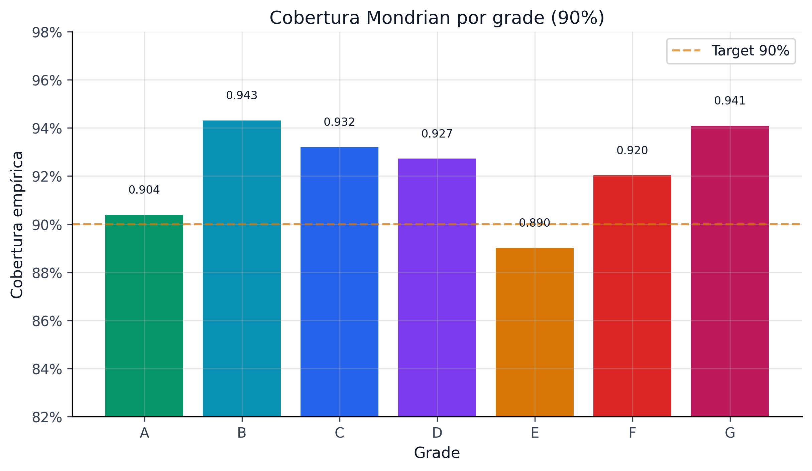
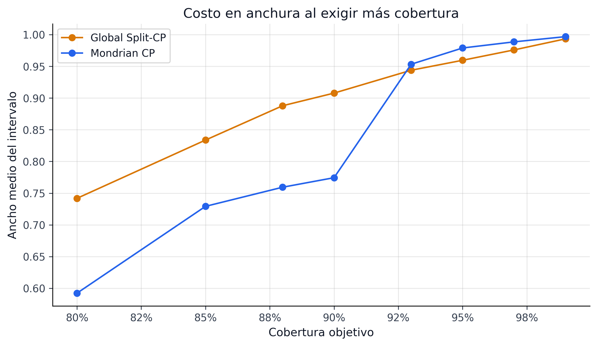



El modelo PD histórico produce un score calibrado. La capa conformal construye
endpoints con residuos contra el outcome binario y debe evaluarse respecto de
ese mismo objeto.

La **predicción conformal** controla cobertura del futuro $Y$ en muestra finita
bajo intercambiabilidad [@vovk2005]. “Distribution-free” no significa
assumption-free: ni el shift temporal ni la selección posterior de modelos o
policies quedan cubiertos por el teorema básico.

```{python}
#| label: tbl-conformal-overview
#| tbl-cap: "Métricas históricas de cobertura del artefacto local (test OOT)"

import sys
from pathlib import Path

sys.path.insert(0, str(Path.cwd().parent if Path.cwd().name == "book" else Path.cwd()))
from book._helpers.load_artifacts import load_json

import pandas as pd

status = load_json("conformal_policy_status", search_models=True)

overview = [
    {"Métrica": "Cobertura empírica @ 90%", "Valor": f"{status['coverage_90']:.2%}"},
    {"Métrica": "Cobertura empírica @ 95%", "Valor": f"{status['coverage_95']:.2%}"},
    {"Métrica": "Ancho promedio @ 90%", "Valor": f"{status['avg_width_90']:.4f}"},
    {"Métrica": "Cobertura mínima por grupo @ 90%", "Valor": f"{status['min_group_coverage_90']:.2%}"},
    {"Métrica": "Winkler score @ 90%", "Valor": f"{status['winkler_90']:.4f}"},
    {"Métrica": "Overall pass", "Valor": str(status.get('overall_pass', status['strict_overall_pass']))},
    {"Métrica": "Strict overall pass", "Valor": str(status['strict_overall_pass'])},
    {"Métrica": "Alertas críticas", "Valor": str(status['critical_alerts'])},
    {"Métrica": "Alertas warning", "Valor": str(status['warning_alerts'])},
    {"Métrica": "Tamaño de muestra (test OOT)", "Valor": f"{status['statistical_tests']['kupiec_90']['n_total']:,}"},
]

pd.DataFrame(overview)
```

{#fig-conformal-coverage-grade fig-alt="Cobertura empírica del resultado binario por grade en el test temporal Lending Club."}

{#fig-conformal-width-tradeoff fig-alt="Relación entre cobertura objetivo y ancho promedio de los intervalos conformales."}

Las figuras @fig-conformal-coverage-grade y @fig-conformal-width-tradeoff
permiten auditar geometría y heterogeneidad. No prueban que los endpoints sean
PD ni que resulten económicamente utilizables.

| Chequeo diagnóstico | Qué describe | Por qué importa |
|---|---|---|
| cobertura global | frecuencia empírica de $Y$ dentro del intervalo | contrasta el target nominal bajo transporte temporal |
| cobertura mínima por grupo | heterogeneidad descriptiva entre grades | evita que el promedio esconda fallos locales |
| ancho promedio | geometría de los endpoints | detecta intervalos triviales o poco discriminantes |
| alertas de backtesting | estabilidad descriptiva en el tiempo | señala shift; no restaura intercambiabilidad |

: Checklist editorial de diagnóstico conformal en el pipeline {#tbl-conformal-checklist}

Este capítulo documenta el contrato teórico, la implementación histórica y sus
límites: split conformal, calibración por grupos, benchmarks, backtesting
temporal y extensiones con targets distintos como LGD/EAD.

```{=html}
<div class="chapter-landing-grid">
  <div class="chapter-card"><h4><a href="07a-split-conformal-basics.html">24. Split Conformal</a></h4><p>Garantía finita, API MAPIE y scores de no conformidad.</p></div>
  <div class="chapter-card"><h4><a href="07b-mondrian-group-conditional.html">Mondrian</a></h4><p>Contrato por grade bajo intercambio dentro del grupo.</p></div>
  <div class="chapter-card"><h4><a href="07c-cqr-variants-benchmark.html">Variantes</a></h4><p>Benchmark descriptivo y trade-offs sin promoción.</p></div>
  <div class="chapter-card"><h4><a href="07d-backtest-monitoring.html">27. Monitoreo</a></h4><p>Backtest mensual, alertas y diagnóstico de transporte.</p></div>
  <div class="chapter-card"><h4><a href="07e-lgd-ead-conformal.html">28. LGD / EAD</a></h4><p>Prototipos históricos y requisitos antes de cualquier extensión.</p></div>
</div>
```

::: {.callout-tip .chapter-close}
## Qué debes quedarte

Con labels binarios, la capa conformal produce intervalos predictivos para
$Y$. La cobertura finita exige intercambiabilidad y no cubre PD latente.

## Esto conecta con…

Portafolio, SICR y ECL son experimentos downstream con estimandos propios; no
heredan automáticamente cobertura conformal.

## Dónde se reutiliza esta señal o artefacto

El contrato de estimando, geometría y transporte permite leer críticamente
Paper 2, Paper 4 y el CRPTO externo.
:::
