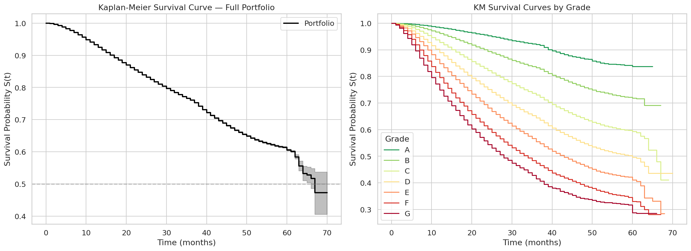



## Análisis de Supervivencia {#sec-survival}

### De la PD Puntual a la PD Temporal

Un score binario resume riesgo bajo un horizonte y no identifica *cuándo*
ocurriría un incumplimiento. Dos préstamos con el mismo score pueden tener
trayectorias temporales distintas; traducirlas a pérdida económica requiere
flujos de caja y un estimando adicional.

El análisis de supervivencia modela el **tiempo hasta el evento**. En términos
pedagógicos puede informar seguimiento, valoración o IFRS9, pero las curvas
locales de esta página son artefactos históricos y no inputs validados para:

- **IFRS9 Stage 2**: construcción de PD lifetime bajo un contrato contable propio;
- **Priorización de seguimiento**: diseño de una regla de intervención y su utilidad;
- **Valoración de cartera**: incorporación explícita de flujos de caja y descuento.

### Modelos Implementados

Los modelos temporales responden preguntas distintas. Cox facilita una lectura
asociativa de covariables y RSF captura no linealidades; ninguno explica
causalmente el fenómeno ni produce, con estos artefactos, curvas IFRS9 validadas.

#### Cox Proportional Hazards

El modelo de Cox PH [@cox1972] estima asociaciones condicionales con el
**hazard** de default. Un hazard ratio mayor o menor que 1 ordena el hazard bajo
el modelo; no identifica el efecto causal de intervenir la covariable ni el
tiempo esperado de default.

::: {.callout-note}
## Supuesto de proporcionalidad
El modelo Cox PH asume hazards proporcionales. `check_assumptions()` y los tests
de Schoenfeld diagnostican compatibilidad con ese supuesto; no lo validan. Si
hay evidencia de violación, RSF evita esa restricción funcional, aunque requiere
su propia validación.
:::

#### Random Survival Forest (RSF)

El Random Survival Forest [@ishwaran2008] complementa a Cox PH porque no obliga al modelo a comportarse de forma lineal ni a mantener el mismo patrón a lo largo del tiempo. En este libro lo usamos como la opción más flexible para capturar interacciones entre plazo, tasa, score e historial.

La métrica de evaluación es el **C-index** (concordancia de Harrell): resume el
orden de tiempos observados bajo el manejo de censura declarado. El snapshot
histórico de RSF reportó **C-index = 0.6797** en su conjunto OOT. La cifra no
valida una PD lifetime o uso productivo.

### Riesgos Competitivos y la Función de Incidencia Acumulada

Un préstamo no solo puede hacer default: también puede **prepagar** antes de su
vencimiento. Estos eventos compiten. Kaplan--Meier y una CIF responden objetos
distintos; interpretar uno como riesgo de default en presencia de prepago puede
sobreestimar la incidencia acumulada del evento.

::: {.callout-warning}
## KM vs CIF en el snapshot histórico
En el artefacto histórico, Kaplan--Meier produjo una incidencia 26.7% mayor que
la CIF bajo las convenciones implementadas; el pipeline tradujo esa diferencia
en **\$125.8M** mediante una simulación ECL. Son cifras diagnósticas, no una
reserva contable validada. La elección entre objetos debe seguir el estimando y
un panel a *reporting date*; véase @sec-competing-risks.
:::

{#fig-kaplan-meier fig-alt="Curvas Kaplan-Meier y funciones de supervivencia para segmentos del dataset Lending Club."}

La figura @fig-kaplan-meier aterriza la intuición temporal: no basta con saber quién es riesgoso; importa cuándo emerge ese riesgo y cómo difiere entre segmentos.

| Dos préstamos con la misma PD puntual | Lectura temporal |
|---|---|
| Score = 10%, con masa de evento en meses tempranos | horizonte distinto; su efecto económico o sobre Stage 2 requiere un estimando adicional |
| Score = 10%, con masa de evento más tardía | misma etiqueta puntual, sin inferencia prudencial automática |

: Ejemplo divulgativo: misma PD, distinto impacto temporal {#tbl-same-pd-different-time}

### Prototipo histórico de curvas de PD lifetime

La función histórica `generate_lifetime_pd_curve()` genera curvas acumuladas a
intervalos de 30 días hasta 5 años. La salida es un prototipo técnico; no es por
sí sola un input de ECL lifetime o Stage 2 validado:

$$
\text{PD}_{\text{lifetime}}(t) = 1 - S(t \mid \mathbf{x})
$$

```{python}
#| label: tbl-survival-summary
#| tbl-cap: "Resumen de modelos de supervivencia y métricas clave"

import sys
from pathlib import Path

sys.path.insert(0, str(Path.cwd().parent if Path.cwd().name == "book" else Path.cwd()))
from book._helpers.load_artifacts import try_load_json

import pandas as pd

summary = try_load_json("pipeline_summary")
surv = summary.get("survival", {})

rows = [
    {"Modelo": "Cox PH", "Tipo": "Semi-paramétrico",
     "C-index": f"{surv.get('cox_concordance', 0):.4f}",
     "Ventaja": "Interpretable (hazard ratios)", "Limitación": "Supuesto de proporcionalidad"},
    {"Modelo": "RSF (500 árboles)", "Tipo": "Ensemble no paramétrico",
     "C-index": f"{surv.get('rsf_concordance', 0):.4f}",
     "Ventaja": "Captura no-linealidades", "Limitación": "Menos interpretable"},
    {"Modelo": "CIF (Aalen-Johansen)", "Tipo": "No paramétrico",
     "C-index": "---",
     "Ventaja": "Estima la CIF bajo sus supuestos", "Limitación": "No condicional a covariables"},
]

pd.DataFrame(rows)
```

::: {.callout-tip}
## Conexión histórica con el pipeline
El pipeline local conectó estas curvas con la simulación ECL de
@sec-ecl-calculation. La diferencia de \$125.8M conserva procedencia de esa
simulación y no prueba que una “corrección” evite sobreprovisión. Hazard ratios y
SHAP son lecturas asociativas distintas; su coincidencia no identifica drivers
causales.
:::

### Exportación de Curvas KM y Tests Log-Rank

La función `fit_kaplan_meier()` ajusta estimadores KM por grade y ejecuta tests
*log-rank* pareados. Esos tests diagnostican diferencias entre curvas bajo sus
supuestos; no justifican por sí solos una partición Mondrian ni garantizan
cobertura condicional o PD lifetime.

Los CSV exportados preservan curvas y p-values como evidencia reproducible del
análisis histórico, no como validación de gobernanza o despliegue.
