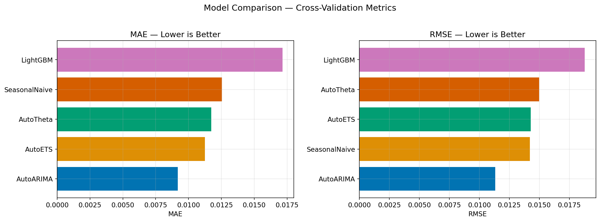



## Series de Tiempo: Vintage Diagnostic {#sec-time-series}

La serie local agrega outcomes terminales por fecha de originación. No es una
serie de defaults observados por mes calendario ni un panel point-in-time. Un
forecast sobre ella describe vintages resueltos y está expuesto a madurez
diferencial; no debe presentarse como pronóstico macro o IFRS9.

{fig-alt="Comparación descriptiva de modelos sobre la serie de vintages."}

La vista legacy del portafolio se omite: además de llamar “monthly default
rate” a outcomes terminales por vintage, su eje de tasa tiene una escala
incorrecta. Las tablas ejecutadas son la superficie auditable.

### Estado gobernado

El artefacto `models/time_series_status.json` marca la lane como `warn`: el
intervalo no pasa el gate, la cobertura observada es insuficiente y el error
escalado no mejora de forma defendible al benchmark. Los nombres runtime
`point_champion`/`interval_champion` identifican selecciones internas, no
promoción paper-facing.

| Estado | Uso permitido |
|---|---|
| `official` | solo si target, backtest y gates predeclarados pasan |
| `warn` | diagnóstico y rediseño |
| `research_only` | exploración sin consumo downstream |

: Semántica de la lane temporal. {#tbl-ts-status-badges}

### Multiplicador histórico

El código construyó un ratio estilizado:

$$
m_t=\frac{\widehat r_t}{\bar r_{\mathrm{history}}}.
$$ {#eq-temporal-mult}

Aplicar $m_t$ a scores PD y luego a ECL es una sensibilidad mecánica. No
representa escenario macro gobernado ni una distribución predictiva de
defaults calendario.

El fan chart legacy se conserva como artefacto de procedencia, pero se retira
de la superficie activa: su texto incrustado presenta escenarios IFRS9 e
intervalos conformales que la serie resolved-only por vintage no valida.

| Horizonte | Lectura válida | Lectura inválida |
|---|---|---|
| corto | error rolling dentro del snapshot | early warning prospectivo |
| medio | sensibilidad a la especificación | estabilidad macro |
| largo | failure mode por anchura/caps | banda ECL con cobertura |

: Cómo leer el diagnóstico por horizonte. {#tbl-ts-horizon-reading}

Una lane futura requiere eventos calendarizados as-of, exposición en riesgo,
censoring y un corte prospectivo. Hasta entonces, los multiplicadores y bandas
TS→ECL permanecen fuera de Paper 2 y del CRPTO vigente.
