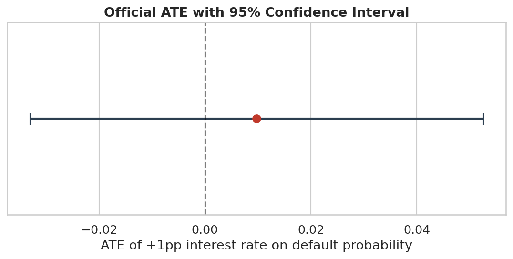
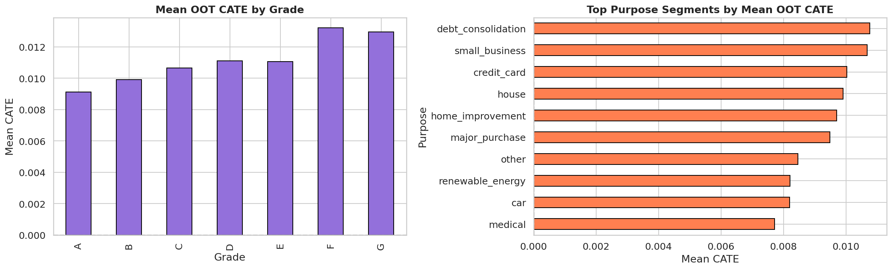
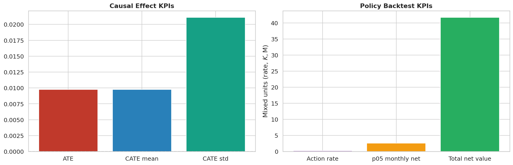

## Inferencia Causal {#sec-causal-inference}

### De Correlación a Causalidad en Riesgo de Crédito

En el dataset de Lending Club, los préstamos con tasas de interés altas tienen más defaults. Pero, la tasa alta *causa* más defaults? O simplemente se cobra más a quienes ya eran riesgosos? Responder esta pregunta requiere pasar de asociación estadística a **estimación causal**, distinguiendo la relación correlacional (útil para predicción) de la relación causal (necesaria para intervención).

Esta distinción es operativamente crítica:

- **Correlación**: "Los préstamos con tasa >20% tienen 24% de default" --- describe el pasado, útil para scoring.
- **Causalidad**: "Si movemos la tasa 1pp, el default esperado cambia en +0.00974pp" --- permite diseñar políticas de precio.

El pipeline causal combina **DoWhy** para identificación y refutación con **EconML** para estimación heterogénea, siguiendo el marco de Double Machine Learning [@chernozhukov2018].

| Pregunta | Correlación | Causalidad |
|---|---|---|
| ¿Qué describe? | cómo se movieron juntas dos variables en el pasado | qué esperamos que cambie si intervenimos una palanca |
| Ejemplo en el dataset | tasas altas aparecen junto a más defaults | mover la tasa puede cambiar el default, pero no necesariamente en la misma magnitud observada |
| Para qué sirve | scoring, segmentación, alertas | pricing, policy, experimentación, intervención |

: Correlación vs intervención en el caso Lending Club {#tbl-correlation-vs-causality}

### Grafo Causal y Estrategia de Identificación

La identificación del efecto causal requiere especificar un **DAG** (Directed Acyclic Graph) con las relaciones causales asumidas. El grafo oficial del proyecto establece:

::: {.figure-stack}

{fig-alt="Intervalo de confianza del efecto promedio de tratamiento de la tasa de interés."}

{#fig-causal-policy-backtest fig-alt="Backtest mensual de la política causal aplicada al portafolio."}

:::

La estrategia de identificación es **backdoor adjustment**: condicionando sobre los confusores (grade\_woe, purpose\_woe, home\_ownership\_woe), la asignación de tratamiento (tasa de interés) se vuelve *as-if* aleatoria, permitiendo estimar el efecto causal.

::: {.callout-note}
## Qué necesitamos asumir para leer esto como causalidad
Para interpretar estos resultados como evidencia causal y no solo como correlación, el análisis asume tres cosas razonables pero exigentes:

1. que no estamos dejando por fuera una variable decisiva que afecte tanto la tasa como el default;
2. que dentro de perfiles comparables sí existen préstamos observados con diferentes niveles de tasa;
3. que las variables usadas como control estaban disponibles cuando el préstamo se originó.

No podemos probar estos supuestos de forma absoluta, pero sí someterlos a chequeos de robustez con DoWhy.
:::

### Double Machine Learning (DML)

El framework DML [@chernozhukov2018] puede entenderse como una estrategia para hacer una comparación más justa. Primero intenta explicar, por separado, qué parte del default y qué parte de la tasa ya estaban “anticipadas” por el perfil del cliente. Luego, sobre lo que sobra después de ese ajuste, estima cuánto cambia realmente el default cuando cambia la tasa.

En este proyecto eso importa mucho porque `int_rate` no se asigna al azar: normalmente sube precisamente en los perfiles que ya eran más riesgosos. DML ayuda a descontar esa mezcla entre riesgo observado y decisión comercial antes de atribuirle a la tasa un efecto causal.

### Efecto Promedio (ATE)

El ATE estimado por DoWhy con identificación backdoor y estimación por regresión lineal es:

$$
\text{ATE} = +0.00974
$$

**Interpretación**: Un aumento de 1 punto porcentual en la tasa de interés se asocia causalmente con un incremento de **0.974 puntos porcentuales** en la probabilidad de default, controlando por grado, propósito, vivienda, DTI, ingreso, monto y FICO.

Sin embargo, el intervalo de confianza del artefacto canónico todavía cruza cero. La lectura correcta no es “efecto causal cerrado”, sino “señal positiva y operativamente útil, pero con incertidumbre suficiente para tratar el ATE agregado con cautela y apoyarse más en heterogeneidad y backtesting de política”.

### Efectos Heterogéneos (CATE) con CausalForestDML

El ATE es un promedio global, pero el efecto de la tasa puede variar sustancialmente entre segmentos. El **Conditional Average Treatment Effect** (CATE) captura esta heterogeneidad usando CausalForestDML [@athey2019]:

No hace falta seguir el detalle algebraico para captar la intuición: el modelo aprende qué parte del riesgo era “propia” del prestatario y qué parte cambia cuando movemos la palanca de precio.

Los **effect modifiers** --- variables que modulan el efecto causal --- son: `loan_amnt`, `annual_inc`, `dti` y `fico_range_low`. El modelo produce un CATE individual para cada préstamo, con intervalos de confianza al 95%.

::: {.figure-stack}

{#fig-cate-heterogeneity fig-alt="Visualización de heterogeneidad CATE por segmentos del portafolio de crédito."}

{#fig-causal-kpis fig-alt="KPIs de ATE, CATE y backtest de la política causal del proyecto."}

:::

Las figuras @fig-cate-heterogeneity y @fig-causal-kpis resumen el paso de una política única a una política segmentada: el efecto de precio no es homogéneo y, por tanto, tampoco debería serlo la respuesta comercial.

::: {.callout-tip}
## Interpretación operativa del CATE
- **CATE > 0**: Subir la tasa en ese segmento *aumenta* la probabilidad de default --- conviene no subir o incluso reducir la tasa.
- **CATE < 0**: Subir la tasa no incrementa default o puede asociarse a mejor selección adversa --- hay margen para ajustar precio.
- **CATE $\approx$ 0**: El efecto es nulo --- la tasa no es palanca relevante en ese segmento.
:::

### Política Causal y Valor Económico

La estimación CATE permite diseñar **políticas de precio segmentadas**: ajustar la tasa de interés en los segmentos donde el efecto causal es más adverso. La simulación de política sobre el conjunto OOT estima un ahorro potencial de **\$41.7M** por reducción de defaults en segmentos con CATE alto, comparado con la política uniforme actual.

```{python}
#| label: tbl-causal-summary
#| tbl-cap: "Resumen de estimación causal: ATE, CATE y refutaciones"

import sys
from pathlib import Path

sys.path.insert(0, str(Path.cwd().parent if Path.cwd().name == "book" else Path.cwd()))
from book._helpers.load_artifacts import try_load_json

import pandas as pd

pipeline = try_load_json("pipeline_summary")
causal = pipeline.get("causal", {})

rows = [
    {"Métrica": "ATE (int_rate → default)",
     "Valor": f"{causal.get('ate', 0.00974):.5f}",
     "Interpretación": "+1pp tasa → +0.974pp probabilidad de default"},
    {"Métrica": "IC 95% del ATE",
     "Valor": f"[{causal.get('ate_ci', [-0.0331, 0.0525])[0]:.4f}, {causal.get('ate_ci', [-0.0331, 0.0525])[1]:.4f}]",
     "Interpretación": "El intervalo aún cruza cero; la señal es útil pero no tajante"},
    {"Métrica": "CATE medio",
     "Valor": f"{causal.get('cate_mean', 0.00974):.5f}",
     "Interpretación": "Efecto promedio heterogéneo (≈ATE si homogéneo)"},
    {"Métrica": "Ahorro potencial (política CATE)",
     "Valor": "$41.7M",
     "Interpretación": "Reducción de pérdidas por ajuste de tasa segmentado"},
    {"Métrica": "Action rate OOT",
     "Valor": f"{causal.get('avg_action_rate', 0):.2%}",
     "Interpretación": "Porción del portafolio donde la policy causal sugiere actuar"},
    {"Métrica": "P05 net mensual OOT",
     "Valor": f"${causal.get('oot_p05_monthly_net', 0):,.0f}",
     "Interpretación": "Lectura conservadora del valor mensual bajo bootstrap"},
    {"Métrica": "Regla seleccionada",
     "Valor": str(causal.get('selected_rule', 'N/A')),
     "Interpretación": "Policy semántica promovida para el análisis causal"},
    {"Métrica": "Método de identificación",
     "Valor": "Backdoor (DoWhy)",
     "Interpretación": "Condicional sobre grade, purpose, home_ownership WOE"},
    {"Métrica": "Estimador",
     "Valor": "CausalForestDML (EconML)",
     "Interpretación": "DML con honest causal forests, 200 árboles"},
]

pd.DataFrame(rows)
```

La figura @fig-causal-policy-backtest hace visible la capa económica que la tabla resume: la policy causal no solo existe como regla estática, sino como trayectoria mensual de valor que puede evaluarse con suavizado y ventanas adversas.

### Refutaciones canónicas y lectura prudente

La versión reciente del companion hacía explícito algo importante que conviene dejar en el libro: las refutaciones de DoWhy no fallaron por encontrar un efecto adverso oculto, sino por la propia debilidad del ATE lineal en este snapshot. Esa es una señal metodológica valiosa, porque obliga a leer el bloque causal como evidencia aplicada útil para segmentación y policy design, no como un cierre definitivo sobre causalidad fuerte en promedio.

```{python}
#| label: tbl-causal-refutation-status
#| tbl-cap: "Estado canónico de las refutaciones causales"

import sys
from pathlib import Path

sys.path.insert(0, str(Path.cwd().parent if Path.cwd().name == "book" else Path.cwd()))
from book._helpers.load_artifacts import try_load_json

import pandas as pd

refutation = try_load_json("causal_refutation_summary", directory="models", default={})
tests = pd.DataFrame(refutation.get("refutation_tests", []))
if not tests.empty:
    tests = tests[["test", "status", "p_value", "interpretation"]]
tests
```

::: {.callout-note}
## Cómo leer este resultado
La señal útil del carril causal no viene de un ATE lineal “cerrado”, sino de combinar:

- heterogeneidad CATE útil para segmentación;
- reglas causales con valor económico OOT positivo;
- una lectura honesta de que la refutación lineal quedó `unavailable` porque el efecto promedio es débil y su intervalo cruza cero.
:::

| Segmento ilustrativo | Si subimos tasa | Lectura práctica |
|---|---|---|
| perfiles más frágiles y caros | el default tiende a subir más | subir precio puede destruir valor en vez de protegerlo |
| perfiles con mejor soporte y menor fragilidad | el efecto puede ser menor o casi nulo | ahí hay más margen para mover precio sin empeorar tanto el riesgo |

: Cómo leer la heterogeneidad CATE en lenguaje de negocio {#tbl-cate-business-reading}

### Refutaciones de DoWhy

La robustez del estimado causal se valida mediante tres tests de refutación estándar [@dowhy2019]:

1. **Placebo treatment** (permutación): Se permuta aleatoriamente el tratamiento. Si el efecto estimado persiste, la estimación original es espuria. El efecto bajo placebo debe ser cercano a cero.
2. **Random common cause**: Se añade un confusor aleatorio. Si el efecto cambia significativamente, el modelo es sensible a confusores no observados.
3. **Data subset** (80%): Se re-estima sobre un subconjunto aleatorio. La estabilidad del efecto indica robustez ante variaciones muestrales.

### Frontera de reglas causales y tail risk OOT

El companion también añadía una capa operativa que vale la pena cristalizar: no solo qué regla causal quedó seleccionada, sino contra qué alternativas compitió y cómo se distribuye el tail risk por grade en el conjunto OOT.

```{python}
#| label: tbl-causal-rule-frontier
#| tbl-cap: "Frontera económica de reglas causales candidatas"

import sys
from pathlib import Path

sys.path.insert(0, str(Path.cwd().parent if Path.cwd().name == "book" else Path.cwd()))
from book._helpers.load_artifacts import try_load_parquet

import pandas as pd

rules = try_load_parquet("causal_policy_rule_candidates")
if not rules.empty:
    rules = rules[[
        "rule_name",
        "action_rate",
        "total_net_value",
        "bootstrap_p05_net",
        "min_grade_total_net",
        "pass_all",
    ]].sort_values("total_net_value", ascending=False)
rules
```

```{python}
#| label: tbl-causal-tail-risk-grade
#| tbl-cap: "Tail risk OOT del CATE por grade"

import sys
from pathlib import Path

sys.path.insert(0, str(Path.cwd().parent if Path.cwd().name == "book" else Path.cwd()))
from book._helpers.load_artifacts import try_load_parquet

tail = try_load_parquet("causal_oot_tail_risk")
if not tail.empty:
    tail = tail[["grade", "n", "mean", "std", "p5", "p95"]].sort_values("grade")
tail
```

La regla promovida en el artefacto oficial, `high_plus_medium_positive`, no es la que maximiza agresivamente el action rate, sino la que logra el mejor valor neto cumpliendo restricciones de bootstrap y piso por grade. Ese matiz es clave: el carril causal del proyecto ya está leyendo economía y robustez conjunta, no solo heterogeneidad estadística.

::: {.callout-warning}
## Limitaciones de la inferencia observacional
Estos resultados son evidencia causal bajo supuestos de identificación --- no un experimento aleatorizado. La ignorabilidad condicional no es testable directamente: si existe un confusor no observado (e.g., información privada del prestatario no capturada en las covariables), el ATE estimado podría estar sesgado. Las refutaciones proporcionan evidencia de plausibilidad, no prueba de causalidad absoluta.
:::

::: {.callout-tip}
## Conexión con el pipeline
La estimación CATE alimenta la optimización de portafolio CATE-adjusted (@sec-cate-portfolio), donde los préstamos con CATE alto reciben penalizaciones en la función objetivo. La simulación A/B (@sec-ab-testing) valida retrospectivamente si incorporar esta señal causal mejora el retorno realizado. Los confusores WOE provienen del feature engineering documentado en @sec-woe-iv.
:::
