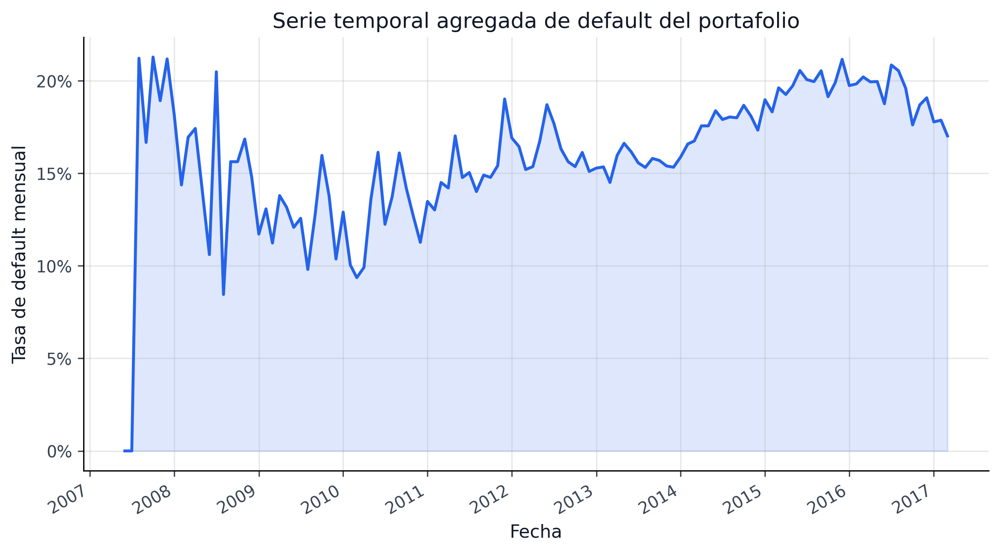
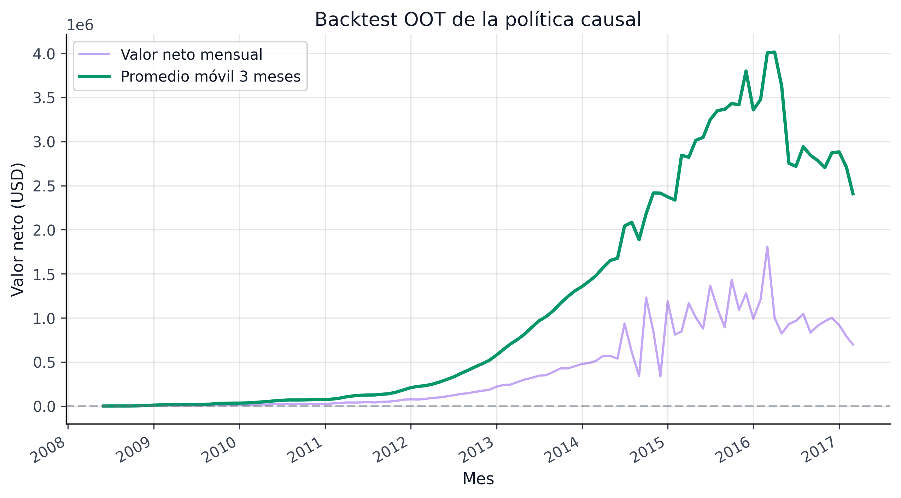

::: {.whole-game-intro}
<span class="whole-game-question">Pregunta central</span>

Si ya tenemos una PD calibrada con intervalos conformales, ¿qué sigue faltando para una lectura de riesgo realmente útil? Faltan tres dimensiones: **cuándo** ocurre el default, **hacia dónde** se mueve el sistema agregado y **por qué** algunas intervenciones cambian el resultado.

Ejemplo concreto: dos préstamos pueden compartir la misma PD puntual, pero diferir en horizonte temporal, sensibilidad a shocks de tasa y respuesta esperada a una política de precio. Esta parte existe para abrir esas tres capas sin romper el hilo del pipeline.
:::

{fig-alt="Serie temporal agregada del portafolio para forecasting de defaults."}

{fig-alt="Valor neto mensual de la política causal aplicada al portafolio."}

| Bloque | Pregunta que responde | Señal editorial |
|---|---|---|
| Supervivencia | ¿cuándo ocurre el default? | PD lifetime y lectura de horizonte para Stage 2 |
| Series de Tiempo | ¿hacia dónde va la tasa agregada? | escenarios, drift temporal y lectura macro |
| Causalidad | ¿qué conviene intervenir? | políticas por segmento y valor económico |
| Simulación A/B | ¿cuánto vale la robustez? | contraste retrospectivo y evidencia económica |

: Lo que agrega esta parte sobre el pipeline PD principal {#tbl-temporal-causal-editorial}

## Navegación curada

```{=html}
<div class="chapter-landing-grid">
  <div class="chapter-card"><h4><a href="08a-survival-analysis.html">30. Supervivencia</a></h4><p>Cox PH, RSF y PD lifetime bajo horizonte temporal.</p></div>
  <div class="chapter-card"><h4><a href="08b-time-series-forecasting.html">31. Series de Tiempo</a></h4><p>Forecasting agregado, cobertura y estado canónico de intervalos.</p></div>
  <div class="chapter-card"><h4><a href="08c-causal-inference.html">32. Causalidad</a></h4><p>DML, CATE y valor económico de las políticas.</p></div>
  <div class="chapter-card"><h4><a href="08d-ab-testing-simulation.html">33. Simulación A/B</a></h4><p>Validación retroactiva robusta vs no robusta.</p></div>
</div>
```


