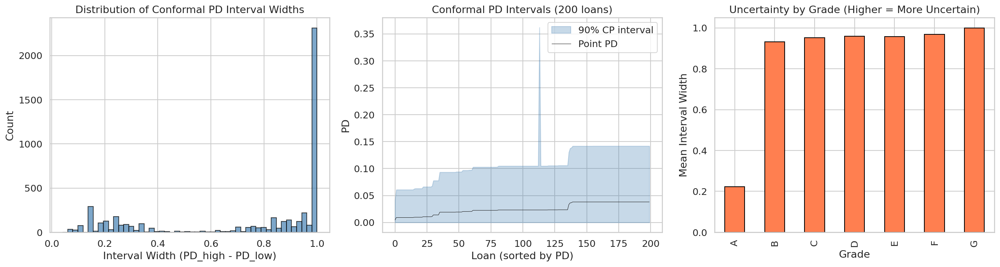

Este capitulo transforma las predicciones calibradas de PD y los intervalos de incertidumbre conformal en decisiones concretas de asignacion de capital. El pipeline completo sigue una arquitectura *predict-then-optimize* donde cada componente alimenta al siguiente:

La @tbl-portfolio-chapter-overview resume las secciones y su contribucion al pipeline.

| Seccion | Contenido | Artefacto principal |
|---------|-----------|---------------------|
| @sec-deterministic-portfolio | Formulacion LP, Pyomo + HiGHS | `portfolio_allocations.parquet` |
| @sec-robust-portfolio | Conjuntos de incertidumbre box, contraparte robusta | `portfolio_robustness_frontier.parquet` |
| @sec-policy-selection | Selector economico v3, test A/B de no-regresion | `champion_portfolio_policy.json` |
| @sec-cate-portfolio | Ajuste causal (CATE) al retorno esperado | `cate_portfolio_comparison.parquet` |
| @sec-efficient-frontier | Frontera de Pareto: riesgo vs robustez vs retorno | `portfolio_robustness_summary.parquet` |

: Resumen del capitulo de optimizacion de portafolio. {#tbl-portfolio-chapter-overview}

::: {.callout-note}
## Solver abierto
Toda la optimizacion usa **HiGHS** como solver LP/MILP open-source [@huangfu_parallelizing_2018], modelado con Pyomo. No se requiere licencia comercial (Gurobi/CPLEX).
:::

::: {.column-page}
{#fig-uncertainty-sets fig-alt="Conjuntos de incertidumbre box usados en la optimización robusta del portafolio."}
:::

La figura @fig-uncertainty-sets conecta estadística con OR: cada intervalo conformal deja de ser una salida descriptiva y se convierte en una región factible de decisión.

| Capa de entrada | Qué aporta a la optimización | Qué error evita |
|---|---|---|
| `pd_point` | ranking base y retorno esperado | decidir como si el score fuera exacto |
| intervalo conformal | rango plausible de riesgo por préstamo | sobreasignar capital a candidatos con alta ambigüedad |
| policy champion | umbrales y perfil económico promovido | dejar la selección final en tuning implícito o subjetivo |
| evaluación A/B y regret | evidencia económica posterior | confundir elegancia metodológica con valor real |

: Cómo se traduce la estadística en decisión de portafolio {#tbl-portfolio-inputs}

```{=html}
<div class="chapter-landing-grid">
  <div class="chapter-card"><h4><a href="09a-deterministic-portfolio.html">35. Determinístico</a></h4><p>Formulación base LP y restricciones canónicas.</p></div>
  <div class="chapter-card"><h4><a href="09b-robust-portfolio.html">36. Robusto</a></h4><p>Uncertainty sets conformales y peor caso plausible.</p></div>
  <div class="chapter-card"><h4><a href="09c-policy-selection.html">37. Política Champion</a></h4><p>Selector económico, A/B y promoción final.</p></div>
  <div class="chapter-card"><h4><a href="09d-cate-adjusted-portfolio.html">38. CATE-Adjusted</a></h4><p>Bridge entre inferencia causal y asignación.</p></div>
  <div class="chapter-card"><h4><a href="09e-efficient-frontier.html">39. Frontera</a></h4><p>Trade-off retorno/robustez y price of robustness.</p></div>
</div>
```


