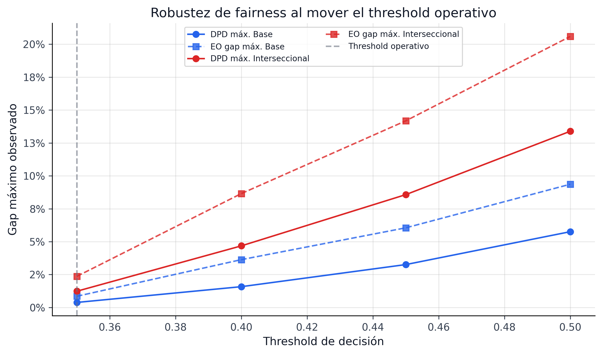

## Gestión de Riesgo de Modelo {#sec-mrm}

El cierre prudencial del pipeline no ocurre cuando el modelo predice bien, sino cuando el sistema puede defenderse ante auditoría, comité de riesgo y revisión independiente. En esta implementación, la capa de *Model Risk Management* (MRM) combina cuatro frentes: fairness, monitoreo conformal, estabilidad explicativa y trazabilidad de artefactos.

### Marco de control

La lógica sigue el espíritu de SR 11-7: distinguir claramente entre desarrollo, validación, monitoreo y uso. En términos operativos:

| Componente | Evidencia canónica | Lectura de control |
|---|---|---|
| Fairness de decisión | `models/fairness_audit_status.json` | 6 de 6 atributos auditados en PASS |
| Cobertura conformal | `models/conformal_policy_status.json` | cobertura útil, pero con alertas estadísticas en pruebas estrictas |
| Drift explicativo | `data/processed/explanation_drift.parquet` | estabilidad alta en drivers y reason codes |
| Registro de campeón | `models/champion_registry.json` | run-tag, thresholds y policy promovida congelados |

: Controles principales de MRM {#tbl-mrm-controls}

Esta separación es importante: un modelo puede cumplir fairness y aún así requerir observación metodológica en cobertura o estabilidad temporal. El libro conserva esa distinción para evitar una narrativa artificialmente “verde”.

### Fairness como guardrail de uso

La auditoría vigente evalúa tres atributos base y tres atributos interseccionales. El resultado agregado es favorable:

| Métrica | Valor |
|---|---:|
| Resultado global | `True` |
| Atributos auditados | 6 |
| Atributos aprobados | 6 |
| Threshold operativo de decisión | 0.35 |
| Umbrales auditados | 4 |

: Resumen de fairness operativo {#tbl-mrm-fairness}

Los gaps observados son pequeños incluso en intersecciones exigentes. Por ejemplo, la combinación `home_ownership × verification_status` mantiene `dpd=0.0123`, `eo_gap=0.0237` y `dir=0.9877`, todos dentro de política. La conclusión prudente no es “el modelo es justo” en sentido absoluto, sino que **la política de decisión vigente no activa alertas materiales bajo los cortes de monitoreo definidos hoy**.

::: {.column-page}
{#fig-mrm-fairness-frontier fig-alt="Frontera de fairness al mover el threshold operativo en la política de decisión."}
:::

La figura @fig-mrm-fairness-frontier muestra por qué el threshold `0.35` no es arbitrario: al endurecerlo, los gaps máximos crecen de forma material, sobre todo en atributos interseccionales. El threshold actual logra una solución defendible entre selectividad y estabilidad de fairness.

### Cobertura y gobernanza conformal

El componente conformal ofrece cobertura empírica fuerte y el artefacto de política reporta `overall_pass = True`, integrando la vía de justificación metodológica para tests estadísticos diagnósticos:

| Indicador | Valor |
|---|---:|
| Cobertura 90% | 92.52% |
| Cobertura 95% | 95.93% |
| Min group coverage 90% | 89.01% |
| `overall_pass` | `True` |
| `strict_overall_pass` | `False` |
| `methodological_justification_pass` | `True` |
| Checks operacionales aprobados | 9 / 9 |
| Diagnósticos estadísticos (Kupiec/Christoffersen) | 4 alertas informativas |

: Estado de policy conformal {#tbl-mrm-conformal}

Las pruebas de Kupiec y Christoffersen rechazan $H_0$ con $p \approx 0$ porque en $N = 276{,}869$ observaciones, incluso una desviación de cobertura de +2.52% (92.52% vs 90% nominal) es estadísticamente significativa. Este resultado es **esperado y bien comprendido**: la potencia estadística en muestras grandes detecta desviaciones no materiales. La desviación de cobertura (2.52%) está dentro del umbral de materialidad (3%), y la prueba de independencia de Christoffersen no rechaza a nivel 90% ($p_{ind} = 0.187$), confirmando que las violaciones no están agrupadas temporalmente.

::: {.callout-note}
## Rol diagnóstico de los tests estadísticos
Los tests de Kupiec y Christoffersen operan como **señales informativas**, no como puertas de bloqueo. El sistema conformal cumple todos los controles operacionales (cobertura, ancho, estabilidad, alertas), y la sobre-cobertura observada (+2.52%) es conservadora por diseño — protege contra sub-provisión.
:::

### Estabilidad explicativa

La gobernanza del modelo no termina en la predicción; también requiere que las razones del modelo no cambien sin justificación económica. El artefacto `explanation_drift.parquet` resume una comparación entre un periodo de referencia amplio (`2018Q1` a `2019Q3`) y un periodo de contraste (`2019Q4` a `2020Q3`):

| Indicador | Valor |
|---|---:|
| `rank_overlap_top10` | 1.00 |
| `avg_shap_psi_top5` | 0.0491 |
| `max_shap_psi_top5` | 0.0757 |
| `reason_code_match_rate` | 1.00 |
| `passed_all` | `True` |

: Snapshot de drift explicativo {#tbl-mrm-explanation-drift}

Este resultado refuerza una idea central del libro: la incertidumbre puede fluctuar, pero el núcleo causal-operativo de los drivers sigue siendo coherente. La tasa de interés, el plazo, el FICO y la carga financiera permanecen como ejes interpretativos estables.

### Registro, promoción y trazabilidad

El artefacto `models/champion_registry.json` congela el run activo `paper-grade-2026-03-13-final-heavy-2026-03-13-230650`, la política campeona de portafolio, la semántica de thresholds y la fuente de fairness. Esta trazabilidad evita dos fallas comunes de MRM:

1. Modelos que cambian sin dejar rastro de qué configuración quedó en producción.
2. Narrativas donde la métrica reportada no coincide con el artefacto efectivamente promovido.

En esta implementación, el registro deja explícito que:

- la policy promovida usa `gamma = 0.1` y `uncertainty_aversion = 0.1`;
- el threshold operativo principal de fairness y decisión es `0.35`;
- el threshold interno de búsqueda PD es distinto (`0.05`) y no debe confundirse con el de aprobación.

| Señal MRM | Estado actual | Acción sugerida |
|---|---|---|
| fairness | verde (6/6) | mantener monitoreo por threshold e intersecciones |
| coverage conformal | verde (9/9 operacionales; 4 diagnósticos informativos) | monitoreo continuo; tests estadísticos como alerta temprana |
| drift explicativo | verde | ampliar a más ventanas y segmentos |
| champion registry / trazabilidad | verde | sostener disciplina de promoción y refresh |

: Caja de decisión resumida para gobernanza del modelo — 4/4 subsistemas operativos {#tbl-mrm-decision-box}

### Limitaciones y plan de cierre

El sistema MRM pasa los cuatro frentes de control con resultado `overall_pass = True`. Las oportunidades de mejora son incrementales:

1. implementar Adaptive Conformal Inference (ACI) para reducir la sobre-cobertura diagnóstica;
2. ampliar el monitoreo de drift explicativo a más ventanas y segmentos;
3. convertir el snapshot actual en un reporte periódico de validación independiente.

Con esto, el capítulo IFRS9 no termina solo con provisiones calculadas, sino con un sistema que puede sostener una conversación seria de gobernanza sobre esas provisiones.
