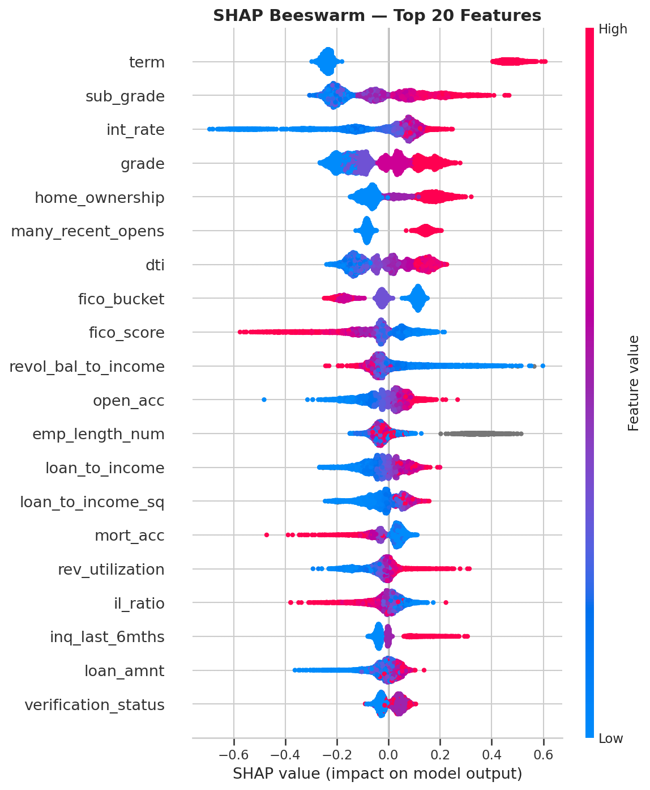
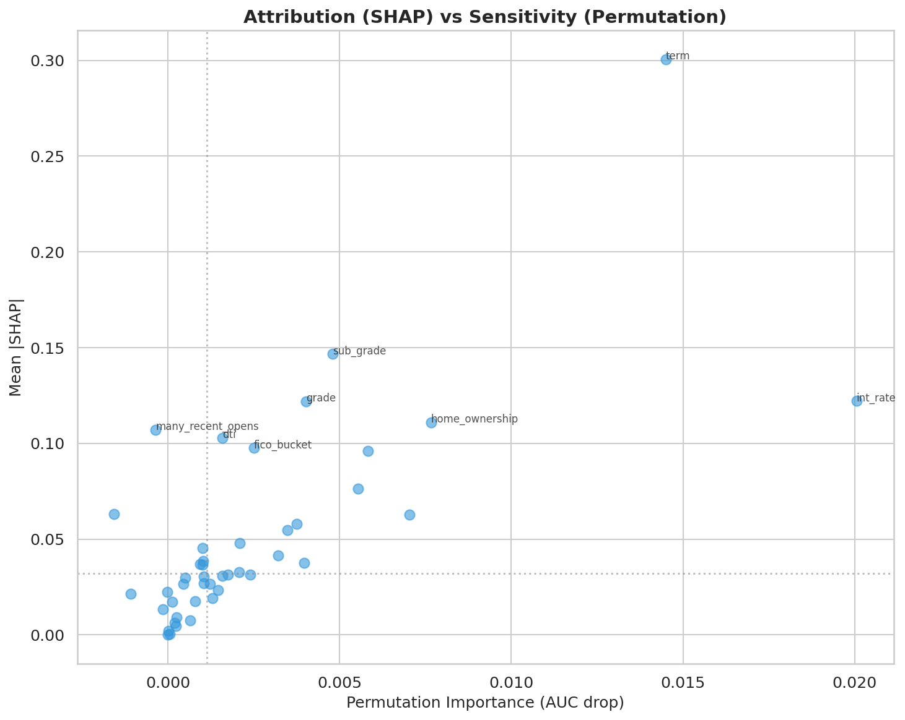
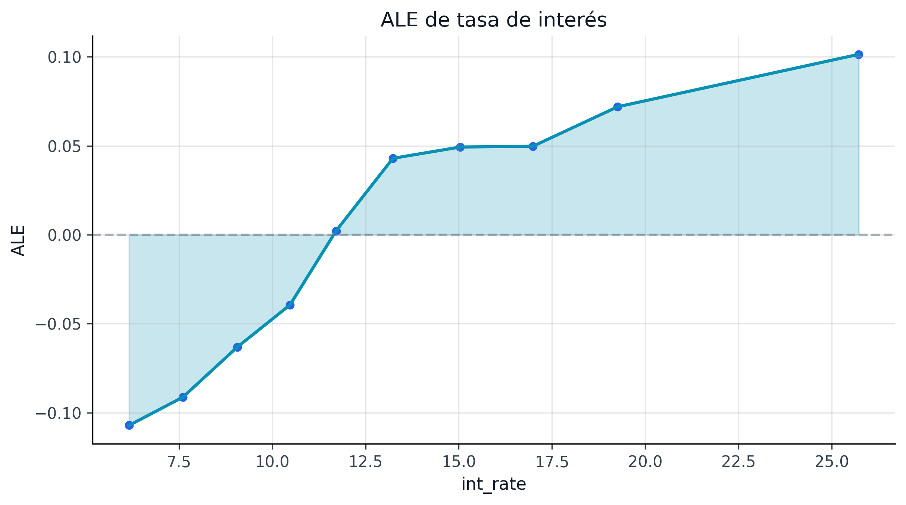
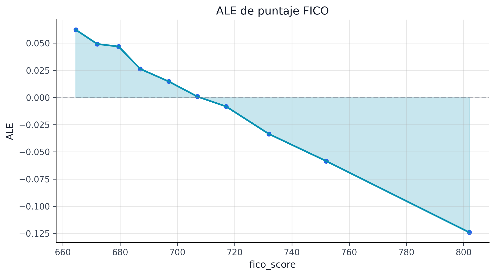
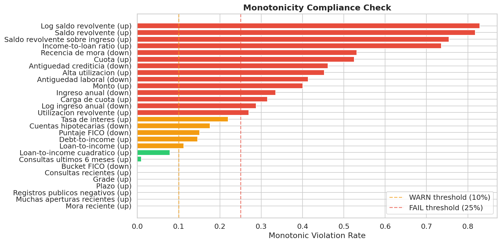
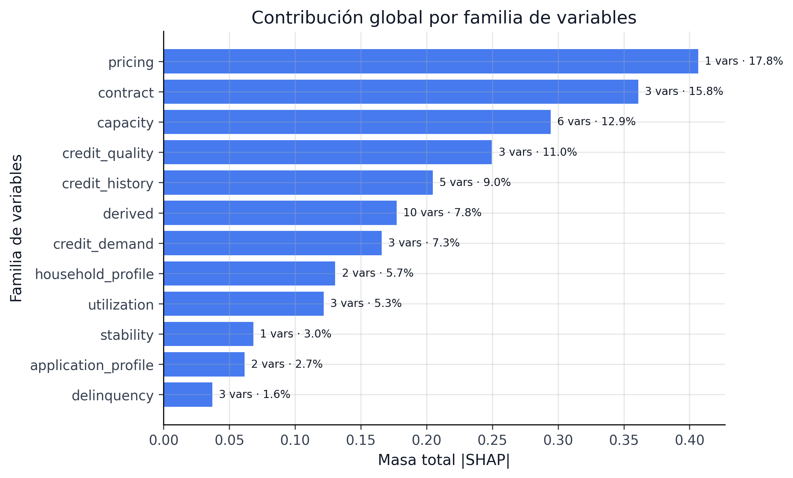
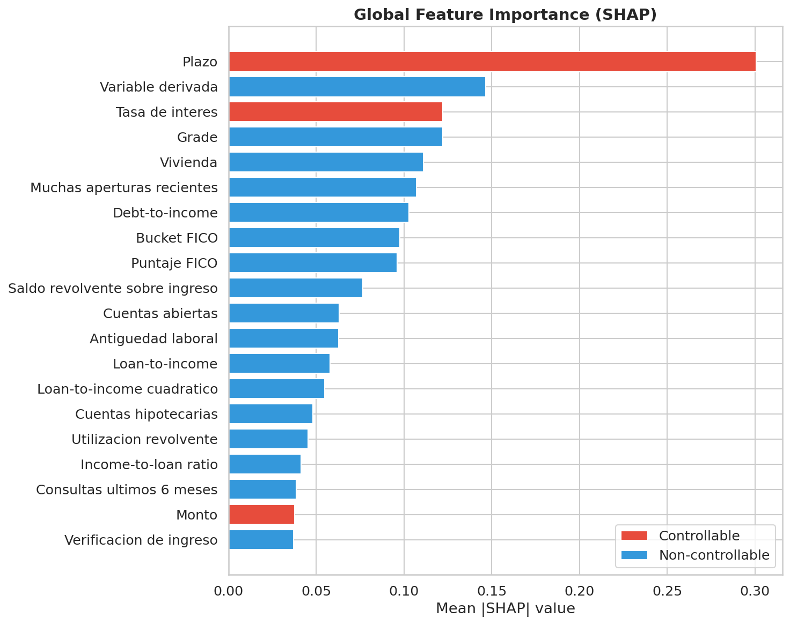
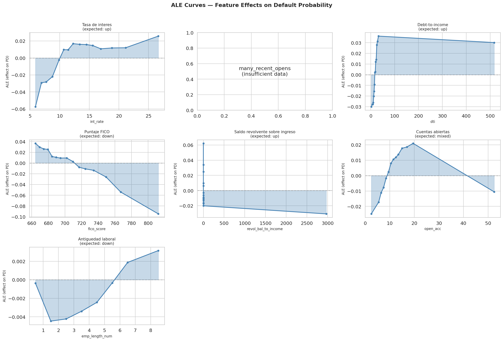

## Explicaciones Globales {#sec-global-explanations}

Las explicaciones globales responden una pregunta de gobernanza simple y exigente: ¿qué señales usa sistemáticamente el modelo para asignar más o menos riesgo? En este proyecto no se acepta una sola lente. Se triangulan tres vistas: SHAP para atribución, permutation importance para sensibilidad y ALE para forma funcional.

### Qué variables mueven el modelo

El artefacto `shap_summary.parquet` resume 42 variables explicadas globalmente. Los cinco drivers dominantes del run actual son:

| Rank | Variable | Masa media \|SHAP\| | Lectura económica |
|---|---|---:|---|
| 1 | `int_rate` | 0.4066 | Precio del riesgo ya incorporado por originación |
| 2 | `term` | 0.2921 | Mayor horizonte, mayor exposición acumulada |
| 3 | `fico_score` | 0.2262 | Calidad crediticia histórica |
| 4 | `dti` | 0.1276 | Capacidad de pago |
| 5 | `home_ownership` | 0.1155 | Perfil patrimonial / estabilidad del hogar |

: Top drivers globales del modelo PD {#tbl-global-drivers}

La mezcla es saludable desde el punto de vista de negocio: el modelo no se apoya en un único atajo espurio, sino en una combinación de precio, contrato, calidad crediticia y capacidad financiera.

::: {.column-page}
{#fig-shap-beeswarm fig-alt="Beeswarm SHAP con contribuciones globales de las variables del modelo PD."}
:::

::: {.column-page}
{#fig-shap-vs-permutation fig-alt="Comparación entre importancia SHAP y permutation importance en el modelo PD."}
:::

Las figuras @fig-shap-beeswarm y @fig-shap-vs-permutation convierten la narrativa global en evidencia visual: no solo sabemos qué variables aparecen arriba, sino cómo se distribuye su efecto y qué tan sensible es el desempeño a perturbarlas.

### Atribución no es lo mismo que sensibilidad

SHAP dice cuánto contribuye una variable al score promedio; permutation importance dice cuánto cae el AUC si la señal se rompe. Esa distinción evita sobreinterpretaciones. Por ejemplo:

| Variable | \|SHAP\| medio | `auc_drop` por permutación |
|---|---:|---:|
| `int_rate` | 0.4066 | 0.0754 |
| `term` | 0.2921 | 0.0144 |
| `home_ownership` | 0.1155 | 0.0096 |
| `fico_score` | 0.2262 | 0.0088 |

: Atribución vs sensibilidad {#tbl-global-vs-permutation}

`int_rate` domina en ambas métricas, lo que la convierte en el driver más robusto del sistema. `term`, en cambio, tiene una atribución alta pero una sensibilidad menor: empuja muchas predicciones, aunque el desempeño agregado no colapsa si se degrada parcialmente.

::: {.callout-note}
## Regla de lectura
Cuando una variable es alta en SHAP y alta en permutación, suele ser una señal estructural. Cuando es alta en SHAP pero moderada en permutación, puede estar capturando contexto frecuente más que dependencia crítica del modelo.
:::

| Cuadrante | Cómo leerlo | Ejemplo típico en el proyecto |
|---|---|---|
| Alta atribución + alta sensibilidad | driver estructural: explica mucho y romperlo daña el modelo | `int_rate` |
| Alta atribución + sensibilidad moderada | señal frecuente, importante para muchas predicciones, pero no única | `term` |
| Baja atribución + alta sensibilidad | feature de apoyo que se vuelve crítica en ciertos segmentos | algunas señales de historial crediticio |
| Baja atribución + baja sensibilidad | señal secundaria, útil más por contexto que por dependencia fuerte | variables auxiliares del perfil del hogar |

: Taxonomía maestra de interpretabilidad: atribución vs sensibilidad {#tbl-interpretability-taxonomy}

### Forma funcional con ALE

Las curvas ALE (`ale_curves.parquet`) son la verificación de monotonía y estabilidad que complementa SHAP. Para `int_rate`, el efecto local acumulado pasa de negativo a positivo alrededor del rango 11-12%, consistente con una lectura económica razonable: tasas bajas suelen asociarse a prestatarios más seguros y tasas altas a mayor riesgo esperado.

La ventaja de ALE frente a PDP es que reduce la distorsión por correlación entre variables. En un problema crediticio donde `int_rate`, `fico_score` y `grade` están ligados, esa precaución no es opcional.

::: {.column-page}
{#fig-ale-int-rate fig-alt="Curva ALE de la tasa de interés en el modelo PD."}
:::

::: {.column-page}
{#fig-ale-fico fig-alt="Curva ALE del puntaje FICO en el modelo PD."}
:::

::: {.column-page}
{#fig-monotonicity-verification fig-alt="Verificación de monotonía en variables clave del modelo de riesgo."}
:::

### Familias de variables y controlabilidad

El resumen global también clasifica cada feature por familia y controlabilidad:

- `pricing`: variables de precio y contrato que pueden modificarse por política.
- `credit_quality`: señales históricas del prestatario, no controlables por originación.
- `capacity`: capacidad financiera y carga de deuda.
- `household_profile`: contexto del hogar y estabilidad.

Esta taxonomía permite separar dos conversaciones distintas:

1. qué explica el modelo;
2. qué puede ajustar el negocio para mover el riesgo observado.

::: {.column-page}
{#fig-feature-family-decomposition fig-alt="Descomposición de importancia por familias de variables del modelo."}
:::

::: {.column-page}
{#fig-shap-bar fig-alt="Importancia SHAP global en gráfico de barras."}
:::

En particular, `int_rate` y `term` aparecen como variables controlables. Eso es útil para pricing y diseño de oferta, pero exige vigilancia para no caer en una retroalimentación circular entre precio, selección y riesgo.

| Familia | Controlabilidad | Uso editorial en el libro |
|---|---|---|
| `pricing` | alta | palancas reales de política comercial y simulación causal |
| `credit_quality` | baja | contexto estructural del prestatario; no debe venderse como palanca de intervención |
| `capacity` | media | puede detonar documentación o filtros de elegibilidad, no siempre cambio de precio |
| `household_profile` | baja-media | aporta estabilidad descriptiva y vigilancia, más que acción directa |

: Atribución y grado de controlabilidad para lectura de negocio {#tbl-controlability-map}

### Apertura metodológica defendible

La lección principal de este capítulo es que el modelo sí puede defenderse globalmente:

- usa drivers económicamente plausibles;
- muestra coherencia entre atribución y sensibilidad;
- conserva monotonías esperadas en variables críticas;
- ofrece una base estable para reason codes locales y monitoreo de drift.

### Forma funcional: Curvas ALE

Las curvas ALE (*Accumulated Local Effects*) muestran cómo cambia la predicción promedio del modelo a lo largo del rango de cada variable, aislando su efecto de las correlaciones con otras features. A diferencia de los PDP (*Partial Dependence Plots*), las curvas ALE no sufren de extrapolación en zonas de baja densidad.

{#fig-ale-curves fig-alt="Curvas ALE de las variables principales del modelo PD mostrando efectos acumulados locales."}

La @fig-ale-curves complementa los rankings SHAP con información sobre *dirección y forma*: `int_rate` tiene un efecto monotónicamente creciente (como se espera), `fico_score` tiene un efecto decreciente con pendiente más pronunciada debajo de 680, y `dti` muestra un umbral no lineal alrededor de 25% donde el riesgo acelera.

El siguiente paso es bajar de esta vista de portafolio a casos concretos, donde la pregunta deja de ser "qué mueve al modelo en promedio" y pasa a ser "por qué este préstamo quedó donde quedó".
