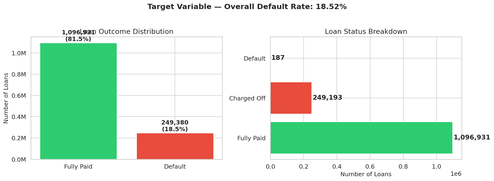
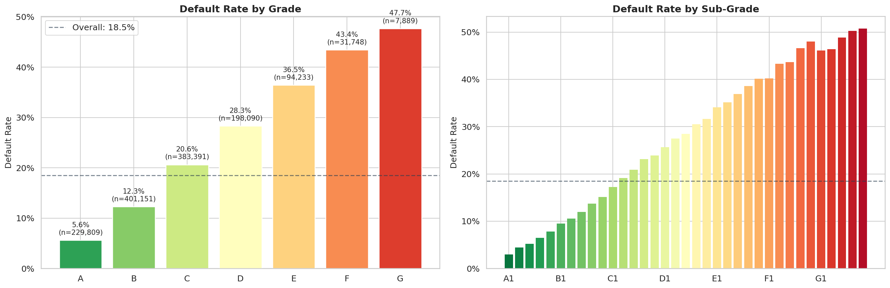
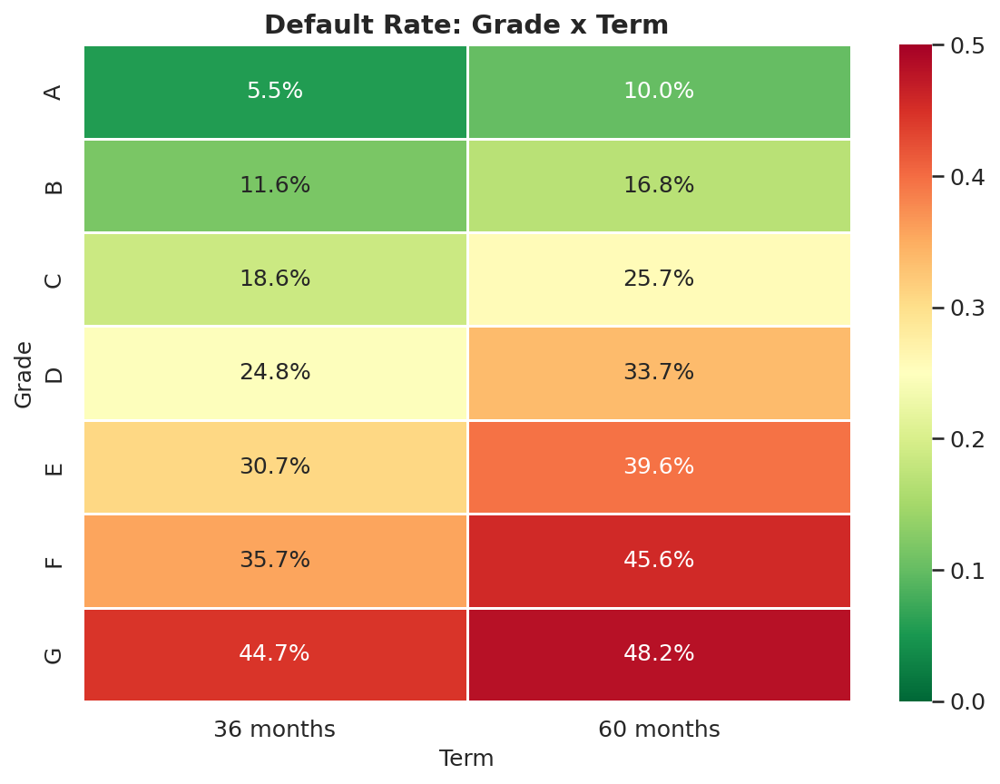



## Hallazgos Clave del EDA {#sec-eda-highlights}

El EDA fija la composición del **split histórico de entrenamiento**. Motiva
hipótesis y controles; no selecciona taxonomías conformales, variables de
policy, grupos de fairness, modelos IFRS9 ni diseños causales.

### Universo analítico local

| Indicador | Valor |
|---|---:|
| préstamos en train | 1,346,311 |
| default terminal | 18.52% |
| plazo 36 meses | 1,005,656 |
| plazo 60 meses | 340,655 |

: Snapshot del train resuelto. {#tbl-eda-core}

La mezcla de plazos documenta heterogeneidad. No identifica PD lifetime,
censoring, ECL o comportamiento a reporting date.

{#fig-target-distribution fig-alt="Distribución de fully paid y default en el split histórico de entrenamiento."}

### Gradiente descriptivo por `grade`

| Grade | Default rate |
|---|---:|
| A | 5.63% |
| B | 12.29% |
| C | 20.64% |
| D | 28.31% |
| E | 36.47% |
| F | 43.44% |
| G | 47.71% |

: Asociación entre `grade` y default terminal en train. {#tbl-eda-grade}

El orden muestra que `grade` contiene información de riesgo y selección previa.
No demuestra que los residuos conformales sean intercambiables dentro de cada
grade ni que esa partición sea mejor que taxonomías alternativas. El CRPTO
vigente reporta las familias declaradas y no selecciona una taxonomía.

{#fig-default-rate-grade fig-alt="Tasa descriptiva de default terminal por grade en train."}

{#fig-grade-term-default fig-alt="Mapa descriptivo de default por grade y term."}

```{=latex}
\clearpage
```

### Qué sí habilita el EDA

- declarar prevalencia y composición del snapshot;
- proponer slices de evaluación antes de mirar outcomes futuros;
- identificar celdas con soporte pequeño;
- formular tests de drift, madurez y estabilidad;
- detectar variables que pueden codificar pricing, selección o leakage.

| Señal | Hipótesis que motiva | Claim que no valida |
|---|---|---|
| gradiente por `grade` | auditar cobertura y residuals por grupo | garantía Mondrian o taxonomía ganadora |
| diferencia por `term` | modelar madurez/censoring | PD lifetime o ECL |
| heterogeneidad de producto | evaluar transporte y composición | efecto causal de propósito/precio |
| prevalencia 18.5% | elegir métricas adecuadas | threshold óptimo o policy |

: De EDA a preguntas, no a decisiones. {#tbl-eda-to-method}

### Orden temporal

Un split temporal reduce la mezcla de períodos frente a uno aleatorio, pero el
`test OOT` del proyecto fue inspeccionado y reutilizado por varias búsquedas.
Además, el universo resolved-only induce sesgo de madurez. Por eso el EDA no
convierte ese corte en holdout prospectivo o final intacto.

| Familia | Variables de contexto | Riesgo de interpretación |
|---|---|---|
| precio/contrato | `int_rate`, `term` | selección y condiciones originadas |
| calidad crediticia | FICO e historial | proxies y cambios de población |
| capacidad | DTI e ingreso | medición a originación, no trayectoria futura |
| perfil | vivienda/verificación | composición y posibles proxies sensibles |

: Familias descriptivas para auditoría. {#tbl-eda-families}

La conclusión es deliberadamente limitada: el dataset tiene estructura y
heterogeneidad suficientes para un laboratorio reproducible. Qué estimando,
grupo o decisión puede sostener exige protocolos posteriores.
