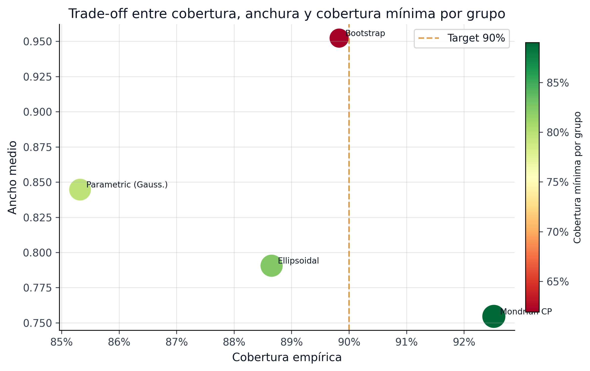
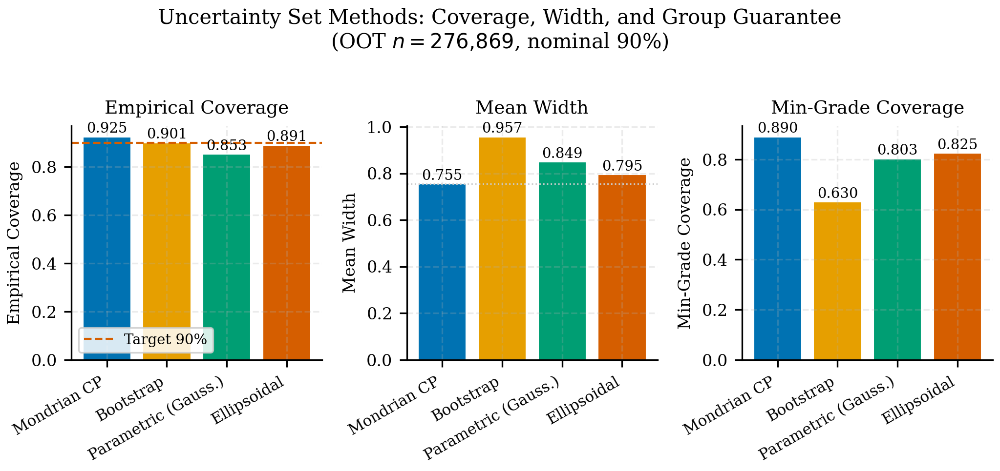

## Baselines de Incertidumbre: BMA vs CP {#sec-uncertainty-baselines}

Una afirmación fuerte sobre incertidumbre no se sostiene sin comparación. Por eso el proyecto contrasta la banda conformal con *Bayesian Model Averaging* (BMA) y otros enfoques alternativos antes de declararla útil para decisión.

### Qué se compara

El contraste entre métodos sobre el mismo universo OOT sigue siendo válido, pero la lectura final del proyecto debe anclarse en el winner conformal promovido por la reapertura. La diferencia clave queda así:

| Método | Cobertura empírica | Ancho medio | Cobertura mínima por grupo |
|---|---:|---:|---:|
| Winner conformal (`score_decile_mondrian`) | 92.97% | 0.7842 | 91.90% |
| Bootstrap | 89.83% | 0.9523 | 61.93% |

: Baselines de incertidumbre relevantes {#tbl-uncertainty-baselines}

Los números cuentan una historia concreta. Bootstrap logra 89.83% de cobertura *en promedio*, pero solo 61.93% en su peor grupo. El winner conformal final `score_decile_mondrian` supera 91.9% en cobertura mínima por grupo y además mantiene intervalos materialmente más estrechos. Para IFRS9, la diferencia no es académica: un sistema que solo luce bien en promedio sistematiza provisiones basadas en incertidumbre sesgada hacia ciertos segmentos. El supervisor de riesgo que pregunta "¿sus intervalos cubren en todos los segmentos?" no puede satisfacerse con un promedio del 89%.

::: {.column-page}
{#fig-uncertainty-baselines-editorial fig-alt="Comparación visual de baselines de incertidumbre del proyecto."}
:::

### Qué muestra BMA

El artefacto `bma_comparison.parquet` cubre 276,869 préstamos y deja ver una limitación práctica importante: muchos intervalos BMA se saturan en el rango completo `[0,1]`, lo que produce coberturas triviales y poco accionables.

Esa saturación tiene una causa raíz: BMA construye su incertidumbre promediando un ensemble (LogReg + CatBoost) que en muchos casos *desacuerda profundamente* sobre qué probabilidad asignar. Ese desacuerdo se propaga como incertidumbre espuria — no es que el préstamo sea ambiguo, sino que los modelos tienen especificaciones diferentes. CP evita este colapso por diseño: cuantifica residuos empíricos observados en el hold-out, no la divergencia teórica entre priors de distintos modelos.

### Por qué gana CP en este contexto

Conformal Prediction ofrece tres ventajas aquí:

1. garantía finita de cobertura bajo supuestos más débiles;
2. posibilidad de particionar por grupos económicamente relevantes;
3. interpretación directa de los intervalos como conjuntos de decisión.

La comparación no pretende afirmar que CP domina cualquier enfoque bayesiano en cualquier dominio. La afirmación defendible es más específica: **para este pipeline crediticio y este objetivo operativo, CP entrega una incertidumbre más usable**.

### Implicación para el resto del libro

Este capítulo justifica dos movimientos posteriores:

- en el CRPTO/Paper_CRPTO, tratar el intervalo conformal como *uncertainty set* operativo;
- en IFRS9, usar el ancho conformal como señal complementaria de prudencia y SICR.

### Limitación y extensiones naturales

Esta comparación usa un BMA simple sobre dos modelos (LogReg + CatBoost). Un BMA más sofisticado — con mayor diversidad de modelos o priors mejor calibrados — podría mejorar sus intervalos. Del mismo modo, conjuntos de incertidumbre elipsoidales (más eficientes en alta dimensión) o métodos conformales adaptativos por instancia (más estrechos para casos fáciles) son extensiones naturales.

El trade-off actual no se interpreta ya como "usar grade porque sí". La lectura correcta es: `grade` fue la partición natural necesaria para justificar Mondrian en crédito, pero el benchmark final promovió `score_decile_mondrian` como winner único porque mejoró la combinación de cobertura, cobertura mínima y eficiencia. Esa jerarquía es la decisión correcta para este contexto.

### Evidencia de Publicación

La figura comparativa presenta el formato y nivel de detalle utilizado en el proyecto externo CRPTO/Paper_CRPTO. Esta figura resume las tres dimensiones del trade-off (cobertura global, ancho medio, cobertura mínima por grupo) en un solo panel, facilitando la lectura comparativa para revisores de journals.

{#fig`Paper_CRPTO` fig-alt="Figura de publicación comparando cobertura, ancho y cobertura mínima entre métodos de incertidumbre."}
