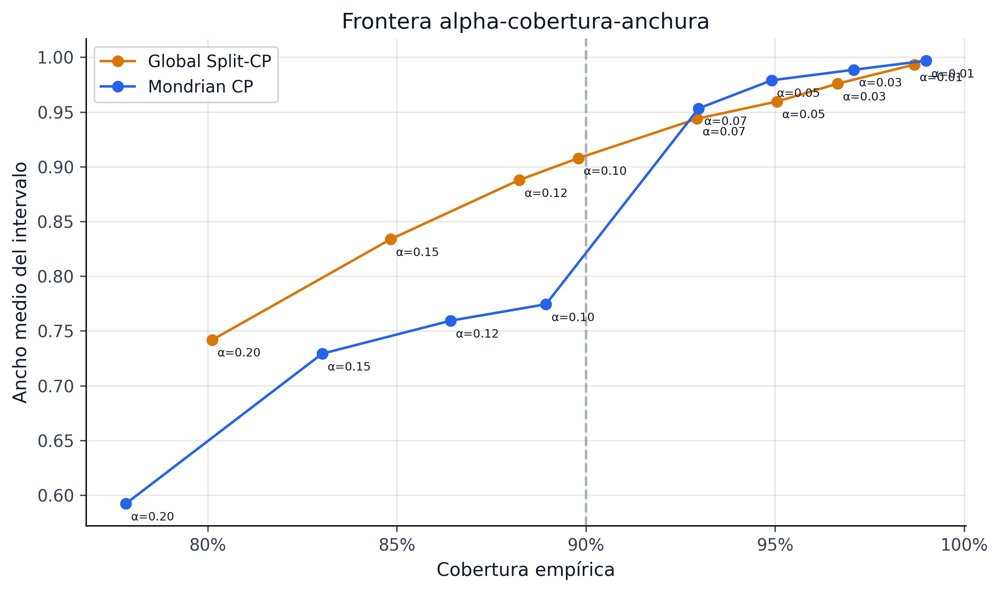
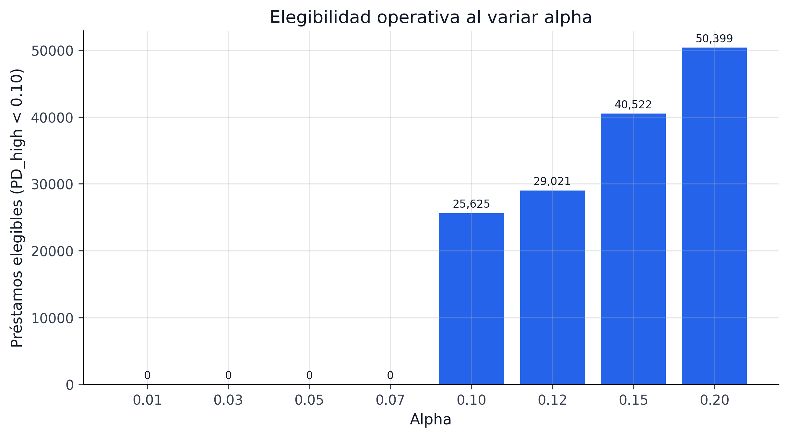
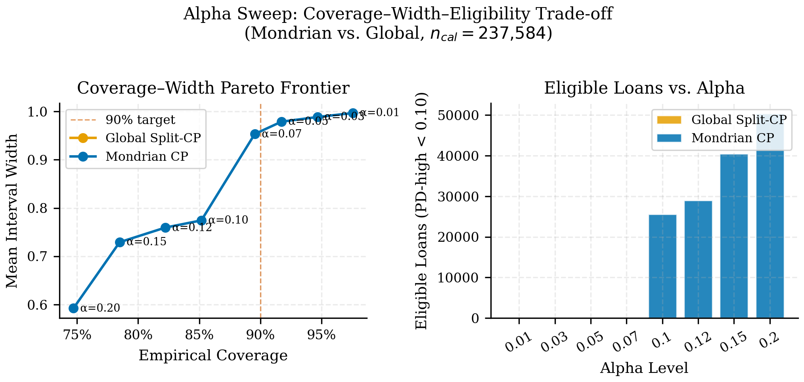

## Alpha Sweep y Frontera de Pareto {#sec-alpha-sweep}

El nivel de confianza conformal no es un parámetro decorativo. Cambiar `alpha` cambia simultáneamente cobertura, ancho y la política económica que el optimizador considera viable. Por eso el libro congela un *alpha sweep* explícito en lugar de fijar 90% por costumbre.

### El frente cobertura-ancho-decisión

El artefacto `alpha_sweep_pareto_both.parquet` contiene 16 configuraciones y resume el trade-off entre confianza y accionabilidad. En la familia global se observa el patrón esperado:

| `alpha` | Confianza | Cobertura empírica | Ancho medio |
|---|---:|---:|---:|
| 0.10 | 90% | 89.80% | 0.9078 |
| 0.07 | 93% | 92.94% | 0.9438 |
| 0.05 | 95% | 95.05% | 0.9595 |
| 0.01 | 99% | 98.68% | 0.9933 |

: Sweep global de alpha {#tbl-alpha-sweep}

El patrón es monotónico y útil: mayor confianza implica mayor ancho. Lo importante es que el costo no es lineal para decisión; llega un punto donde casi no quedan observaciones elegibles o el portafolio se vuelve demasiado conservador.

::: {.column-page}
{#fig-alpha-pareto-advanced fig-alt="Frontera de Pareto del parámetro alpha en el proyecto."}
:::

::: {.column-page}
{#fig-alpha-eligible-advanced fig-alt="Cantidad de préstamos elegibles al variar alpha en la variante Mondrian."}
:::

### Frontera de Pareto operativa

La frontera relevante del proyecto no es solo cobertura vs ancho, sino:

$$
\text{Cobertura} \uparrow \quad \Longleftrightarrow \quad \text{Ancho} \uparrow \quad \Longleftrightarrow \quad \text{Retorno robusto utilizable} \downarrow
$$

Ese tercer eje explica por qué el libro conecta directamente el sweep con portafolio e IFRS9: elegir `alpha` define cuánto capital, provisión o apetito de riesgo estamos dispuestos a inmovilizar por prudencia.

### Qué política deja este análisis

El sweep sugiere una regla editorial y metodológica simple:

1. 90% es razonable como punto operativo de trabajo;
2. 95% sirve como lectura prudencial más exigente;
3. 99% es útil como escenario de estrés, no como default de producción.

Esta regla evita caer en la tentación de usar el mayor nivel de confianza disponible sin medir su costo económico.

### Conexión con papers

El CRPTO/Paper_CRPTO usará este frente como parte de su argumento de *predict-then-optimize*: el nivel conformal puede verse como una palanca explícita de robustez. El Paper IFRS9 lo reinterpreta como costo prudencial sobre ECL y staging.

### Limitación

La frontera actual resume un universo y un run congelados. El paso natural siguiente es repetirla por segmento, por grade y por periodo para identificar si el `alpha` operativo debería ser único o contextual.

### Evidencia de Publicación

La @fig`Paper_CRPTO` muestra la frontera Pareto con el formato utilizado en el CRPTO/Paper_CRPTO, donde el eje horizontal representa el nivel de confianza (1-α) y el eje vertical los KPIs de portafolio resultantes. Esta visualización permite a un revisor evaluar de un vistazo cuánto "cuesta" cada punto porcentual adicional de confianza en términos de retorno esperado.

{#fig`Paper_CRPTO` fig-alt="Frontera Pareto mostrando cobertura vs retorno vs ancho para diferentes niveles alpha."}
