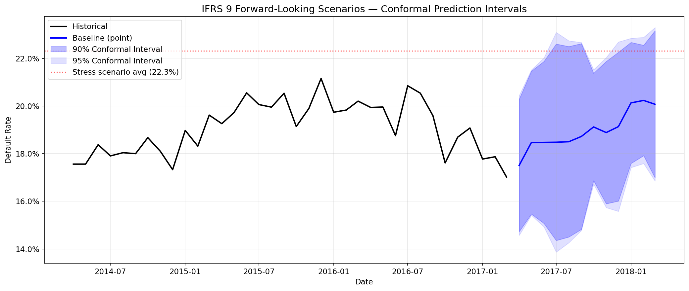
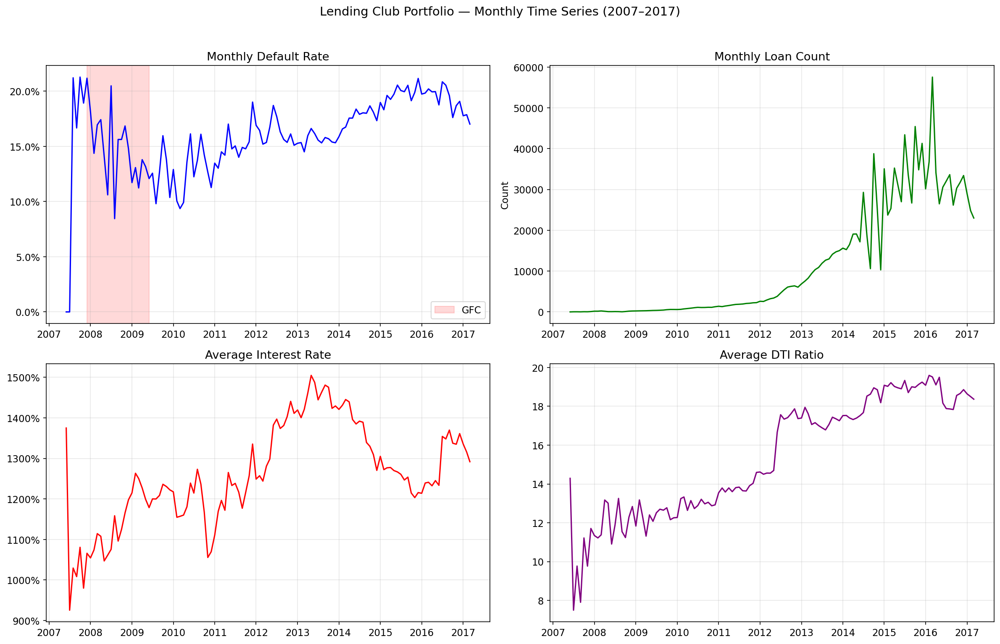

## Intervalos de Series de Tiempo Propagados a ECL {#sec-ts-ecl}

El pipeline temporal no termina cuando se pronostica una tasa de default. Su valor real aparece cuando esa incertidumbre se propaga hacia provisiones. El artefacto `ts_ecl_intervals.parquet` documenta justamente ese puente entre series de tiempo y lectura prudencial de ECL.

### Qué contiene el artefacto

Para cada mes, el artefacto captura la propagación completa de la incertidumbre del forecast hasta las provisiones. El pronóstico puntual de tasa de default (`ts_point`) se convierte en un multiplicador de PD que, aplicado a cada préstamo del portafolio, genera un ECL puntual. Pero el forecast no es un número único: la banda al 90% produce un rango de multiplicadores (optimista y adverso) que, al propagarse por la fórmula ECL = PD × LGD × EAD × DF, genera un rango de provisiones. Críticamente, cuando el multiplicador adverso empuja a préstamos por encima del umbral de Stage 2, estos migran de PD a 12 meses a PD lifetime, amplificando el efecto del forecast de forma no lineal.

### Ejemplo mensual

Los primeros meses disponibles muestran una expansión material del rango ECL:

| Mes | ECL punto | ECL adverse 90 | ECL optimistic 90 | Rango ECL 90 |
|---|---:|---:|---:|---:|
| 2020-10 | \$47.5M | \$199.9M | \$47.5M | \$152.4M |
| 2020-11 | \$47.5M | \$313.7M | \$47.5M | \$266.1M |
| 2020-12 | \$61.1M | \$349.0M | \$47.5M | \$301.4M |
| 2021-01 | \$109.6M | \$352.2M | \$47.5M | \$304.7M |

: Propagación de pronóstico temporal a ECL {#tbl-ts-ecl}

La tabla revela dos efectos que se refuerzan mutuamente. El primero es la amplificación por staging: cuando el multiplicador adverso es suficientemente alto, préstamos que estaban en Stage 1 (provisión a 12 meses) cruzan el umbral SICR y migran a Stage 2 (provisión a vida completa), multiplicando su ECL individual por 3--5x. El segundo efecto es la no linealidad de la propagación cerca de cero: cuando el forecast optimista arroja tasas de default muy bajas, la ECL correspondiente se comprime contra el piso (\$47.5M en todos los meses), pero el escenario adverso no tiene techo análogo --- puede expandirse hasta \$352M. Esta asimetría explica por qué el rango ECL crece de \$152M en octubre 2020 a \$305M en enero 2021: no es que la incertidumbre del forecast se duplique, sino que el escenario adverso activa cada vez más migraciones de staging que amplifican la señal. En términos prácticos, esto significa que una entidad que ancle sus provisiones exclusivamente en el forecast puntual (\$109.6M en enero 2021) podría estar subestimando la exposición por un factor de 3x en el escenario adverso.

::: {.column-page}
{#fig-ts-fan-chart-advanced fig-alt="Fan chart de pronóstico IFRS9 para el bloque avanzado de ECL."}
:::

::: {.column-page}
{#fig-ts-overview-advanced fig-alt="Vista agregada de series de tiempo del portafolio y sus trayectorias."}
:::

::: {.column-page}
{#fig-ts-portfolio-advanced fig-alt="Vista agregada del portafolio para lectura temporal y prudencial."}
:::

### Interpretación

Este capítulo deja dos mensajes:

1. la incertidumbre temporal no debe quedarse en la capa de forecasting;
2. un escenario macro adverso puede entrar al balance vía multiplicadores de PD mucho antes de materializar defaults observados.

En ese sentido, los intervalos temporales se parecen más a una herramienta de planeación prudencial que a una simple mejora de accuracy.

### Relación con IFRS9

La conexión con el capítulo IFRS9 es directa. Si el ECL agregado por escenario ya es sensible a multiplicadores macro, agregar una banda temporal hace visible una segunda fuente de fragilidad: la incertidumbre sobre la trayectoria futura del propio entorno.

| Estado editorial | Uso recomendado |
|---|---|
| Oficial | hoy no aplica a estos intervalos |
| Advertencia | útil para sensibilidad y comités prudenciales |
| Solo investigación | estado actual: evidencia valiosa para paper y agenda, no para automatizar provisión mensual |

: Estado actual del carril TS→ECL {#tbl-ts-ecl-status}

### Qué falta

Todavía no se ha integrado esta capa como política oficial de staging o provisión mensual. El valor actual es analítico y estratégico:

- cuantifica el rango de provisión inducido por forecasting;
- muestra el impacto potencial sobre Stage 2;
- prepara una agenda sólida para papers y extensiones de maestría.

El camino hacia la operacionalización requiere tres desarrollos: primero, integrar la banda temporal con la banda conformal para producir un *doble intervalo* (incertidumbre del modelo + incertidumbre macro) que cubra ambas fuentes de fragilidad; segundo, establecer una política de actualización mensual donde los cuantiles conformales se recalibren con cada nueva observación, siguiendo la literatura de conformal prediction online; y tercero, definir triggers automáticos de recalibración cuando la banda temporal supere un umbral predefinido (por ejemplo, cuando el rango ECL al 90% exceda el 200% del ECL puntual). Hasta que estos desarrollos se completen, el valor del artefacto es analítico y estratégico: demuestra que la incertidumbre temporal existe, es material, y que ignorarla equivale a provisionar sobre una foto fija en un mundo que se mueve.
