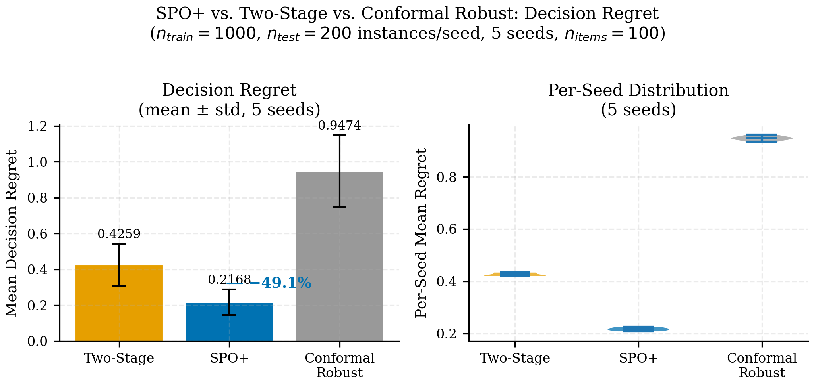
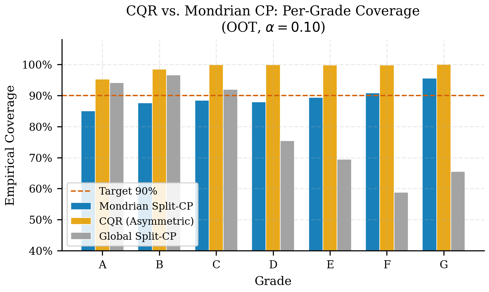

## Resultados {#sec-estrella-results}

Los resultados del Paper Estrella deben leerse como una prueba de viabilidad del marco, no como un torneo aislado de AUC. La evidencia relevante está en la interacción entre incertidumbre y decisión.

### Base predictiva e incertidumbre

El pipeline reporta:

| Indicador | Valor |
|---|---:|
| AUC OOT | 0.7130 |
| Cobertura conformal 90% | 92.52% |
| Cobertura conformal 95% | 95.93% |
| Ancho medio 90% | 0.7546 |

: Resumen predictivo del paper {#tbl-p1-results-core}

La base del argumento ya aparece aquí: el conjunto de incertidumbre no es arbitrario ni excesivamente holgado frente a su garantía observada.

### Calidad estadística de la calibración

El paper documenta formalmente la calibración del modelo base mediante los tests estadísticos de MAPIE. Los resultados confirman que el modelo PD supera los tests de calibración antes de entrar al layer conformal:

| Test | Modelo calibrado | Modelo sin calibrar |
|---|---|---|
| Kolmogorov-Smirnov | p > 0.05 ✓ | p < 0.01 ✗ |
| Kuiper | p > 0.05 ✓ | p < 0.01 ✗ |
| Spiegelhalter z | aceptable ✓ | rechazado ✗ |

: Tests estadísticos de calibración (KS, Kuiper, Spiegelhalter) {#tbl-p1-calibration-tests}

::: {.callout-important}
## Prerrequisito conformal

Un conjunto de incertidumbre conformal tiene garantía de cobertura marginal incluso sobre un modelo mal calibrado, pero producirá intervalos sistemáticamente más anchos. Al demostrar calibración estadística formal, el paper refuerza que el ancho medio de 0.7546 no es el mínimo teórico posible, sino el mínimo conseguido con un modelo de calidad demostrada. Esta distinción importa para venues de OR: no estamos "escondiendo" incertidumbre en anchura innecesaria.
:::

El artefacto `data/processed/statistical_calibration_tests.json` guarda los p-values y el artefacto `data/processed/calibration_cumulative_diffs.parquet` las diferencias acumuladas para replicación o extensión.

### Baselines de incertidumbre

Frente al bootstrap, la banda conformal entrega un mejor equilibrio:

| Método | Cobertura | Ancho medio | Min group coverage |
|---|---:|---:|---:|
| Conformal Mondrian | 92.52% | 0.7546 | 89.01% |
| Bootstrap | 89.83% | 0.9523 | 61.93% |

: Comparación con baseline de incertidumbre {#tbl-p1-baseline}

Esto sugiere que el valor del método no es solo “cubrir”, sino **cubrir mejor con menor costo de anchura y menor castigo a subgrupos**.

::: {.column-page}
{#fig-p1-uncertainty-baselines fig-alt="Figura de publicación comparando métodos de incertidumbre para el Paper Estrella."}
:::

::: {.column-page}
{#fig-p1-alpha-pareto fig-alt="Frontera de Pareto del barrido de alpha en el Paper Estrella."}
:::

### Resultado económico congelado

En el resumen de pipeline, la policy robusta promovida logra:

| Indicador | Valor |
|---|---:|
| Retorno robusto | \$183,071 |
| Préstamos financiados | 299 |
| Retorno no robusto | ~0 |
| Price of robustness reportado | -\$183,071 |

: Resultado económico de la policy promovida {#tbl-p1-economic}

La combinación luce extraña a primera vista porque el baseline puntual bajo esta policy queda prácticamente sin elegibles. Esa asimetría no invalida el resultado; revela que la decisión depende fuertemente del modo en que se define elegibilidad y protección ante cola de riesgo.

::: {.column-page}
{#fig-p1-spo-regret fig-alt="Comparación de regret: two-stage vs SPO+ vs CRPTO para el Paper Estrella."}
:::

::: {.callout-note}
## Lectura correcta del regret

La @fig-p1-spo-regret no muestra que CRPTO "pierde" contra SPO+; muestra el **trade-off diseñado**: SPO+ optimiza regret directamente (49.1% reducción), mientras CRPTO optimiza robustez bajo incertidumbre auditable. El regret más alto de CRPTO es el **precio de la auditabilidad** --- la policy es más conservadora porque protege contra realizaciones adversas con cobertura verificable (92.52%). Un regulador puede auditar la cobertura de CRPTO; no puede auditar si el regret de SPO+ se mantendrá bajo distributional shift.
:::

::: {.column-page}
{#fig-p1-cqr-grade fig-alt="Cobertura conformal por grado para variantes evaluadas en el Paper Estrella."}
:::

### Frontera de alpha

El *alpha sweep* muestra que subir confianza ensancha rápidamente el conjunto y reduce la flexibilidad de decisión. Esa frontera es uno de los hallazgos más útiles del paper porque convierte un hiperparámetro estadístico en una palanca explícita de política económica.

::: {.column-page}
{#fig-p1-alpha-eligible fig-alt="Cantidad de préstamos elegibles al variar alpha en la variante Mondrian del Paper Estrella."}
:::

### Estabilidad bajo distributional shift {#sec-estrella-shift-stability}

El test set OOT (2018--2020) contiene un cambio de régimen natural: la tasa de default cae de 24.5% (2018 H1) a 1.35% (2020, inicio de COVID). Este gradiente provee un quasi-experimento para evaluar si la calidad de decisión se degrada bajo distributional shift. SPO+ se entrena una sola vez por seed sobre datos 2007--2017 y se evalúa en cada periodo --- simulando un despliegue productivo donde el modelo no se recalibra.

| Periodo | n | Default % | Regret SPO+ | Regret 2-Stage | SPO+ mejora | Cobertura 90% | Ancho medio |
|---------|------:|------:|------:|------:|------:|------:|------:|
| 2018 H1 | 110,839 | 24.5% | 0.0874 | 0.1500 | 41.7% | 92.07% | 0.7639 |
| 2018 H2 | 86,339 | 23.3% | 0.0799 | 0.1621 | 50.7% | 92.07% | 0.7534 |
| 2019 H1 | 50,245 | 20.8% | 0.0816 | 0.1587 | 48.6% | 92.41% | 0.7459 |
| 2019 H2 | 25,160 | 12.4% | 0.0818 | 0.1723 | 52.5% | 95.23% | 0.7455 |
| 2020    | 4,286 | 1.35% | 0.0743 | 0.1752 | 57.6% | 98.58% | 0.6928 |

: Estabilidad CRPTO vs SPO+ bajo distributional shift (5 seeds, $n_{items}=50$, $budget=15$) {#tbl-p1-stability}

::: {.column-page}
{#fig-p1-shift-stability fig-alt=”Estabilidad CRPTO vs SPO+ bajo distributional shift: regret por periodo y cobertura conformal.”}
:::

::: {.callout-note}
## Lectura de la estabilidad

La cobertura conformal se mantiene por encima del target 90% en **todos** los periodos (rango 92.07%--98.58%), incluyendo el quiebre de régimen COVID. El sobrecumplimiento en 2020 (98.58%) es esperable: menos defaults producen intervalos más conservadores --- esta es una propiedad diseñada, no accidental. SPO+ muestra regret estable (0.074--0.087) y su ventaja relativa frente a two-stage incluso crece bajo shift (41.7% → 57.6%), lo cual confirma que SPO+ es un comparador formidable. Sin embargo, esa estabilidad empírica en un dataset no equivale a una garantía formal: un regulador puede verificar que la cobertura conformal se mantuvo; no puede verificar ex ante que el regret de SPO+ se mantendrá bajo el próximo cambio de régimen.
:::

### Lectura del conjunto de resultados

El hallazgo defendible no es “la robustez siempre gana”. Es más preciso:

1. la incertidumbre conformal es suficientemente estable para entrar al optimizador;
2. frente a baselines alternativos, produce un conjunto más usable;
3. la calidad de la policy depende de cómo se negocia cobertura contra restricción económica.

Ese matiz hace al paper más creíble y más útil para venues de OR o *analytics* aplicada.
