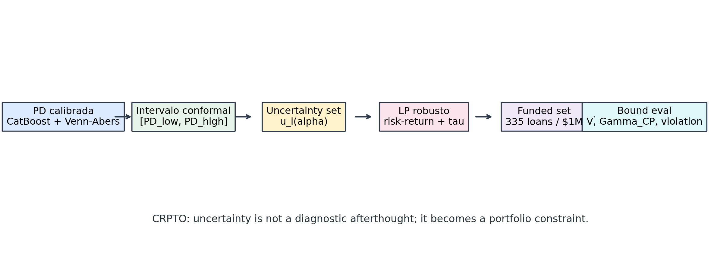
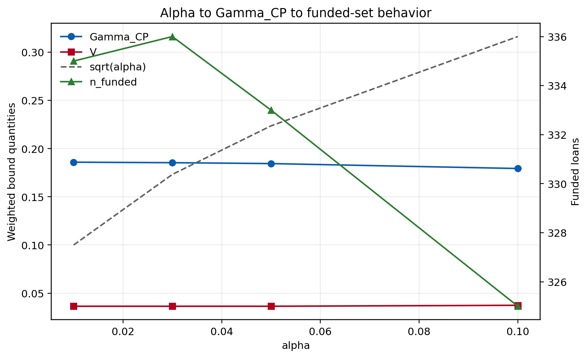
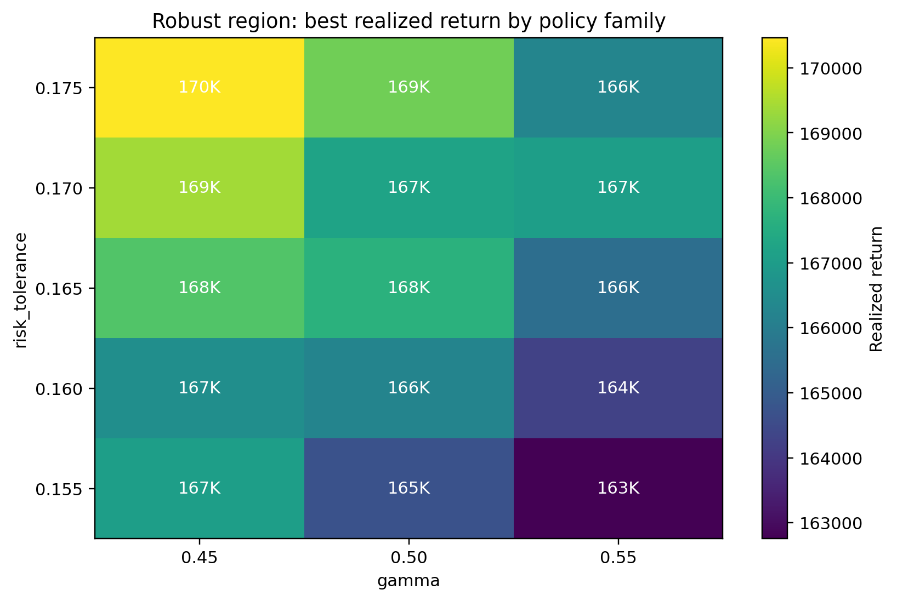

## Apéndice Journal-Ready de Robustez {#sec-p1-journal-appendix}

Esta pagina agrupa el material que fortalece el Paper Estrella sin cambiar su
direccion. La idea es dejar listo el paquete de appendix para una version
journal: tail risk, satisficing, dependencia, stress temporal, bootstrap,
sensibilidad a presupuesto/LGD/caps y region robusta por familia de policy.

Los artefactos se generan con:

```bash
uv run python scripts/build_paper1_journal_package.py
```

El script usa solamente artefactos congelados del Paper Estrella. No reabre la
busqueda de champion y no reemplaza el retorno oficial del paper.

```{python}
#| label: p1-journal-setup
#| include: false

from pathlib import Path

import pandas as pd

cwd = Path.cwd().resolve()
root = next(
    candidate
    for candidate in [cwd, *cwd.parents]
    if (candidate / "reports" / "paper_material").exists()
    and (candidate / "models").exists()
)
tables_dir = root / "reports" / "paper_material" / "paper1" / "tables"
figures_dir = root / "reports" / "paper_material" / "figures_publication"
status_path = root / "models" / "paper1_journal_package_status.json"


def read_table(name: str) -> pd.DataFrame:
    return pd.read_csv(tables_dir / name)
```

### Export controlado desde Paper 4

El cierre del laboratorio Paper 4 deja cuatro piezas que si agregan valor al
Paper Estrella. Entran como robustez, limitaciones y framing editorial; no
reabren el champion oficial ni cambian el metodo central CRPTO.

| ID | Uso en Paper Estrella | Artefacto fuente | Regla de claim |
|---|---|---|---|
| F03 dynamic stress | robustez adicional del champion bajo replay mensual | `paper4_v31_champion_vs_cvar_stress_memo.csv` | 512 common paths y 494,592 trace rows son replay interno, no forecast externo |
| F04 CVaR/OCE | justifica conservar el economic champion frente al challenger de cola | `paper4_v31_champion_vs_cvar_stress_memo.csv`, `paper4_v467_cvar_frontier_probe.csv` | el challenger baja cola, pero `prob_beats = 47.65625%` no vence riqueza pareada |
| F05 online conformal | fortalece limitaciones y future work | `paper4_v470_online_monitoring_proxy_summary.csv` | proxy interno solamente; sin holdout externo/source-family para despliegue |
| SDAM/Powell | mejora el lenguaje de decision analytics | `paper4_sequential_decision_schema.json`, `19f-sequential-decision-framework.qmd` | framing CFA/secuencial; no claim DLA ni Bellman optimality |

: Piezas de Paper 4 exportadas al Paper Estrella como evidencia acotada {#tbl-p1-paper4-export}

La lectura editorial es deliberadamente estrecha. F03 sirve como robustness
extra; F04 defiende la decision de no cambiar del champion economico a CVaR; F05
vuelve mas honesta la seccion de limitaciones; y SDAM ayuda a explicar que CRPTO
es una politica CFA parametrica, no una caja negra de decision-focused learning.
El memo completo queda en
`docs/research/paper4_to_estrella_export_2026-05-17.md`.

### Figura conceptual CRPTO

La Figura @fig-p1-crpto-conceptual es la candidata natural para Figura 1 del
paper. Su valor es editorial: muestra que la incertidumbre no es un diagnostico
posterior, sino una restriccion que viaja hasta la decision.

{#fig-p1-crpto-conceptual fig-alt="Diagrama horizontal de seis bloques que conecta PD calibrada, intervalo conformal, uncertainty set, LP robusto, funded set y bound eval."}

### Alpha, `Gamma_CP` y funded set

La Figura @fig-p1-alpha-gamma-funded-set conecta el parametro conformal con las
cantidades que el comite de riesgo si puede leer: prima de robustez, no
cobertura ponderada y numero de prestamos financiados.

{#fig-p1-alpha-gamma-funded-set fig-alt="Grafica de lineas que muestra Gamma_CP, V, raiz de alpha y numero de prestamos financiados al variar alpha."}

### Region robusta `45/45`

La Figura @fig-p1-robust-region-heatmap es la evidencia visual de que el
champion no es un punto aislado. Cada celda resume la mejor rentabilidad de una
familia `risk_tolerance` por `gamma`, dentro de la mini-grid final exacta.

{#fig-p1-robust-region-heatmap fig-alt="Heatmap de retornos por risk tolerance y gamma; todas las familias pasan alpha01 en la region robusta final."}

### A12. Tail risk OCE/CVaR

Esta tabla responde una pregunta natural de journal: si el funded set tiene buen
retorno y buen bound, ¿que pasa con la cola de perdida realizada? La respuesta
se reporta como diagnostico sobre el funded set exacto, no como una nueva
optimizacion.

La lectura de cola se apoya en dos familias canonicas: CVaR como medida
optimizable de perdida extrema [@rockafellar2000_cvar] y OCE como clase convexa
de medidas de riesgo/aversion [@bental_teboulle2007_oce]. En este paper esas
referencias justifican el diagnostico de sensibilidad, no un cambio de
champion.

```{python}
#| label: tbl-p1-journal-tail-risk
#| tbl-cap: "A12. Tail risk del funded set exacto bajo LGD alternativos"

tail = read_table("paper1_tableA12_tail_risk_oce_cvar.csv")
tail
```

Lectura: `mean_loss_rate` negativo equivale a retorno medio positivo. Los
campos `cvar_90_loss_rate`, `cvar_95_loss_rate` y `cvar_99_loss_rate` muestran
la severidad de cola bajo pesos del funded set. La columna
`funded_set_repriced_return` es una repricing diagnostic loan-level; el retorno
oficial del champion sigue siendo `$170,464.54` desde
`models/final_project_promotion.json`.

### A13. Satisficing margins

Satisficing traduce el resultado a lenguaje OR: no solo maximizamos retorno,
sino que pasamos umbrales minimos de seguridad y holgura.

```{python}
#| label: tbl-p1-journal-satisficing
#| tbl-cap: "A13. Margenes satisficing de la policy oficial"

satisficing = read_table("paper1_tableA13_satisficing_margins.csv")
satisficing
```

Esta tabla es util para la introduccion y la discusion. Permite decir que el
champion economico supera al comparador theorem-tight en retorno, mantiene
`V <= sqrt(alpha)` y conserva `Gamma_CP` bajo un techo editorial de 20 puntos
porcentuales.

### A14. Diagnosticos de dependencia por cluster

El tightening Hoeffding/Bernstein necesita independencia adicional. No la
podemos asumir gratis; por eso documentamos estructura de dependencia y
concentracion por periodo, grade y periodo-grade.

```{python}
#| label: tbl-p1-journal-dependency
#| tbl-cap: "A14. Clusters con mayor exposicion y contribucion al bound"

dependency = read_table("paper1_tableA14_dependency_cluster_diagnostics.csv")
dependency.sort_values(["exposure_share", "V_contribution"], ascending=False).head(15)
```

Esta tabla no prueba independencia. Su funcion es mas honesta: mostrar donde
esta concentrada la exposicion y que clusters cargan la no-cobertura ponderada.
Eso fortalece el appendix teorico porque evita vender el tightening condicional
como si ya estuviera demostrado distribution-free.

### A15. Leave-one-period-out y stress temporal

La critica de post-seleccion suele preguntar si el resultado depende de un solo
periodo OOT. Esta tabla mantiene el funded set exportado, remueve o sobrepondera
periodos y re-normaliza pesos para medir sensibilidad.

```{python}
#| label: tbl-p1-journal-period-stress
#| tbl-cap: "A15. Stress leave-one-period-out y overweight 2x sobre el funded set"

period_stress = read_table("paper1_tableA15_leave_one_period_stress.csv")
period_stress
```

De nuevo, esto es diagnostico, no re-optimizacion. Sirve para revisar si `V`,
`Gamma_CP`, default ponderado o concentracion maxima se vuelven inestables al
mover masa temporal.

### A16. Bootstrap del funded set

El bootstrap no reemplaza el bound conformal. Sirve para dar intervalos
empiricos sobre metricas realizadas del funded set y preparar respuestas a
reviewers que pidan incertidumbre de segundo orden.

```{python}
#| label: tbl-p1-journal-bootstrap
#| tbl-cap: "A16. Bootstrap empirico del funded set exacto"

bootstrap = read_table("paper1_tableA16_bootstrap_funded_set_metrics.csv")
bootstrap
```

La fila de retorno bootstrap tambien usa `funded_set_repriced_return_lgd45`;
por eso no debe citarse como retorno oficial del champion. El paper final debe
citar retorno oficial desde `final_project_promotion.json` y usar esta tabla
como sensibilidad.

### A17. Presupuesto, LGD y caps de concentracion

La tabla A17 agrupa tres preguntas aplicadas:

- ¿que pasa si el mismo funded set se escala a otro presupuesto?
- ¿como cambia el retorno loan-level si LGD pasa de 35% a 60%?
- ¿el funded set viola caps simples de concentracion por segmento?

```{python}
#| label: tbl-p1-journal-budget-lgd-cap
#| tbl-cap: "A17. Sensibilidad diagnostica a presupuesto, LGD y caps de concentracion"

budget_cap_lgd = read_table("paper1_tableA17_budget_cap_lgd_sensitivity.csv")
budget_cap_lgd
```

La columna `diagnostic_pass` en los caps no dice que el optimizador resolvio un
problema con esa restriccion. Dice si el funded set exportado ya satisface ese
cap simple. Si un reviewer pide caps reales como constraint, eso seria un nuevo
experimento P2, no una correccion al champion actual.

### A18. Region robusta por familia de policy

Esta tabla es el par tabular del heatmap. Resume todas las familias finales
`risk_tolerance x gamma` y confirma que todas las celdas tienen pass rate
`alpha01 = 1.0`.

```{python}
#| label: tbl-p1-journal-robust-region-family
#| tbl-cap: "A18. Region robusta final por familia risk_tolerance x gamma"

robust_region = read_table("paper1_tableA18_robust_region_policy_family.csv")
robust_region
```

Esta es una de las mejores defensas del paper: el resultado de abril no es
"un champion con suerte", sino una region final donde todas las policies
evaluadas pasan el gate exacto.

### Appendix A3--A18 recomendado

::: {#tbl-p1-appendix-map}

| Tabla | Rol | Body o appendix |
|---|---|---|
| A3 | nested holdout 5k -> 25k -> 276k | appendix principal |
| A4 | sensibilidad periodo-grade | appendix principal |
| A5 | decision-aware conformal selector | appendix principal |
| A6 | synthetic shift basico | appendix principal |
| A7 | funded-set loan export | appendix online |
| A8 | funded-set composition | appendix online |
| A9 | strict temporal holdout | appendix principal |
| A10 | exact eval ranks 1/2/3 | appendix principal |
| A11 | enhanced synthetic shift | appendix principal |
| A12 | OCE/CVaR tail risk | appendix journal |
| A13 | satisficing margins | cuerpo corto o appendix |
| A14 | dependencia por clusters | appendix teorico |
| A15 | leave-one-period-out stress | appendix journal |
| A16 | bootstrap funded-set metrics | appendix journal |
| A17 | presupuesto, LGD y caps | appendix journal |
| A18 | robust region by policy family | cuerpo corto o appendix |

Mapa recomendado del appendix del Paper Estrella.
:::

### Checklist reproducible

Para regenerar el paquete completo de esta pagina:

```bash
uv run python scripts/export_paper1_canonical_tables.py
uv run python scripts/analyze_paper1_p1_evidence.py
uv run python scripts/build_paper1_journal_package.py
uv run pytest tests/test_docs/test_paper_estrella_final_sync.py
```

Para renderizar solo esta parte del libro:

```bash
cd book
QUARTO_PYTHON="$(pwd)/../.venv/bin/python" quarto render chapters/14-paper-estrella/14g-manuscript-blueprint.qmd --to html
QUARTO_PYTHON="$(pwd)/../.venv/bin/python" quarto render chapters/14-paper-estrella/14h-journal-appendix-robustness.qmd --to html
```

::: {.callout-important}
## Regla de sincronizacion

Si alguna tabla A12--A18 contradice `models/final_project_promotion.json`, gana
`final_project_promotion.json`. Las tablas nuevas son evidencia de robustez,
sensibilidad y empaque journal; no son una promocion nueva del champion.
:::

El estado reproducible queda registrado en
`models/paper1_journal_package_status.json` y el dossier asociado queda en
`docs/research/paper_estrella_journal_package_2026-05-04.md`.
