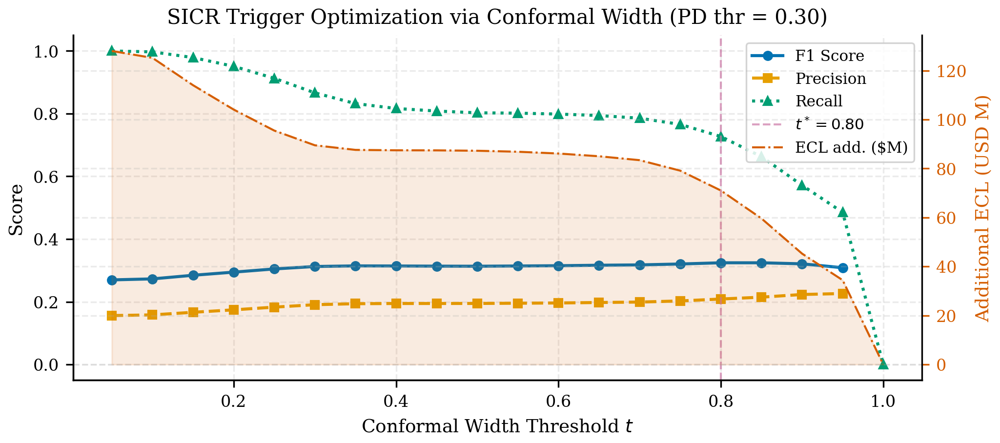
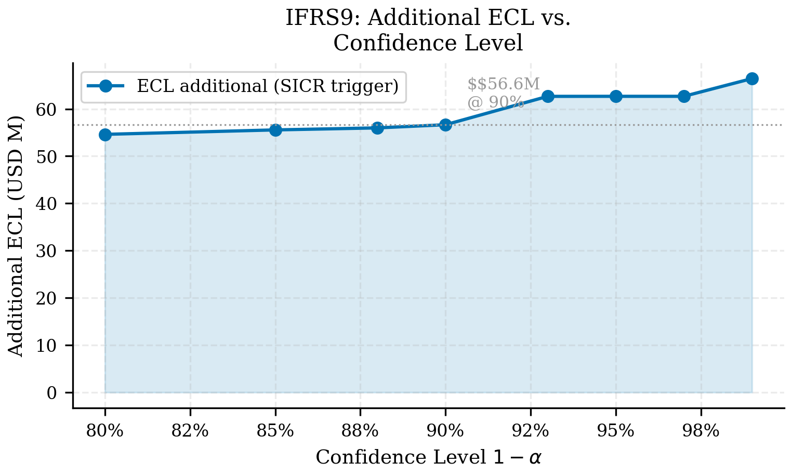
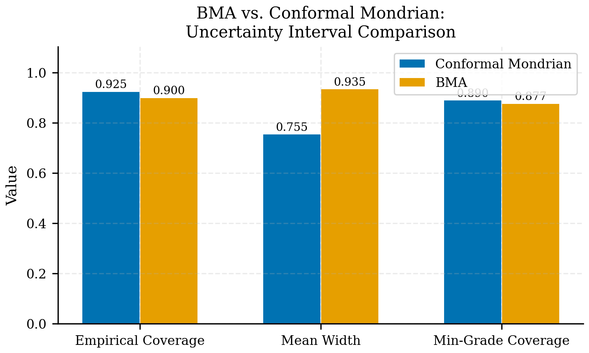

## Resultados {#sec-p2-results}

Los resultados muestran que IFRS9 es el lugar donde la incertidumbre deja de ser una curiosidad estadística y se convierte en un costo prudencial observable.

### ECL por escenario

```{python}
#| label: tbl-p2-results
#| tbl-cap: "IFRS9 ECL por escenario (cargado del artefacto canónico)"

import sys
from pathlib import Path
sys.path.insert(0, str(Path.cwd().parent if Path.cwd().name == "book" else Path.cwd()))
from book._helpers.load_artifacts import load_parquet
import pandas as pd

df = load_parquet("ifrs9_scenario_summary")

SCENARIO_LABEL = {
    "baseline": "Baseline",
    "mild_stress": "Mild Stress",
    "adverse": "Adverse",
    "severe": "Severe",
}

rows = []
for _, row in df.iterrows():
    ecl = row.get("total_ecl", 0)
    ecl_low = row.get("total_ecl_low", 0)
    ecl_high = row.get("total_ecl_high", 0)
    rows.append({
        "Escenario": SCENARIO_LABEL.get(row["scenario"], row["scenario"]),
        "Total ECL": f"${ecl/1e9:.3f}B",
        "Banda [low, high]": f"[${ecl_low/1e9:.3f}B, ${ecl_high/1e9:.3f}B]",
        "Stage 1 (n)": f"{int(row.get('stage1_n', 0)):,}",
        "Stage 2 (n)": f"{int(row.get('stage2_n', 0)):,}",
        "Stage 3 (n)": f"{int(row.get('stage3_n', 0)):,}",
    })

pd.DataFrame(rows)
```

```{python}
#| echo: false

# Compute sensitivity for narrative
base_ecl = df[df["scenario"] == "baseline"]["total_ecl"].values[0]
severe_ecl = df[df["scenario"] == "severe"]["total_ecl"].values[0]
pct_increase = (severe_ecl - base_ecl) / base_ecl * 100
```

El salto de baseline a severe implica aproximadamente **+70%** de ECL (con corrección CIF por riesgos competitivos integrada, ver @sec-cif-correction). Esa sensibilidad es suficiente para justificar una lectura prudencial explícita del escenario y no solo un reporte puntual de provisión.

::: {.column-page}
{#fig-p2-sicr-grid fig-alt="Grid de escenarios y reglas SICR del paper IFRS9."}
:::

::: {.column-page}
{#fig-p2-ecl-alpha fig-alt="Sensibilidad del ECL al parámetro alpha en el paper IFRS9."}
:::

### SICR con ancho conformal

El trigger complementario basado en incertidumbre encuentra un óptimo útil en `t* = 0.30` para `pd_threshold = 0.20`, con:

| Indicador | Valor |
|---|---:|
| F1 | 0.2515 |
| Recall de defaults no capturados | 75.8% |
| Precisión | 8.9% |
| ECL adicional | \$56.6M |

: Resultado operativo de SICR conformal {#tbl-p2-sicr}

La precisión de 8.9% merece una lectura operativa explícita: de cada 11 préstamos que el trigger reclasifica a Stage 2, solo uno resultará en default observado. Esto parece ineficiente hasta que se considera la asimetría de costos. Reclasificar un préstamo sano a Stage 2 genera sobre-provisión temporal (el exceso se libera cuando el préstamo se cura), pero dejar un default futuro en Stage 1 genera una insuficiencia de capital que puede requerir inyección urgente. Con un peso de costo asimétrico $w_{FN} = 5.0$ (ver @sec-stage-cost), la precisión de 8.9% es económicamente racional: el costo de los 10 falsos positivos es menor que el costo del único default que se habría escapado. En términos de gobernanza, un recall de 75.8% significa que el trigger conformal captura tres de cada cuatro deterioros que la PD puntual habría ignorado — una mejora material en la capacidad de detección temprana que justifica los \$56.6M adicionales de provisión como prima de protección.

::: {.column-page}
{#fig-p2-bma-vs-cp fig-alt="Comparación entre BMA y predicción conformal en el paper IFRS9."}
:::

La razón por la que CP domina a BMA en este contexto — intervalos más angostos, cobertura mínima garantizada por grupo — se analiza en detalle desde la perspectiva metodológica en @sec-uncertainty-baselines.

### Sensibilidad metodológica

Las extensiones del libro revelan tres fuentes adicionales de fragilidad en las provisiones IFRS9, cada una con un mecanismo distinto y un orden de magnitud propio.

La primera es la sensibilidad al umbral de staging. El análisis de costos por misclasificación (@sec-stage-cost) muestra que el óptimo de `pd_threshold` se ubica en 0.15 con un costo total de \$97.3M, pero la superficie es relativamente plana entre 0.13 y 0.18 (variación menor al 5%). Esto significa que la práctica habitual de fijar el umbral SICR en un valor convencional (como 0.20) puede alejarse del óptimo sin que el gestor lo perciba — el costo adicional se distribuye silenciosamente entre sobre-provisión y sub-detección.

La segunda es el sesgo del método de supervivencia. El capítulo de riesgos competitivos (@sec-cif-correction) demuestra que Kaplan-Meier sobreestima la PD lifetime en 26.7% respecto a la función de incidencia acumulada (CIF), porque trata los prepagos como censura en lugar de como un riesgo competitivo que retira préstamos del pool de riesgo. A escala de portafolio, esta diferencia se traduce en \$125.8M de reserva excesiva — un 12.6% del ECL total bajo KM. Para un banco que reporta bajo IFRS9, esta sobre-estimación infla artificialmente el Stage 2, reduce el capital disponible y puede distorsionar la señal de deterioro genuino.

La tercera es la incertidumbre temporal propagada a provisiones. El capítulo de series de tiempo (@sec-ts-ecl) muestra que cuando la banda de pronóstico de tasa de default se propaga a través de la fórmula ECL, el rango de provisión puede alcanzar \$305M — casi tres veces el ECL puntual. La expansión no es proporcional al error de pronóstico: cerca de cero, el escenario optimista se comprime contra un piso natural (no hay default negativo), mientras que el escenario adverso activa migraciones de staging que amplifican la señal de forma no lineal.

La implicación conjunta es que un pipeline de provisiones que ignore cualquiera de estas tres dimensiones está operando con una falsa sensación de precisión. El threshold de staging, el método de supervivencia y la trayectoria macro son tres palancas que, individualmente, pueden mover las provisiones en decenas de millones, y que interactúan entre sí de formas que solo un análisis integrado puede capturar.

### Lectura del paper

El resultado central del paper no es que exista una única provisión “correcta” — es que el pipeline puede exponer de forma trazable tres capas de información que un comité de finanzas y riesgo necesita para tomar decisiones defendibles: una provisión puntual que ancla la conversación, una banda prudencial que cuantifica la incertidumbre del modelo por segmento de riesgo, y el costo marginal de endurecer el staging o el escenario. Sin la primera, no hay referencia; sin la segunda, no hay honestidad sobre lo que el modelo no sabe; sin la tercera, no hay capacidad de respuesta ante cambios de régimen. La combinación de las tres convierte el reporte de provisiones de un número defensivo en un instrumento de gestión activa.
