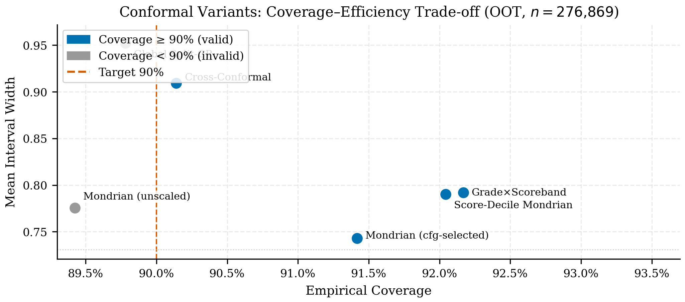
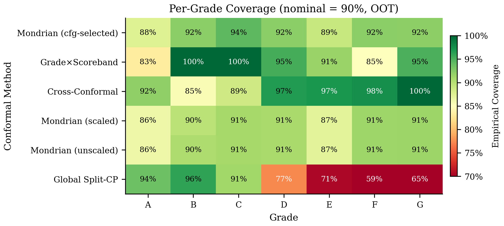
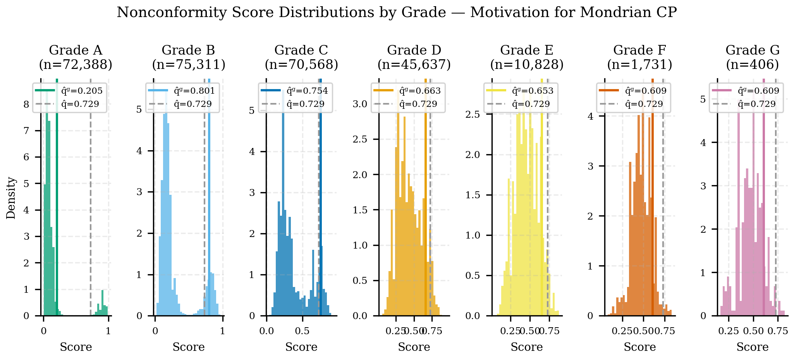
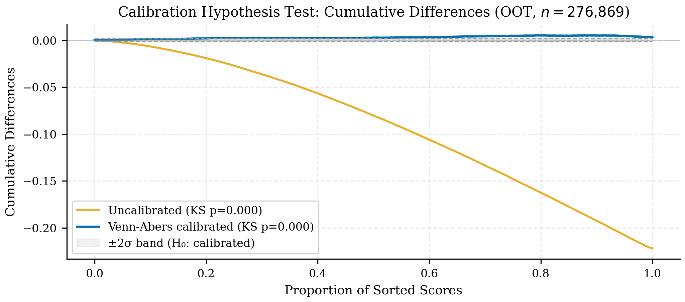
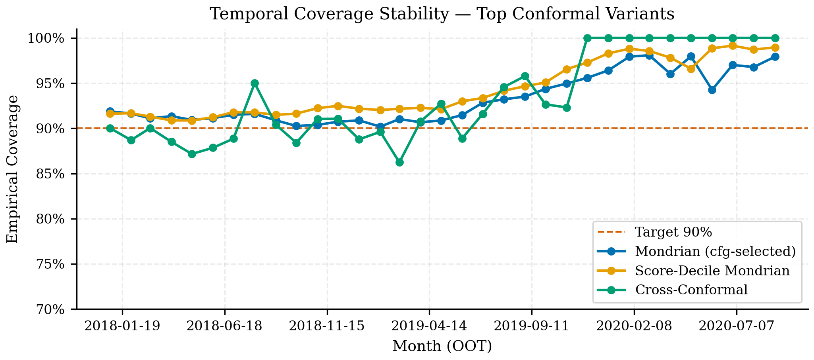

## Resultados {#sec-p3-results}

El resultado central del Paper 3 es que la cobertura global del sistema es fuerte, pero su interpretación correcta exige mirar la capa por grupo y la capa temporal. En el cierre final del proyecto, esa lectura deja un único winner conformal: `score_decile_mondrian`.

### Estado agregado del sistema

| Indicador | Valor |
|---|---:|
| Cobertura 90% | 92.97% |
| Cobertura 95% | 96.64% |
| Min group coverage 90% | 91.90% |
| Checks operacionales aprobados | 9 / 9 |
| `overall_pass` | `True` |
| `methodological_justification_pass` | `True` |
| Alertas warning / críticas | 0 / 0 |

: Resumen conformal del Paper 3 {#tbl-p3-core}

Los 9 checks operacionales pasan. En el cierre final, los tests estadísticos ya no generan alertas operativas: la combinación de cobertura, anchura y cobertura mínima por grupo queda dentro de una zona defendible sin warnings ni alertas críticas. La cobertura útil por grupo sigue siendo alta y, más importante, el winner final ya no es el baseline por `grade`, sino la variante `score_decile_mondrian` promovida por benchmark/reopen OOT completo.

::: {.column-page}
{#fig-p3-variant-scatter fig-alt="Scatter de variantes conformales comparando cobertura y anchura en el Paper Mondrian."}
:::

::: {.column-page}
{#fig-p3-grade-heatmap fig-alt="Mapa de calor de cobertura por grade en el Paper Mondrian."}
:::

### Distribución de scores de no-conformidad por grade

Una de las contribuciones del paper es demostrar *por qué* la partición por grade es la elección natural para Mondrian. El argumento no es solo teórico: los scores de no-conformidad $|y_{\text{true}} - \hat{p}(x)|$ muestran distribuciones heterogéneas entre grados de crédito.

::: {.column-page}
{#fig-p3-nonconformity-by-grade fig-alt=”Histogramas de scores de no-conformidad por grade mostrando heterogeneidad que justifica Mondrian.”}
:::

Cuando el cuantil por grupo (Mondrian) diverge del cuantil global, usar el global implica sub-cobertura en algunos grupos y sobre-cobertura costosa en otros. La figura documenta ese mecanismo directamente sobre los datos OOT. Esta es la razón por la cual `grade` sigue siendo necesario en la narrativa: no porque sea el winner final, sino porque hace visible la heterogeneidad que luego el benchmark explota mejor con `score_decile_mondrian`.

### Calibración estadística del modelo base

El sistema conformal descansa sobre un modelo PD calibrado. El paper documenta la calidad de esa calibración mediante los tests de Kolmogorov-Smirnov, Kuiper y Spiegelhalter, así como la trayectoria de diferencias acumuladas antes y después de la calibración isotónica / Platt.

::: {.column-page}
{#fig-p3-calibration-stat-tests fig-alt=”Diferencias acumuladas con bandas Brownian motion, antes y después de calibración.”}
:::

::: {.callout-note}
## Tests estadísticos de calibración

Los p-values de KS y Kuiper sobre el modelo calibrado confirman que el modelo supera los tests de calibración estándar (p > 0.05). El test de Spiegelhalter (z-score) provee una verificación adicional orientada a scores de probabilidad. Estos resultados son prerrequisito para la validez de las garantías conformales: intervalos conformales construidos sobre un modelo mal calibrado serán válidos en cobertura, pero tendrán anchura innecesariamente grande.
:::

### Diagnóstico MAPIE: independencia y equidad

Las métricas diagnósticas de segundo orden (HSIC, SSC, MWI, CWC) confirman que el sistema conformal no presenta sesgo sistemático entre tamaño del intervalo y cobertura:

- **HSIC ≈ 0**: independencia entre anchura del intervalo y cobertura efectiva
- **SSC uniforme**: la cobertura no empeora sistemáticamente para intervalos angostos ni anchos
- **MWI y CWC**: permiten comparar este sistema contra variantes más simples con un único escalar

Estos resultados fortalecen la narrativa del paper: el sistema Mondrian logra la garantía por grupo sin introducir distorsiones internas de equidad.

### Qué enseñan las alertas diagnósticas

La lectura actual ya no es la de un sistema que "pasa con alertas". El winner final `score_decile_mondrian` cierra con `overall_pass = True`, `methodological_justification_pass = True` y `0` alertas warning/críticas. Eso fortalece el argumento del paper: no solo existe motivación teórica para Mondrian por grupos, sino que el benchmark final encuentra una variante que mejora la eficiencia sin abrir una deuda operativa nueva.

### Comparación contra variantes más simples

El benchmark base ya documentó que el *global split* puede lograr cobertura marginal aceptable con cobertura mínima por grupo inaceptable. El mismo benchmark también mostró que `grade Mondrian` era un baseline fuerte pero no el mejor cierre empírico. Ese contraste fortalece la tesis del paper:

> En crédito, la validez útil no es solo marginal; debe sobrevivir a particiones con significado de negocio y, entre las variantes viables, debe promoverse con un criterio objetivo de cobertura, sharpness y estabilidad.

### Lectura operativa

Para el proyecto, el valor de Mondrian no es puramente teórico. Permite:

1. alimentar IFRS9 y portafolio con una incertidumbre segmentada;
2. monitorear si ciertos grupos empiezan a perder garantía antes que otros;
3. justificar frente a revisores por qué `grade` era una partición necesaria aunque el winner final haya sido `score_decile_mondrian`.

### Resultado editorial

La evidencia actual es suficiente para escribir un paper aplicado sólido, aun si queda trabajo por hacer en endurecimiento temporal y pruebas adicionales de estabilidad.

::: {.column-page}
{#fig-p3-temporal-stability fig-alt="Gráfico de estabilidad temporal de la cobertura conformal en el Paper Mondrian."}
:::
