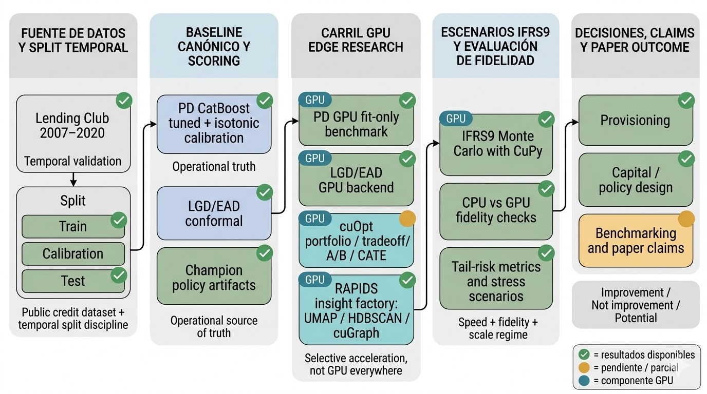



::: {.whole-game-intro}
<span class="whole-game-question">Pregunta central</span>

¿Dónde crea valor defendible la GPU en un pipeline real de riesgo crediticio cuando medimos velocidad, fidelidad y relevancia de decisión al mismo tiempo? Esta landing abre el paper GPU como una pieza complementaria a los papers principales y a la propuesta integrada de Paper 4.

Ejemplo concreto: un mismo carril GPU puede verse muy distinto según la métrica. `PD fit-only` sí mejora, `PD full-stage` no; `IFRS9 Monte Carlo` sí cambia el régimen de escala; `cuOpt` parece fuerte, pero todavía exige reruns CPU pareados para convertir intuición en claim paper-grade.
:::

Este paper no quiere probar que “todo debe correr en GPU”. Quiere proponer una regla mucho más útil: **la GPU vale cuando acelera workloads selectivos sin perder fidelidad material o cuando habilita un régimen de decisión/escala que CPU hacía impráctico**.

::: {.callout-note .mini-abstract}
## Mini-abstract
**Problema**: los benchmarks GPU suelen sobrevalorar speedup aislado y subvalorar fidelidad, overhead y relevancia de decisión.
**Método**: benchmark aplicado sobre scoring, IFRS9 Monte Carlo, optimización prescriptiva e insight analytics, con separación explícita entre mejora real, no mejora y potencial.
**Hallazgo esperado**: el aporte fuerte no es “GPU everywhere”, sino un mapa selectivo y fidelidad-aware para sistemas de riesgo crediticio.
:::

## Qué propone exactamente este paper

La propuesta central no es una librería ni un benchmark suelto. Es un marco aplicado para contestar una pregunta de ingeniería financiera:

> ¿Qué partes de un pipeline real de riesgo crediticio sí merecen promoción a GPU cuando medimos conjuntamente tiempo, fidelidad de salidas, impacto en decisión y régimen de escala?

En términos concretos, el paper propone:

- una taxonomía de workloads GPU en crédito: `scoring`, `provisión IFRS9`, `optimización prescriptiva` y `analítica estructural`;
- una regla de evaluación única: `speed + fidelity + decision impact + scale regime`;
- un benchmark aplicado sobre el mismo proyecto, no sobre microdemos desconectadas;
- una lectura honesta de tres buckets:
  - `improvement`
  - `not improvement`
  - `potential`

El claim fuerte del paper sería este:

> La GPU sí crea valor defendible en riesgo crediticio, pero de manera selectiva: ya es muy fuerte en Monte Carlo IFRS9, útil en algunos entrenamientos y workstreams de analítica estructural, y prometedora en OR/portfolio si se completan los reruns y métricas de fidelidad de decisión.

## Diagrama del paper

La figura siguiente resume la arquitectura narrativa del paper, separando baseline canónico, carril GPU edge research, evaluación de fidelidad y la salida final hacia decisiones y benchmarking.

{#fig-paper-gpu-overview fig-alt="Diagrama horizontal del paper GPU con etapas del pipeline, componentes GPU y estados de resultados."}

## Por qué este paper vale la pena

No compite con el CRPTO/Paper_CRPTO, con IFRS9 E2E ni con Mondrian. Los complementa. Mientras esos papers responden preguntas metodológicas y prudenciales, `Paper GPU` responde una pregunta transversal de plataforma aplicada:

- dónde conviene acelerar;
- dónde no conviene;
- qué claims ya son publicables;
- y qué falta para convertir promesa técnica en evidencia paper-grade.

## Cómo leer esta parte

- **Positioning** fija el gap y por qué el framing correcto es applied finance + OR.
- **Theoretical Framework** define el marco de cuatro lentes y la regla `speed + fidelity + decision impact + scale regime`.
- **Existing Evidence** resume la evidencia ya disponible en el repo.
- **Gap And Experiments** enumera exactamente qué falta para volver submission-ready este draft.

## Navegación curada

```{=html}
<div class="chapter-landing-grid">
  <div class="chapter-card"><h4><a href="17a-positioning.html">Positioning</a></h4><p>Gap, venue fit y relación con los otros papers.</p></div>
  <div class="chapter-card"><h4><a href="17b-theoretical-framework.html">Theoretical Framework</a></h4><p>Cuatro lentes y regla de evaluación fidelidad-aware.</p></div>
  <div class="chapter-card"><h4><a href="17c-existing-evidence.html">Existing Evidence</a></h4><p>Qué ya tenemos y qué claims ya son defendibles.</p></div>
  <div class="chapter-card"><h4><a href="17d-gap-and-experiments.html">Gap And Experiments</a></h4><p>Experimentos faltantes, checklist y ruta de submission.</p></div>
</div>
```
