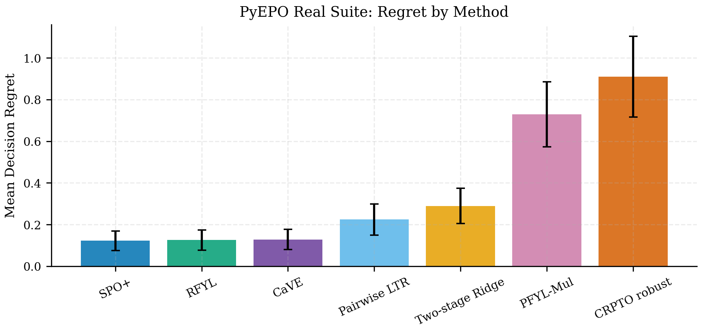
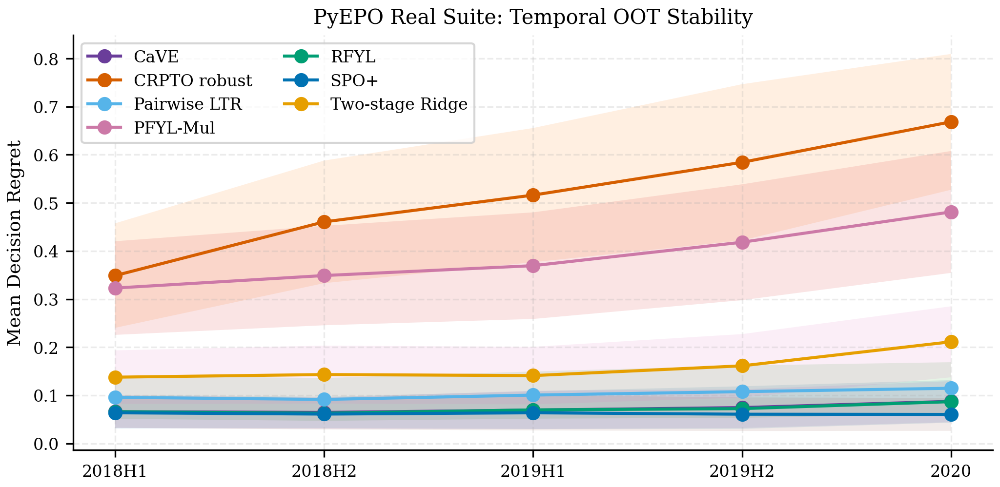

## Rol academico

La v39 convierte la antigua lane de "oracle-regret only" en una suite real de
decision-focused learning con PyEPO 1.3.7. La corrida final entrena modelos
diferenciables contra la decision de portafolio para SPO+, RFYL, PFYL-Mul,
pairwise LTR y CaVE. CRPTO se mantiene como comparador no entrenado, auditable
y conservador.

La regla editorial se mantiene: Paper Estrella usa PyEPO solo para reproducir
el anexo SPO+ y sostener la frase "SPO+ gana regret; CRPTO gana
garantia/auditabilidad". Paper 4 absorbe el laboratorio completo.

```{python}
#| label: p4-pyepo-setup
#| include: false

from pathlib import Path

import pandas as pd

cwd = Path.cwd()
root = next(
    (
        candidate
        for candidate in [cwd, *cwd.parents]
        if (candidate / "pyproject.toml").exists() and (candidate / "reports").exists()
    ),
    cwd,
)
tables_dir = root / "reports/paper_material/paper4/tables"

ledger = pd.read_csv(tables_dir / "pyepo_real_suite_execution_ledger_20260528.csv")
full = pd.read_csv(tables_dir / "pyepo_real_suite_summary_full_20260528.csv")
temporal = pd.read_csv(tables_dir / "pyepo_real_suite_summary_temporal_20260528.csv")
period = pd.read_csv(tables_dir / "pyepo_real_suite_temporal_by_period_20260528.csv")
coverage = pd.read_csv(tables_dir / "pyepo_real_suite_temporal_coverage_20260528.csv")
coverage_grade = pd.read_csv(
    tables_dir / "pyepo_real_suite_temporal_coverage_by_period_grade_20260528.csv"
)
cave_sensitivity = pd.read_csv(tables_dir / "pyepo_real_suite_cave_sensitivity_20260528.csv")
pfyl_ablation = pd.read_csv(tables_dir / "pyepo_real_suite_pfyl_ablation_20260528.csv")
spoplus_robustness = pd.read_csv(
    tables_dir / "pyepo_real_suite_spoplus_robustness_20260528.csv"
)

display_cols = [
    "method_display",
    "mean_regret",
    "std_regret",
    "median_regret",
    "improvement_vs_two_stage_pct",
    "n_observations",
]

def pretty_summary(df):
    out = df[display_cols].copy()
    out["mean_regret"] = out["mean_regret"].map(lambda x: f"{x:.6f}")
    out["std_regret"] = out["std_regret"].map(lambda x: f"{x:.6f}")
    out["median_regret"] = out["median_regret"].map(lambda x: f"{x:.6f}")
    out["improvement_vs_two_stage_pct"] = out["improvement_vs_two_stage_pct"].map(lambda x: f"{x:.2f}%")
    out["n_observations"] = out["n_observations"].map(lambda x: f"{int(x):,}")
    return out.rename(
        columns={
            "method_display": "Metodo",
            "mean_regret": "Regret medio",
            "std_regret": "Std",
            "median_regret": "Mediana",
            "improvement_vs_two_stage_pct": "Mejora vs two-stage",
            "n_observations": "Obs.",
        }
    )

def pretty_followup(df, cols):
    out = df[cols].copy()
    for col in ["mean_regret", "std_regret", "median_regret"]:
        if col in out:
            out[col] = out[col].map(lambda x: f"{x:.6f}")
    if "improvement_vs_two_stage_pct" in out:
        out["improvement_vs_two_stage_pct"] = out["improvement_vs_two_stage_pct"].map(
            lambda x: f"{x:.2f}%"
        )
    if "runtime_seconds" in out:
        out["runtime_seconds"] = out["runtime_seconds"].map(lambda x: f"{x:.1f}")
    return out
```

## Ejecucion final

La suite final se ejecuto con `pyepo==1.3.7`, `gurobipy==13.0.2`, Gurobi WLS
academico y `torch-num-threads=4`. La combinacion PyEPO/Gurobi quedo asi:
PyEPO define las perdidas y el entrenamiento; Gurobi entrega la rama binaria de
CaVE; y el resto de losses usa un oracle top-k exacto porque la restriccion del
problema es seleccionar exactamente `budget` loans [@pyepo2026; @gurobi2026].
La rama CaVE se reporta como metodo de Paper 4, no como comparador principal de
Paper Estrella [@tang2024cave].

```{python}
#| label: tbl-p4-pyepo-execution-ledger
#| tbl-cap: "Ledger de ejecucion PyEPO 1.3.7 con Gurobi WLS"

ledger_display = ledger[
    [
        "run",
        "mode",
        "runtime_seconds",
        "best_method",
        "best_mean_regret",
        "spo_plus_improvement_vs_two_stage_pct",
        "smoke_gate_passed",
        "artifact_dir",
    ]
].copy()
ledger_display["runtime_seconds"] = ledger_display["runtime_seconds"].map(lambda x: f"{x:.1f}")
ledger_display["best_mean_regret"] = ledger_display["best_mean_regret"].map(lambda x: f"{x:.6f}")
ledger_display["spo_plus_improvement_vs_two_stage_pct"] = ledger_display[
    "spo_plus_improvement_vs_two_stage_pct"
].map(lambda x: f"{x:.2f}%")
ledger_display
```

::: {.callout-note}
## Leccion de ingenieria

El primer intento de `paper4_full` mostro miles de warnings `LP solver failed`
en PFYL-Mul usando el LP legacy de OR-Tools. Ese fallback no era metodologicamente
aceptable porque seleccionaba por orden, no por costo. La suite final corrige el
backend: SPO+, RFYL, PFYL-Mul y LTR usan `exact_topk_numpy_lexicographic`; CaVE
usa `gurobi_binary_optDatasetConstrs`. Desde esa correccion no aparecieron
fallbacks y todos los checks de regret no negativo pasaron.
:::

## Paper 4 full

La corrida completa usa 15 features numericas, `n_items=100`, `budget=30`,
2,000 instancias de entrenamiento, 500 instancias de test, 75 epochs y 10
semillas. Este es el resultado central de Paper 4 para comparar losses PyEPO.

```{python}
#| label: tbl-p4-pyepo-full-summary
#| tbl-cap: "Paper 4 full: regret por metodo PyEPO y comparadores"

pretty_summary(full)
```

{#fig-p4-pyepo-full-regret fig-alt="Grafico de barras con regret medio por metodo para la corrida Paper 4 full de PyEPO 1.3.7."}

La frontera baja de regret queda formada por SPO+, RFYL y CaVE. SPO+ obtiene el
mejor regret medio (`0.122379`) y reduce el regret frente a two-stage en
`57.66%`. RFYL (`0.125405`) y CaVE (`0.128109`) quedan muy cerca, lo que
convierte a CaVE en una comparacion formal relevante ahora que Gurobi esta
disponible. LTR queda como benchmark intermedio y PFYL-Mul es un resultado
negativo bajo la formulacion positiva desplazada.

## Follow-ups de cierre

Despues de la suite principal se ejecutaron tres cierres metodologicos sin tocar
DVC: una ablation PFYL-Mul con costo `risk_only = calibrated_pd * LGD`, una
sensibilidad CaVE sobre `max_iter`, y dos probes medianos de SPO+. Estos runs no
reemplazan el full canonico; cierran explicaciones alternativas y robustecen la
narrativa de Paper 4.

```{python}
#| label: tbl-p4-pyepo-pfyl-ablation
#| tbl-cap: "PFYL-Mul: ablation de costo economico versus risk-only"

pretty_followup(
    pfyl_ablation,
    [
        "run_name",
        "cost_target",
        "mean_regret",
        "std_regret",
        "improvement_vs_two_stage_pct",
        "n_observations",
        "n_train_instances",
        "epochs",
        "seeds",
    ],
).rename(
    columns={
        "run_name": "Run",
        "cost_target": "Costo",
        "mean_regret": "Regret medio",
        "std_regret": "Std",
        "improvement_vs_two_stage_pct": "Mejora vs TS",
        "n_observations": "Obs.",
        "n_train_instances": "Train inst.",
        "epochs": "Epochs",
        "seeds": "Seeds",
    }
)
```

El resultado es un negativo fuerte: quitar el termino de retorno mejora PFYL-Mul
de `0.729797` a `0.481047`, pero sigue muy lejos del two-stage risk-only y no
queda cerca de SPO+/RFYL/CaVE. Por tanto, Paper 4 debe narrarlo como una loss no
alineada para esta decision top-k, no como un metodo competitivo.

```{python}
#| label: tbl-p4-pyepo-cave-sensitivity
#| tbl-cap: "CaVE: sensibilidad al numero de iteraciones de cone alignment"

pretty_followup(
    cave_sensitivity,
    [
        "run_name",
        "scope",
        "cave_max_iter",
        "mean_regret",
        "std_regret",
        "improvement_vs_two_stage_pct",
        "runtime_seconds",
        "n_observations",
    ],
).rename(
    columns={
        "run_name": "Run",
        "scope": "Scope",
        "cave_max_iter": "max_iter",
        "mean_regret": "Regret medio",
        "std_regret": "Std",
        "improvement_vs_two_stage_pct": "Mejora vs TS",
        "runtime_seconds": "Runtime s",
        "n_observations": "Obs.",
    }
)
```

CaVE `max_iter=1` replica practicamente al canonico `max_iter=3` en escala full
(`0.127453` vs `0.128109`) y corre en bastante menos tiempo cuando se aisla como
unico metodo. El probe `max_iter=5` no mejora la decision en escala mediana
(`0.155371`), aunque la loss interna baje mucho; mas iteraciones no son una
garantia de menor regret.

```{python}
#| label: tbl-p4-pyepo-spoplus-robustness
#| tbl-cap: "SPO+: probes de robustez para learning rate y tamano top-k"

pretty_followup(
    spoplus_robustness,
    [
        "run_name",
        "n_items",
        "budget",
        "lr",
        "mean_regret",
        "std_regret",
        "improvement_vs_two_stage_pct",
        "n_observations",
    ],
).rename(
    columns={
        "run_name": "Run",
        "n_items": "Items",
        "budget": "Budget",
        "lr": "LR",
        "mean_regret": "Regret medio",
        "std_regret": "Std",
        "improvement_vs_two_stage_pct": "Mejora vs TS",
        "n_observations": "Obs.",
    }
)
```

SPO+ conserva mejora alta en los probes medianos: `55.70%` con learning rate
`5e-4` y `57.19%` en top-k50. Esto no prueba optimalidad universal, pero si
reduce el riesgo de que el resultado central dependa de una unica escala o de un
unico learning rate.

## Temporal OOT

La corrida temporal usa `n_items=50`, `budget=15`, 1,600 instancias de
entrenamiento, 80 instancias por periodo y 10 semillas. Su rol no es reemplazar
el full, sino medir estabilidad fuera de tiempo y conectar regret con cobertura
conformal.

```{python}
#| label: tbl-p4-pyepo-temporal-summary
#| tbl-cap: "Temporal OOT: regret agregado por metodo"

pretty_summary(temporal)
```

```{python}
#| label: tbl-p4-pyepo-temporal-period
#| tbl-cap: "Temporal OOT: regret medio por periodo"

period_order = ["2018H1", "2018H2", "2019H1", "2019H2", "2020"]
period_display = (
    period.pivot_table(index="period", columns="method_display", values="mean_regret")
    .reindex(period_order)
    .reset_index()
)
for col in period_display.columns:
    if col != "period":
        period_display[col] = period_display[col].map(lambda x: f"{x:.6f}")
period_display
```

{#fig-p4-pyepo-temporal-stability fig-alt="Lineas de regret medio por periodo para SPO+, RFYL, PFYL-Mul, LTR, CaVE, two-stage y CRPTO robust."}

El stress OOT principal es 2020. Two-stage sube de un regret medio de
aproximadamente `0.138` en 2018H1 a `0.211` en 2020. SPO+ mantiene una banda
muy estable (`0.060` a `0.064`) y por eso alcanza `61.07%` de mejora agregada
frente a two-stage en la corrida temporal. RFYL y CaVE siguen siendo fuertes,
pero degradan mas claramente en 2020.

## Cobertura y auditabilidad

CRPTO no compite por menor regret puro. Su papel es mostrar la contraparte
auditable: cobertura conformal y decisiones conservadoras. La misma corrida
temporal registra cobertura 90% por periodo entre `92.41%` y `99.25%`, cobertura
95% entre `95.67%` y `99.70%`, y minima cobertura por grade entre `81.25%` y
`98.87%`.

```{python}
#| label: tbl-p4-pyepo-coverage-periods
#| tbl-cap: "Cobertura conformal registrada por la corrida temporal PyEPO"

coverage_display = coverage.copy()
coverage_display["default_rate"] = coverage_display["default_rate"].map(lambda x: f"{100 * x:.2f}%")
coverage_display["coverage_90"] = coverage_display["coverage_90"].map(lambda x: f"{100 * x:.2f}%")
coverage_display["coverage_95"] = coverage_display["coverage_95"].map(lambda x: f"{100 * x:.2f}%")
coverage_display["avg_width_90"] = coverage_display["avg_width_90"].map(lambda x: f"{x:.4f}")
coverage_display["min_grade_coverage_90"] = coverage_display["min_grade_coverage_90"].map(
    lambda x: f"{100 * x:.2f}%"
)
coverage_display.rename(
    columns={
        "period": "Periodo",
        "n_loans": "Loans",
        "default_rate": "Default rate",
        "coverage_90": "Coverage 90",
        "coverage_95": "Coverage 95",
        "avg_width_90": "Width 90",
        "min_grade_coverage_90": "Min grade cov. 90",
    }
)
```

Esta lectura no contradice el ranking de regret. Dice algo distinto y util:
SPO+ y los losses PyEPO son la evidencia de rendimiento decisional; CRPTO es la
evidencia de control, cobertura y auditabilidad.

```{python}
#| label: tbl-p4-pyepo-coverage-grade-tail
#| tbl-cap: "Cobertura 90 por periodo y grade: celdas con menor cobertura"

grade_tail = coverage_grade.sort_values("coverage_90").head(8).copy()
grade_tail["default_rate"] = grade_tail["default_rate"].map(lambda x: f"{100 * x:.2f}%")
grade_tail["coverage_90"] = grade_tail["coverage_90"].map(lambda x: f"{100 * x:.2f}%")
grade_tail["coverage_95"] = grade_tail["coverage_95"].map(lambda x: f"{100 * x:.2f}%")
grade_tail["avg_width_90"] = grade_tail["avg_width_90"].map(lambda x: f"{x:.4f}")
grade_tail.rename(
    columns={
        "period": "Periodo",
        "grade": "Grade",
        "n_loans": "Loans",
        "default_rate": "Default rate",
        "coverage_90": "Coverage 90",
        "coverage_95": "Coverage 95",
        "avg_width_90": "Width 90",
    }
)
```

## Uso en los papers

Para **Paper Estrella**, usar solo el paired run:
`paper_estrella_pyepo137_wls_topk_paired_20260528`. El numero actualizado es
`48.51%` de mejora de SPO+ frente a two-stage, con Wilcoxon pareado
`p = 3.80e-163` sobre 1,000 observaciones.

Para **Paper 4**, usar el full y el temporal:

- Full: `paper4_pyepo137_wls_topk_full_20260528`, 5,000 observaciones por
  metodo.
- Temporal: `paper4_pyepo137_wls_topk_temporal_20260528`, 4,000 observaciones
  por metodo y cinco periodos OOT.

La frase metodologica recomendada es: "PyEPO 1.3.7 habilita una suite formal de
DFL sobre la decision top-k de portafolio; Gurobi 13 habilita CaVE mediante
restricciones binarias, y CRPTO permanece como comparador robusto auditable, no
como learner de regret."

## Reproducibilidad

```bash
source scripts/setup_gurobi_env.sh
OMP_NUM_THREADS=4 MKL_NUM_THREADS=4 OPENBLAS_NUM_THREADS=4 \
uv run --extra spo python scripts/run_pyepo_real_suite.py --mode paired --torch-num-threads 4

OMP_NUM_THREADS=4 MKL_NUM_THREADS=4 OPENBLAS_NUM_THREADS=4 \
uv run --extra spo python scripts/run_pyepo_real_suite.py --mode paper4_full --torch-num-threads 4

OMP_NUM_THREADS=4 MKL_NUM_THREADS=4 OPENBLAS_NUM_THREADS=4 \
uv run --extra spo python scripts/run_pyepo_real_suite.py --mode temporal --torch-num-threads 4

uv run --extra spo python scripts/run_pyepo_real_suite.py --mode paper4_full \
  --cost-target risk_only --methods pfyl_mul --torch-num-threads 4

uv run --extra spo python scripts/run_pyepo_real_suite.py --mode paper4_full \
  --methods cave --cave-max-iter 1 --torch-num-threads 4

uv run python scripts/summarize_pyepo_followups.py
```

Artefactos congelados:

- `reports/paper_material/paper_estrella/pyepo/paper_estrella_pyepo137_wls_topk_paired_20260528/`
- `reports/paper_material/paper4/status/paper4_pyepo137_wls_topk_full_20260528/`
- `reports/paper_material/paper4/status/paper4_pyepo137_wls_topk_temporal_20260528/`
- `reports/paper_material/paper4/status/paper4_pyepo137_wls_pfyl_risk_only_full_20260528/`
- `reports/paper_material/paper4/status/paper4_pyepo137_wls_cave_maxiter1_full_20260528/`
- `reports/paper_material/paper4/status/paper4_pyepo137_wls_cave_maxiter5_medium_20260528/`
- `reports/paper_material/paper4/status/paper4_pyepo137_wls_spoplus_lr5e4_medium_20260528/`
- `reports/paper_material/paper4/status/paper4_pyepo137_wls_spoplus_topk50_medium_20260528/`
- `reports/paper_material/paper4/tables/pyepo_real_suite_execution_ledger_20260528.csv`
- `reports/paper_material/paper4/tables/pyepo_real_suite_followup_summary_20260528.csv`
- `reports/paper_material/paper4/tables/pyepo_real_suite_temporal_coverage_by_period_grade_20260528.csv`
