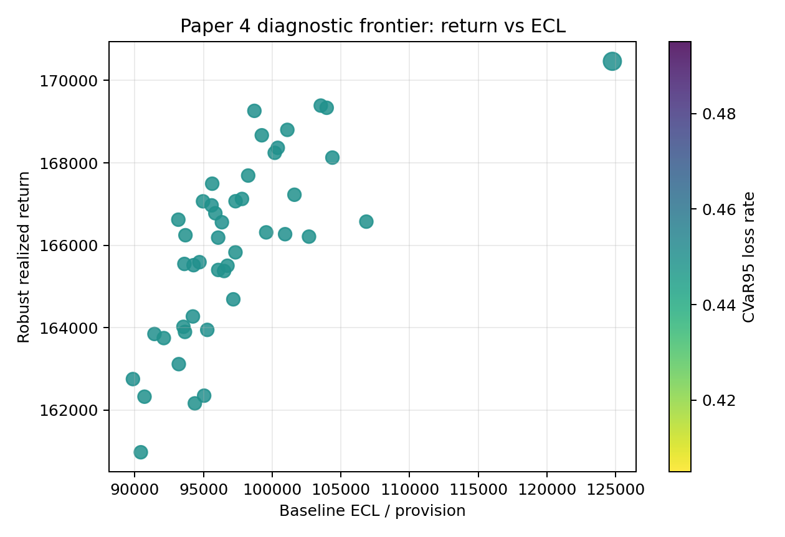
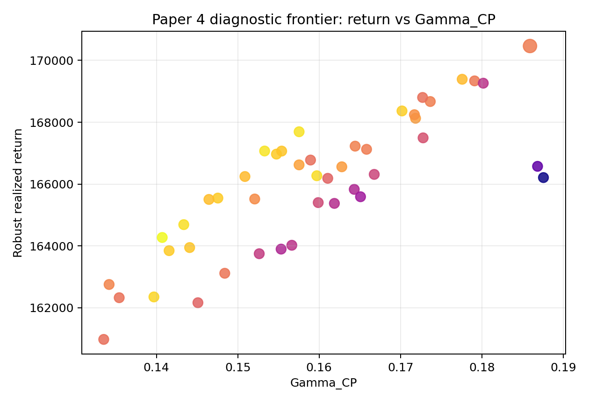

```{python}
#| include: false

from __future__ import annotations

import json
import sys
from pathlib import Path

import pandas as pd

ROOT = Path.cwd().resolve()
while ROOT != ROOT.parent and not (ROOT / "reports").exists():
    ROOT = ROOT.parent
sys.path.insert(0, str(ROOT))

TABLE_DIR = ROOT / "reports" / "paper_material" / "paper4" / "tables"
STATUS_DIR = ROOT / "reports" / "paper_material" / "paper4" / "status"

def _csv(name: str) -> pd.DataFrame:
    path = TABLE_DIR / name
    return pd.read_csv(path) if path.exists() else pd.DataFrame()

def _json(name: str) -> dict:
    path = STATUS_DIR / name
    return json.loads(path.read_text(encoding="utf-8")) if path.exists() else {}

selector = _csv("paper4_table14_ifrs9_tail_satisficing_selector.csv")
frontier = _csv("paper4_return_ecl_tail_frontier.csv")
bootstrap = _csv("paper4_policy_pairwise_bootstrap_ci.csv")
robust_sat = _csv("paper4_robust_satisficing_policy_eval.csv")
config = _json("paper4_diagnostic_selector_config.json")
```

## Pregunta {#sec-paper4-diagnostic-selector-question}

Paper 4 ya puede comparar policies con más lentes que retorno robusto. La
pregunta ahora es:

> Si combinamos retorno, ECL, cola, satisficing y auditabilidad, ¿aparecen
> candidates que valga la pena rerresolver exacto en el futuro?

Este selector es diagnóstico. No crea champion y no crea promotion JSON.

::: {.callout-important}
## No promotion

La salida `promote_candidate_for_future_run` significa "vale la pena abrir un
experimento exacto", no "reemplaza al champion". El Paper Estrella sigue
congelado.
:::

## Artifacts

```{python}
#| label: tbl-paper4-selector-config
#| tbl-cap: "Configuración del selector diagnóstico"

pd.DataFrame(
    [{"component": key, "weight": value} for key, value in config.get("weights", {}).items()]
)
```

## Resultado

```{python}
#| label: tbl-paper4-diagnostic-selector-top
#| tbl-cap: "Top policies del selector diagnóstico Paper 4"

cols = [
    "policy_id",
    "realized_total_return",
    "net_return_after_ecl_full",
    "ecl",
    "cvar_95_loss_rate_full",
    "satisficing_pass_rate",
    "gamma_cp",
    "weighted_miscoverage_V",
    "diagnostic_selector_score",
    "diagnostic_selector_rank",
    "diagnostic_decision",
]
selector[cols].head(12) if not selector.empty else selector
```

La frontera muestra qué policies son eficientes en retorno vs ECL/tail:

{#fig-paper4-return-ecl-tail fig-alt="Scatter plot of baseline ECL on the x-axis and robust realized return on the y-axis, colored by CVaR95 loss rate."}

{#fig-paper4-gamma-return fig-alt="Scatter plot of Gamma CP on the x-axis and robust realized return on the y-axis, colored by diagnostic selector score."}

```{python}
#| label: tbl-paper4-frontier-table
#| tbl-cap: "Frontera tabular retorno/ECL/tail/auditabilidad"

frontier.sort_values("diagnostic_selector_rank").head(12) if not frontier.empty else frontier
```

## Paired bootstrap

Para no depender solo de ranking puntual, se generó un bootstrap pareado por
meses comunes contra el champion.

```{python}
#| label: tbl-paper4-paired-bootstrap
#| tbl-cap: "Diferencias bootstrap de net return vs champion"

bootstrap.head(12) if not bootstrap.empty else bootstrap
```

## Robust satisficing

El screen A13 también queda convertido en decisión diagnóstica:

```{python}
#| label: tbl-paper4-robust-satisficing-policy
#| tbl-cap: "Robust satisficing policy diagnostic"

robust_sat.head(12) if not robust_sat.empty else robust_sat
```

## Interpretación

La función de esta página no es elegir el Paper 4 final. Es filtrar el espacio.
Si una policy aparece arriba por selector, frontera y bootstrap, entonces vale
la pena abrir un rerun exacto con allocations persistidas. Si solo gana por un
componente, queda como señal parcial.

El selector también ayuda a depurar la arquitectura:

- si ECL domina demasiado, hay que ajustar pesos o stage logic;
- si satisficing no discrimina, los thresholds necesitan revisión;
- si `Gamma_CP` penaliza demasiado, la frontera regret-auditability debe
  decidir el tradeoff;
- si bootstrap no respalda el ranking, la policy queda parked.

## Next Step

El siguiente experimento serio sería:

```text
paper4_exact_replay_top5_selector_candidates
```

Ese run debería rerresolver solo el champion y los top 5 candidates, guardar
allocation vectors exactos, repetir IFRS9/tail/satisficing y comparar proxy vs
exacto antes de cualquier claim fuerte.
