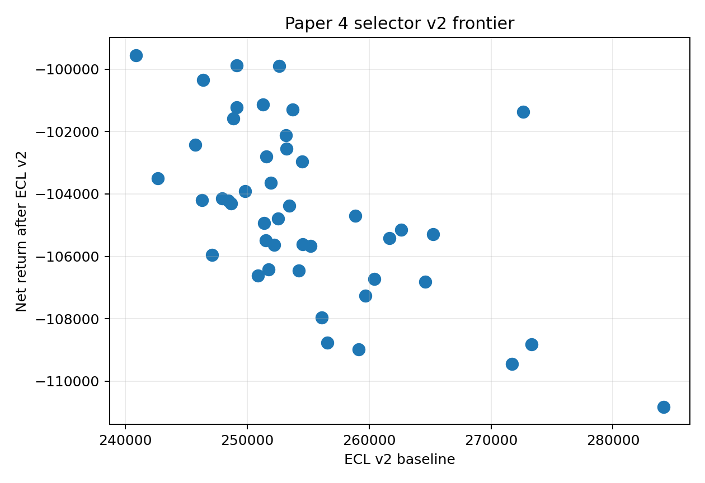

```{python}
#| include: false

from __future__ import annotations

import json
import sys
from pathlib import Path

import pandas as pd

ROOT = Path.cwd().resolve()
while ROOT != ROOT.parent and not (ROOT / "reports").exists():
    ROOT = ROOT.parent
sys.path.insert(0, str(ROOT))

TABLE_DIR = ROOT / "reports" / "paper_material" / "paper4" / "tables"
STATUS_DIR = ROOT / "reports" / "paper_material" / "paper4" / "status"

def _csv(name: str) -> pd.DataFrame:
    path = TABLE_DIR / name
    return pd.read_csv(path) if path.exists() else pd.DataFrame()

def _json(name: str) -> dict:
    path = STATUS_DIR / name
    return json.loads(path.read_text(encoding="utf-8")) if path.exists() else {}

def _cols(df: pd.DataFrame, columns: list[str]) -> pd.DataFrame:
    return df[[col for col in columns if col in df.columns]] if not df.empty else df

summary = _csv("paper4_ifrs9_v2_policy_summary.csv")
sicr = _csv("paper4_sicr_rule_comparison.csv")
stress = _csv("paper4_ifrs9_stage_transition_stress.csv")
selector = _csv("paper4_selector_v2_results.csv")
config = _json("paper4_selector_v2_config.json")
```

## Pregunta {#sec-paper4-ifrs9-v2-question}

El P0 ya tenía ECL por policy, pero Paper 4 necesitaba un overlay prudencial más
explícito:

> ¿Cómo cambia el ranking si tratamos SICR, lifetime ECL, escenarios de LGD y
> Stage 2 como parte del selector, no como tabla decorativa?

Esta versión agrega tres reglas SICR, tres escenarios y una penalización de
selector que mezcla retorno neto, ECL, cola, MDCP, fairness proxy y
auditabilidad.

## Artifacts

```{python}
#| label: tbl-paper4-selector-v2-config
#| tbl-cap: "Configuración selector v2"

pd.DataFrame(
    [{"component": key, "weight": value} for key, value in config.get("weights", {}).items()]
)
```

```{python}
#| label: tbl-paper4-ifrs9-v2-summary
#| tbl-cap: "IFRS9 v2 por policy, escenario y regla SICR"

_cols(
    summary,
    [
        "policy_id",
        "scenario",
        "sicr_rule",
        "funded_exposure",
        "ecl_v2",
        "stage2_lifetime_share",
        "stage3_observed_share",
        "net_return_after_ecl_v2",
    ],
).head(18)
```

## Resultado

```{python}
#| label: tbl-paper4-sicr-rule-comparison
#| tbl-cap: "Comparación de reglas SICR"

_cols(
    sicr,
    [
        "policy_id",
        "sicr_rule",
        "ecl_v2_baseline",
        "ecl_v2_adverse",
        "ecl_v2_severe",
        "severe_minus_baseline_ecl",
    ],
).head(18)
```

```{python}
#| label: tbl-paper4-selector-v2-top
#| tbl-cap: "Top selector v2 IFRS9/tail/MDCP/fairness/auditabilidad"

_cols(
    selector,
    [
        "policy_id",
        "net_return_after_ecl_v2",
        "ecl_v2",
        "cvar_95_loss_rate_v2",
        "worst_source_coverage_alpha01",
        "max_abs_representation_gap",
        "selector_v2_score",
        "selector_v2_gate_pass",
        "selector_v2_rank",
        "selector_v2_decision",
    ],
).head(15)
```

{#fig-paper4-selector-v2-frontier fig-alt="Scatter plot of CVaR95 loss rate on the x-axis and net return after ECL v2 on the y-axis, colored by selector v2 score."}

## Interpretación

El selector v2 es deliberadamente severo. Varias policies obtienen buen score
continuo pero fallan gates de peor cobertura o composición proxy. Eso es sano:
Paper 4 no busca una policy que gane por una sola métrica, sino una arquitectura
donde cada claim tenga un contrato.

La lectura prudencial es doble:

1. ECL/lifetime puede cambiar la conveniencia de policies que parecían buenas
   por retorno robusto.
2. Un ranking alto sin gate pass es una señal de investigación, no una señal de
   despliegue.

## Caveats

La regla lifetime sigue siendo proxy: Stage 2 usa un multiplicador simplificado
y SICR se define con PD absoluta, PD relativa o stress por grade. No modela
curvas lifetime completas, prepayment, recuperación ni macro paths calibrados.

## Next Step

El siguiente paso útil no es endurecer más el selector. Es conectar esta tabla
con allocations exactas persistidas para que ECL y Stage 2 se calculen sobre
funded sets exactos para todos los candidates relevantes.
