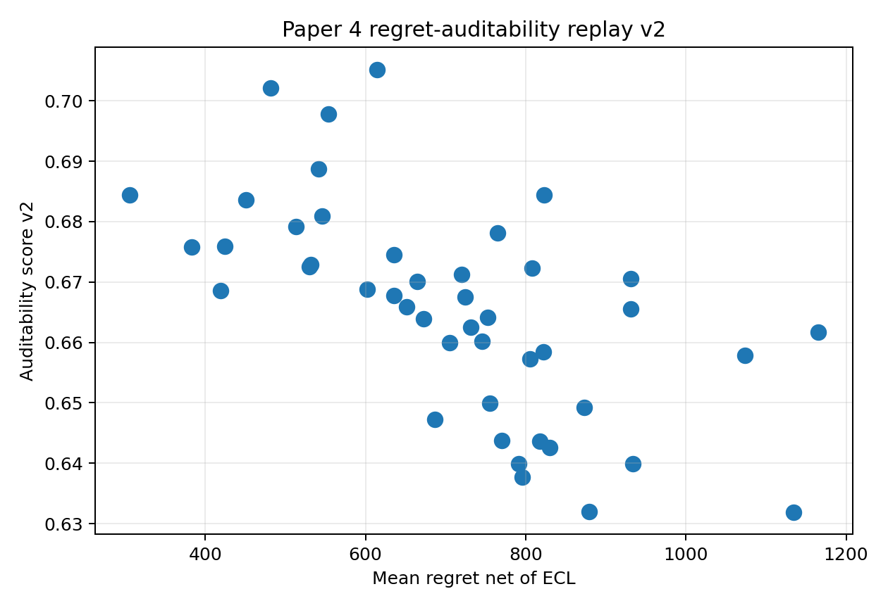

```{python}
#| include: false

from __future__ import annotations

import sys
from pathlib import Path

import pandas as pd

ROOT = Path.cwd().resolve()
while ROOT != ROOT.parent and not (ROOT / "reports").exists():
    ROOT = ROOT.parent
sys.path.insert(0, str(ROOT))

TABLE_DIR = ROOT / "reports" / "paper_material" / "paper4" / "tables"

def _csv(name: str) -> pd.DataFrame:
    path = TABLE_DIR / name
    return pd.read_csv(path) if path.exists() else pd.DataFrame()

def _pq(name: str) -> pd.DataFrame:
    path = TABLE_DIR / name
    return pd.read_parquet(path) if path.exists() else pd.DataFrame()

def _cols(df: pd.DataFrame, columns: list[str]) -> pd.DataFrame:
    return df[[col for col in columns if col in df.columns]] if not df.empty else df

replay = _pq("paper4_regret_auditability_replay_v2.parquet")
pareto = _csv("paper4_regret_auditability_pareto_v2.csv")
hybrid = _csv("paper4_spo_crpto_hybrid_results.csv")
```

## Pregunta {#sec-paper4-regret-auditability-v2-question}

La tensión SPO+ vs CRPTO se vuelve más concreta cuando la medimos por mes:

> ¿Qué policies reducen regret contra el oracle mensual y cuáles conservan más
> auditabilidad conformal/robusta?

Esta página no reemplaza el champion del Paper Estrella. Documenta la frontera
para Paper 4: regret bajo replay histórico frente a una métrica explícita de
auditabilidad.

## Artifacts

```{python}
#| label: tbl-paper4-regret-auditability-replay-v2
#| tbl-cap: "Replay mensual regret-auditability"

_cols(
    replay,
    [
        "policy_id",
        "month",
        "period",
        "net_return_after_ecl",
        "oracle_net_return",
        "decision_regret_net_ecl",
        "coverage_online_90",
        "auditability_score_v2",
    ],
).head(18)
```

## Resultado

```{python}
#| label: tbl-paper4-regret-auditability-pareto-v2
#| tbl-cap: "Frontera agregada regret-auditability"

pareto.head(15) if not pareto.empty else pareto
```

{#fig-paper4-regret-auditability-v2 fig-alt="Scatter plot of mean net ECL regret on the x-axis and auditability score on the y-axis."}

```{python}
#| label: tbl-paper4-hybrid-v2
#| tbl-cap: "Candidatos híbridos SPO+ / CRPTO"

hybrid.head(10) if not hybrid.empty else hybrid
```

## Interpretación

El resultado vuelve operacional una frase clave del Paper Estrella: SPO+ puede
buscar regret bajo, mientras CRPTO entrega cobertura, bound y auditabilidad.
Paper 4 no tiene que decidir esa tensión de inmediato. Puede trazarla, medirla
mensualmente y probar híbridos sin cambiar la tesis principal.

Un híbrido prometedor tendría que cumplir tres condiciones:

1. regret mensual bajo frente al oracle histórico;
2. cobertura online aceptable;
3. auditabilidad suficiente para explicar por qué financió o rechazó un
   préstamo.

## Caveats

El oracle mensual es retrospectivo: elige el mejor net return observado por mes
entre policies disponibles. Eso sirve para medir regret histórico, pero no es
una política implementable online. El score de auditabilidad también es
diagnóstico, no una métrica regulatoria validada.

## Next Step

La versión siguiente debe conectar esta frontera con un solver híbrido real:
usar una pérdida tipo regret/SPO como objetivo secundario, mantener constraints
CRPTO y medir si el costo de auditabilidad compra estabilidad fuera de muestra.
