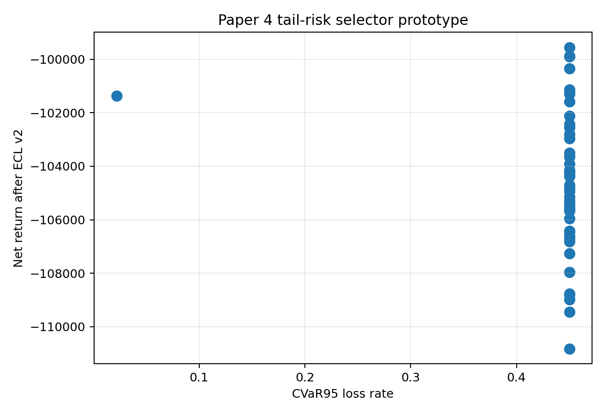
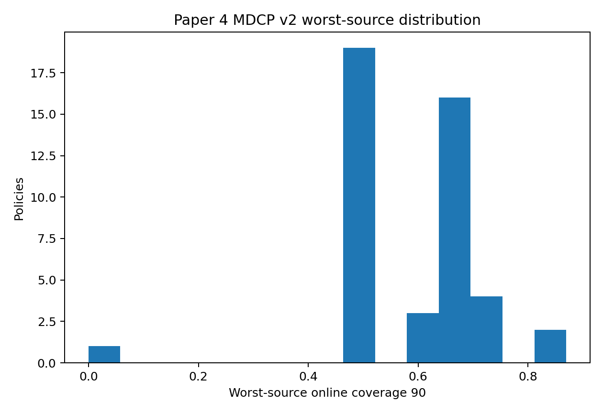

```{python}
#| include: false

from __future__ import annotations

import sys
from pathlib import Path

import pandas as pd

ROOT = Path.cwd().resolve()
while ROOT != ROOT.parent and not (ROOT / "reports").exists():
    ROOT = ROOT.parent
sys.path.insert(0, str(ROOT))

TABLE_DIR = ROOT / "reports" / "paper_material" / "paper4" / "tables"

def _csv(name: str) -> pd.DataFrame:
    path = TABLE_DIR / name
    return pd.read_csv(path) if path.exists() else pd.DataFrame()

def _cols(df: pd.DataFrame, columns: list[str]) -> pd.DataFrame:
    return df[[col for col in columns if col in df.columns]] if not df.empty else df

tail = _csv("paper4_tail_risk_selector_results.csv")
grid = _csv("paper4_oce_cvar_constraint_grid.csv")
definitions = _csv("paper4_mdcp_source_definitions.csv")
mdcp_eval = _csv("paper4_mdcp_policy_eval_v2.csv")
mdcp_frontier = _csv("paper4_mdcp_worst_source_frontier.csv")
overlap = _csv("paper4_overlap_policy_funded_sets.csv")
cate_value = _csv("paper4_cate_exact_topk_value.csv")
```

## Pregunta {#sec-paper4-tail-mdcp-causal-question}

Esta página junta tres lanes que no deben quedarse como apéndices sueltos:

> ¿Qué pasa si miramos cola, peor source de cobertura y CATE bajo gates
> explícitos, sin forzar todavía un claim final?

La respuesta v2 es: ya se pueden medir, pero cada uno conserva caveats fuertes.

## Tail Risk Selector

```{python}
#| label: tbl-paper4-tail-selector-v2
#| tbl-cap: "Selector de cola v2"

_cols(
    tail,
    [
        "policy_id",
        "net_return_after_ecl_v2",
        "cvar_95_loss_rate_v2",
        "entropic_oce_theta5_v2",
        "tail_selector_rank",
    ],
).head(15)
```

```{python}
#| label: tbl-paper4-oce-cvar-grid
#| tbl-cap: "Grid de restricciones CVaR/OCE"

grid if not grid.empty else grid
```

{#fig-paper4-tail-risk-v2 fig-alt="Scatter plot of CVaR95 loss rate on the x-axis and net return after ECL v2 on the y-axis."}

## MDCP Formal v2

```{python}
#| label: tbl-paper4-mdcp-definitions-v2
#| tbl-cap: "Definiciones source para MDCP v2"

definitions if not definitions.empty else definitions
```

```{python}
#| label: tbl-paper4-mdcp-frontier-v2
#| tbl-cap: "Worst-source coverage frontier"

mdcp_frontier.head(20) if not mdcp_frontier.empty else mdcp_frontier
```

{#fig-paper4-mdcp-worst-source-v2 fig-alt="Scatter plot of worst source coverage by policy and source family."}

## Causal Gate v2

```{python}
#| label: tbl-paper4-cate-overlap-v2
#| tbl-cap: "Overlap diagnóstico para funded sets exact-limited"

overlap if not overlap.empty else overlap
```

```{python}
#| label: tbl-paper4-cate-value-v2
#| tbl-cap: "CATE value diagnóstico sobre top-k exact-limited"

cate_value if not cate_value.empty else cate_value
```

La nota de causalidad vive en
`reports/paper_material/paper4/notes/paper4_causal_v2_gate.md`. La decisión
sigue siendo conservadora: CATE puede informar hipótesis y sensibilidad, pero
no debe entrar al objetivo del solver sin identificación defendible.

## Interpretación

Los tres lanes cumplen funciones distintas:

| Lane | Rol actual | Qué falta |
|---|---|---|
| OCE/CVaR | penalizar o filtrar cola de pérdida | CVaR LP o objective integrado |
| MDCP | medir peor source de cobertura | sources más defendibles y garantías formales |
| CATE | gate causal y value toy | treatment/outcome, overlap, sensibilidad e identificación |

## Caveats

El selector de cola todavía elige entre policies existentes; no optimiza
directamente una cartera con restricción CVaR. MDCP usa sources construidos
desde grade, periodo, grade-period y score-decile. CATE conserva intervalos que
cruzan cero para gran parte de los funded sets; por eso no hay claim causal.

## Next Step

La ruta más viable es secuencial:

1. integrar CVaR como constraint real en un LP pequeño;
2. repetir MDCP con funded sets exactos completos;
3. diseñar un experimento causal antes de usar CATE como señal de decisión.
