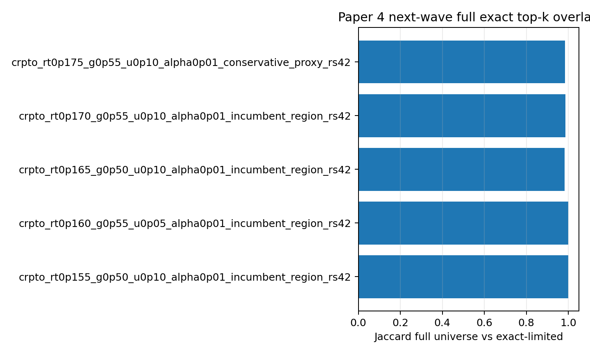

```{python}
#| include: false

from __future__ import annotations

import json
import sys
from pathlib import Path

import pandas as pd

ROOT = Path.cwd().resolve()
while ROOT != ROOT.parent and not (ROOT / "reports").exists():
    ROOT = ROOT.parent
sys.path.insert(0, str(ROOT))

TABLE_DIR = ROOT / "reports" / "paper_material" / "paper4" / "tables"
STATUS_DIR = ROOT / "reports" / "paper_material" / "paper4" / "status"

def _csv(name: str) -> pd.DataFrame:
    path = TABLE_DIR / name
    return pd.read_csv(path) if path.exists() else pd.DataFrame()

def _json(name: str) -> dict:
    path = STATUS_DIR / name
    return json.loads(path.read_text(encoding="utf-8")) if path.exists() else {}

def _cols(df: pd.DataFrame, columns: list[str]) -> pd.DataFrame:
    return df[[col for col in columns if col in df.columns]] if not df.empty else df

status = _json("paper4_full_universe_exact_topk_status.json")
full_eval = _csv("paper4_full_universe_topk_policy_eval.csv")
comparison = _csv("paper4_full_universe_vs_exact_limited_comparison.csv")
ifrs9 = _csv("paper4_full_universe_ifrs9_tail_eval.csv")
```

## Pregunta {#sec-paper4-next-wave-exact-question}

El mayor caveat técnico del Paper 4 era que los challengers no tenían funded
sets exactos sobre el universo completo. El v2 resolvía cada policy dentro de
un subset de 3,000 loans. Esta página ejecuta el salto clave:

> ¿Los top candidates siguen siendo estables cuando el LP se resuelve sobre los
> 276,869 préstamos OOT completos?

La respuesta empírica es sí para este top-k: los cinco challengers resolvieron
óptimo con HiGHS y la comparación contra exact-limited quedó prácticamente
idéntica.

::: {.callout-important}
## Sigue sin promoción

Este resultado elimina un caveat importante, pero no crea
`paper4_final_promotion.json`. El CRPTO/Paper_CRPTO externo sigue protegido; Paper 4 solo
gana evidencia exacta para experimentar.
:::

## Contrato

```{python}
#| label: tbl-paper4-full-exact-status
#| tbl-cap: "Status full-universe exact top-k"

pd.DataFrame(
    [
        {"field": key, "value": str(value)}
        for key, value in status.items()
        if key not in {"policy_ids"}
    ]
)
```

## Resultado Exacto

```{python}
#| label: tbl-paper4-full-exact-policy-eval
#| tbl-cap: "Full-universe exact top-k policy evaluation"

_cols(
    full_eval,
    [
        "policy_id",
        "candidate_pool_n",
        "solver_status",
        "full_n_funded",
        "full_funded_exposure",
        "full_realized_return",
        "full_weighted_pd_high",
        "full_coverage_alpha01",
    ],
)
```

```{python}
#| label: tbl-paper4-full-vs-limited
#| tbl-cap: "Full universe vs exact-limited"

_cols(
    comparison,
    [
        "policy_id",
        "full_universe_n",
        "exact_limited_n",
        "overlap_n",
        "jaccard_full_vs_exact_limited",
        "return_delta_full_minus_limited",
    ],
)
```

{#fig-paper4-full-exact-overlap fig-alt="Horizontal bar chart of Jaccard overlap between full-universe exact allocations and exact-limited allocations for top-k policies."}

## IFRS9/Tail Sobre Funded Sets Exactos

```{python}
#| label: tbl-paper4-full-exact-ifrs9
#| tbl-cap: "IFRS9/tail exact-funded next wave"

_cols(
    ifrs9,
    [
        "policy_id",
        "scenario",
        "sicr_rule",
        "realized_return_proxy_lgd45",
        "ecl_next_wave",
        "stage2_lifetime_share",
        "stage3_observed_share",
        "cvar_95_pd_lgd",
        "net_return_after_ecl_next_wave",
    ],
).head(18)
```

## Interpretación

El resultado más importante no es que un challenger gane. Es que el subset de
3,000 loans era suficiente para reproducir casi todo el funded set exacto del
full universe en este top-k. Para algunos candidates el Jaccard es 1; para otros
queda alrededor de 0.98. Esto convierte la evidencia v2 en algo mucho más
confiable: ya no era solo una reconstrucción proxy, sino una aproximación que
podemos auditar contra el solve completo.

Aun así, IFRS9 sigue mostrando una tensión dura. Bajo reglas SICR conservadoras,
el net return after ECL puede volverse negativo. Esa no es una falla del solve;
es una señal de que la parte prudencial domina cuando Stage 2 lifetime se activa
masivamente.

## Next Step

El siguiente avance no es otro top-k exacto por sí solo. Es usar estos funded
sets exactos para recalibrar selector, tail risk, MDCP, fairness y causal gates
sin depender de proxies.
