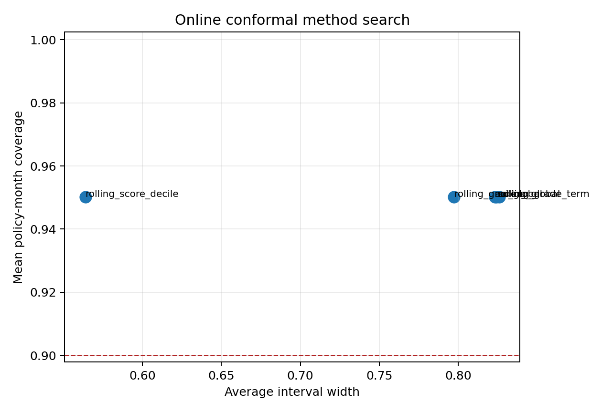
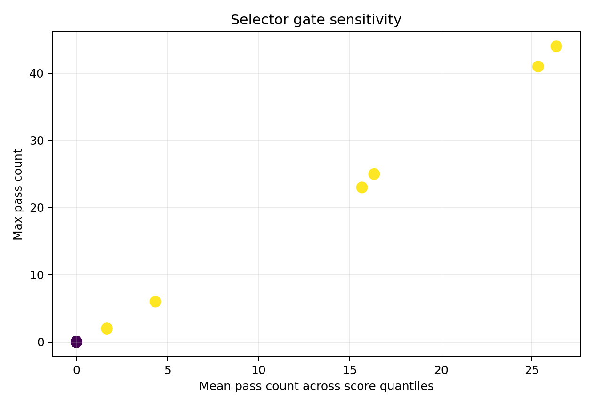

```{python}
#| include: false

from __future__ import annotations

import sys
from pathlib import Path

import pandas as pd

ROOT = Path.cwd().resolve()
while ROOT != ROOT.parent and not (ROOT / "reports").exists():
    ROOT = ROOT.parent
sys.path.insert(0, str(ROOT))

TABLE_DIR = ROOT / "reports" / "paper_material" / "paper4" / "tables"

def _csv(name: str) -> pd.DataFrame:
    path = TABLE_DIR / name
    return pd.read_csv(path) if path.exists() else pd.DataFrame()

def _cols(df: pd.DataFrame, columns: list[str]) -> pd.DataFrame:
    return df[[col for col in columns if col in df.columns]] if not df.empty else df

online = _csv("paper4_online_conformal_method_search.csv")
gates = _csv("paper4_selector_gate_sensitivity_summary.csv")
tail = _csv("paper4_tail_penalty_lp_search.csv")
```

## Pregunta {#sec-paper4-next-wave-method-searches-question}

Después del full exact top-k, Paper 4 puede abrir búsquedas sin cambiar el
champion:

> ¿Qué métodos merecen salir del carril research y cuáles siguen bloqueados por
> cobertura, gates o costo económico?

Esta página junta tres búsquedas: online conformal, sensibilidad de gates del
selector y LP con penalización de cola.

## Online Conformal Search

```{python}
#| label: tbl-paper4-online-method-search
#| tbl-cap: "Búsqueda online conformal next wave"

online if not online.empty else online
```

{#fig-paper4-online-method-search fig-alt="Scatter plot of average interval width versus mean policy-month coverage for rolling global, grade, grade-term, score-decile and ACI global methods."}

El método `rolling_score_decile` queda como el mejor candidato práctico porque
mantiene la misma cobertura media con menor ancho promedio. Pero ningún método
pasa promoción: el peor policy-month sigue cerca de 0.67, demasiado bajo para
claim online fuerte.

## Selector Gate Search

```{python}
#| label: tbl-paper4-selector-gate-search
#| tbl-cap: "Sensibilidad de gates selector v2"

gates.head(20) if not gates.empty else gates
```

{#fig-paper4-selector-gate-search fig-alt="Scatter plot of mean pass count versus max pass count across selector gate thresholds, colored by number of distinct top policies."}

La lectura es clara: con fairness gap `0.20` o `0.25`, el selector bloquea todo.
Con `0.30` o `0.35`, aparecen candidates. Eso no significa que debamos relajar
la regla; significa que el threshold debe justificarse como comité, stress o
proxy-governance.

## Tail Penalty LP Search

```{python}
#| label: tbl-paper4-tail-penalty-lp
#| tbl-cap: "LP candidate-pool con penalización tail"

_cols(
    tail,
    [
        "tail_lp_policy_id",
        "risk_tolerance",
        "tail_penalty",
        "candidate_pool_n",
        "solver_status",
        "n_funded",
        "realized_return_proxy_lgd45",
        "mean_stress_loss_rate",
        "cvar_95_stress_loss_rate",
        "oce_theta5",
    ],
)
```

El LP de cola todavía es un prototype: usa un candidate pool de 20k y penaliza
PD-high × LGD en el objetivo. Aun así, ya muestra el tradeoff esperado: penalizar
fuerte la cola reduce stress loss, pero también reduce retorno realizado.

## Next Step

La ruta de implementación seria queda así:

1. online CP: convertir `rolling_score_decile` en challenger contra ACI/UP-OCP;
2. selector: definir thresholds como decisión de comité, no como tuning libre;
3. tail: reemplazar penalización simple por CVaR LP con escenarios y variables
   auxiliares.
