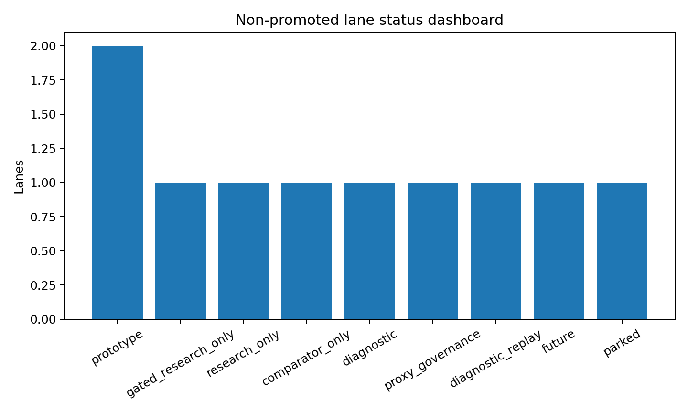

```{python}
#| include: false

from __future__ import annotations

import sys
from pathlib import Path

import pandas as pd

ROOT = Path.cwd().resolve()
while ROOT != ROOT.parent and not (ROOT / "reports").exists():
    ROOT = ROOT.parent
sys.path.insert(0, str(ROOT))

TABLE_DIR = ROOT / "reports" / "paper_material" / "paper4" / "tables"

def _csv(name: str) -> pd.DataFrame:
    path = TABLE_DIR / name
    return pd.read_csv(path) if path.exists() else pd.DataFrame()

def _cols(df: pd.DataFrame, columns: list[str]) -> pd.DataFrame:
    return df[[col for col in columns if col in df.columns]] if not df.empty else df

causal = _csv("paper4_causal_treatment_identification_grid.csv")
balance = _csv("paper4_causal_balance_diagnostics.csv")
mdcp = _csv("paper4_mdcp_source_family_search.csv")
fairness = _csv("paper4_fairness_proxy_governance_grid.csv")
dashboard = _csv("paper4_nonpromoted_lane_dashboard.csv")
```

## Pregunta {#sec-paper4-nonpromoted-causal-question}

El usuario pidió explícitamente qué lanes como CATE ameritan búsqueda para salir
de research. Esta página ejecuta esa idea:

> ¿Qué tendría que pasar para que CATE, MDCP, fairness formal, CQR, TS o CVaR
> salgan del carril research-only?

La respuesta es desigual. Algunos lanes ya tienen señal; CATE sigue gated.

## Causal Identification Search

```{python}
#| label: tbl-paper4-causal-identification-search
#| tbl-cap: "Búsqueda de tratamientos causales candidatos"

causal if not causal.empty else causal
```

```{python}
#| label: tbl-paper4-causal-balance
#| tbl-cap: "Balance diagnóstico por tratamiento"

balance.head(20) if not balance.empty else balance
```

El único tratamiento que pasa a dossier es `high_rate_within_grade`: tiene
prevalencia razonable, support por grade-period completo y max SMD moderado. No
queda promovido porque pricing/tightness sigue siendo confounded. Pero sí merece
un dossier causal más serio que `selected_by_full_topk`, que claramente no es
un tratamiento causal defendible.

::: {.callout-warning}
## CATE sigue gated

Este resultado no promueve CATE al objetivo `C_t`. Solo identifica una ruta más
defendible para reabrir el carril causal: pricing/tightness dentro de grade.
:::

## MDCP Source Family Search

```{python}
#| label: tbl-paper4-mdcp-source-family-search
#| tbl-cap: "MDCP source-family search"

mdcp.head(24) if not mdcp.empty else mdcp
```

En esta búsqueda, las sources grade, period y grade-period se comportan mejor
que en el v2 proxy. Eso se debe a que ahora se evalúa sobre funded sets exactos
del top-k y con online method search como referencia. Sigue siendo MDCP proxy:
source-family search no es prueba formal MDCP.

## Fairness Proxy Governance

```{python}
#| label: tbl-paper4-fairness-proxy-governance
#| tbl-cap: "Fairness proxy governance grid"

fairness.head(24) if not fairness.empty else fairness
```

La lectura es honesta: por grade varios challengers pasan gap `0.25`, pero el
champion no; por period la mayoría falla. Eso no debe traducirse en fairness
legal. Sí debe traducirse en governance: cualquier claim de composición funded
tiene que declarar source, threshold y caveat.

## Dashboard De Carriles No Promovidos

```{python}
#| label: tbl-paper4-nonpromoted-dashboard
#| tbl-cap: "Carriles no promovidos y condición para salir de research"

dashboard if not dashboard.empty else dashboard
```

{#fig-paper4-nonpromoted-lane-status fig-alt="Bar chart counting non-promoted lanes by current status, including gated research, prototype, research-only, comparator-only and parked."}

## Next Step

La búsqueda que más amerita continuar es causal `high_rate_within_grade`:
definir estimand, confounders, sensibilidad y policy value. La segunda es MDCP
formal con sources defendibles. CATE completo sigue detrás de esos gates.
