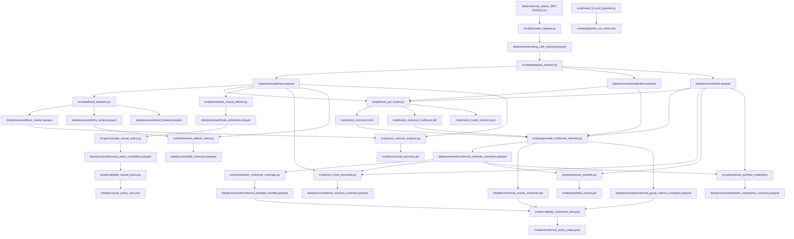
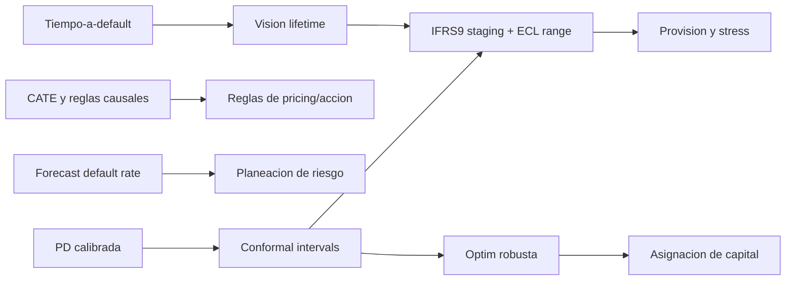

# Informe Integral del Proyecto de Riesgo de Credito (Lending Club)
Fecha: 2026-02-09
Autor del estado: Auditoria tecnica de cierre

---

## ADENDA DE ALINEACION (2026-02-15)

Este informe conserva su valor historico, pero varios puntos de "stubs/deferred" quedaron desactualizados respecto al codigo actual del repositorio.

Actualizacion de estado:
- `api/` ya tiene endpoints funcionales (predict, conformal, ecl, query, summaries, health).
- `streamlit_app/` ya tiene dashboard multipagina implementado y en uso.
- Test suite actual: `76` pruebas (no `5`).
- `docker-compose.yml` y Dockerfiles ya existen y ejecutan stack de showcase.

Decision arquitectonica vigente:
- Modo **Streamlit-first Thesis Mode**.
- DuckDB como motor local de analitica.
- dbt como capa de gobernanza/documentacion/linaje.
- Feast como capa de feature store para narrativa de consistencia train/serve.
- FastAPI y MCP quedan como servicios opcionales de soporte.

Referencias actualizadas:
- `SESSION_STATE.md` (fuente principal de estado)
- `README.md` (setup + estrategia de serving)

---

## 0) Resumen ejecutivo

Este proyecto implementa un pipeline end-to-end de riesgo de credito con enfoque de decision bajo incertidumbre:

`Datos -> Feature Engineering -> PD -> Calibracion -> Conformal -> IFRS9 -> Causal -> Optimizacion`

Estado actual (verificado en artefactos):
- Notebooks `01` a `09`: ejecutados al 100% y sin errores.
- Pipeline orquestado: todos los pasos en `ok` (`models/pipeline_run_status.pkl`).
- PD final (OOT): AUC `0.7187`, KS `0.3221`, Brier `0.1537`, ECE `0.0128`.
- Conformal Mondrian: cobertura 90 `0.9197`, cobertura 95 `0.9608`, ancho medio 90 `0.7593`.
- Politica conformal: `7/7` checks aprobados, `0` alertas.
- Causal policy seleccionada: `high_plus_medium_positive`, net value `5.857M`, bootstrap p05 `5.800M`.
- IFRS9 sensibilidad: ECL baseline `795.9M`, severe `1.358B`, uplift `+70.65%`.
- Optimizacion robusta: ya no colapsa en riesgo estricto (ej. tolerancia `0.06` financia `14` casos, no cero).

Lectura de negocio:
- El proyecto ya produce decisiones trazables y auditables bajo incertidumbre.
- El mayor trade-off economico se concentra en el costo de robustez.
- La calidad de calibracion PD y la eficiencia de intervalos conformal dominan casi todo el valor downstream (IFRS9 y optimizacion).

---

## 1) Objetivo, alcance y tesis

### 1.1 Objetivo central
Construir un stack de decision de riesgo de credito que no dependa solo de predicciones puntuales, sino que incorpore:
1. Probabilidades calibradas (PD confiable)
2. Incertidumbre con garantias de cobertura finita (Conformal)
3. Decisiones de negocio bajo restricciones (Optimizacion robusta)

### 1.2 Alcance implementado
- Modelado PD, calibracion, intervalos conformal.
- Forecasting de tasas de default.
- Analisis survival para tiempo-a-default.
- Analisis causal para reglas de accion.
- IFRS9 scenario/sensitivity con trazabilidad de insumos.
- Optimizacion de portafolio robusta y analisis de costo de robustez.

### 1.3 Fuera de alcance por ahora
- Capa de entrega productiva final (API/Streamlit completos, Docker, CI/CD, observabilidad productiva).

---

## 2) Diagnostico de consistencia del proyecto

### 2.1 Integridad de notebooks
Estado real (artefacto `reports/project_audit_snapshot.json`):

| Notebook | Ejecutadas | Celdas de codigo | Errores |
|---|---:|---:|---:|
| `notebooks/01_eda_lending_club.ipynb` | 27 | 27 | 0 |
| `notebooks/02_feature_engineering.ipynb` | 21 | 21 | 0 |
| `notebooks/03_pd_modeling.ipynb` | 25 | 25 | 0 |
| `notebooks/04_conformal_prediction.ipynb` | 15 | 15 | 0 |
| `notebooks/05_time_series_forecasting.ipynb` | 23 | 23 | 0 |
| `notebooks/06_survival_analysis.ipynb` | 21 | 21 | 0 |
| `notebooks/07_causal_inference.ipynb` | 15 | 15 | 0 |
| `notebooks/08_portfolio_optimization.ipynb` | 13 | 13 | 0 |
| `notebooks/09_end_to_end_pipeline.ipynb` | 12 | 12 | 0 |

### 2.2 Integridad de scripts y salidas
Scripts criticos existen y generan artefactos consistentes en `data/processed` y `models`.

Scripts core:
- `scripts/train_pd_model.py`
- `scripts/generate_conformal_intervals.py`
- `scripts/backtest_conformal_coverage.py`
- `scripts/validate_conformal_policy.py`
- `scripts/estimate_causal_effects.py`
- `scripts/simulate_causal_policy.py`
- `scripts/validate_causal_policy.py`
- `scripts/run_ifrs9_sensitivity.py`
- `scripts/optimize_portfolio.py`
- `scripts/optimize_portfolio_tradeoff.py`
- `scripts/end_to_end_pipeline.py`

### 2.3 Pruebas
`pytest -q` actual:
- `5 passed`, `1 warning` deprecacion de import en pandera.

### 2.4 Historial de checkpoints
Existe trazabilidad historica de construccion y fixes en `checkpoints/`:
- `SESSION_CHECKPOINT_PHASE0.md`
- `SESSION_CHECKPOINT_NB01_NB02.md`
- `SESSION_CHECKPOINT_NB01_NB03.md`
- `SESSION_CHECKPOINT_NB03_FIXED.md`

---

## 3) Diagrama completo del proyecto

### 3.1 Diagrama funcional (macro)

### 3.2 Diagrama de dependencia de decision

---

## 4) Datos y calidad de insumos

### 4.1 Volumetria y split temporal
- Train: `1,346,311` (default `18.52%`)
- Calibration: `237,584` (default `22.20%`)
- Test OOT: `276,869` (default `21.98%`)

Temporalidad:
- Train max `2017-03-01`
- Calibration `2017-03-01` a `2017-12-01`
- Test min `2018-01-01`

Interpretacion:
- Split respeta no-fuga temporal.
- El incremento de default en calibration/test confirma drift y justifica validacion OOT.

### 4.2 Hallazgos EDA relevantes para negocio
Del notebook `01`:
- Default por grade escalonado (A bajo, G muy alto).
- `int_rate` y calidad crediticia explican gran parte del riesgo.
- Cambios por vintage implican que una sola foto de performance no es suficiente.

Implica:
- No usar split aleatorio para aprobar modelos de riesgo.
- Monitorear estabilidad poblacional y recalibrar cuando cambie la mezcla.

---

## 5) Librerias usadas y justificacion tecnica

### 5.1 Stack principal usado en este proyecto

| Dominio | Librerias | Uso real en proyecto | Justificacion |
|---|---|---|---|
| Tabular ML | `catboost`, `scikit-learn`, `optuna` | PD model + calibracion + tuning | CatBoost maneja bien datos tabulares y categoricos; Optuna mejora hiperparametros; sklearn estandariza metricas/calibracion |
| Incertidumbre | `mapie` (split conformal), implementacion Mondrian propia en `src/models/conformal.py` | Intervalos PD con cobertura finita | Permite garantias de cobertura y decisiones robustas |
| Time series | `statsforecast`, `mlforecast`, `lightgbm`, `hierarchicalforecast` | Forecast de tasa de default con intervalos | Combina baselines estadisticos y ML para series cortas/medias |
| Survival | `lifelines`, `scikit-survival` | Cox + RSF para tiempo a default | Agrega dimension temporal de riesgo (no solo evento binario) |
| Causal | `econml`, `dowhy` | CATE y validacion causal para politica | Evita decisiones basadas en correlacion sesgada |
| Optimizacion | `pyomo`, `highspy`, `cvxpy` (soporte) | LP/MILP robusto bajo restricciones PD | Traduce modelos en decisiones de asignacion de capital |
| Validacion datos | `pandera` | Esquemas de frontera | Mitiga errores silenciosos en contratos de datos |
| Plataforma | `fastapi`, `streamlit` | Capa delivery funcional (modo thesis/showcase) | Habilita storytelling, consultas y demostracion de resultados |

### 5.2 Comentario practico para negocio
En palabras simples:
- `CatBoost + calibracion` dice que tan riesgoso es un credito en probabilidades confiables.
- `Conformal` dice cuanta incertidumbre tenemos en esa probabilidad.
- `Pyomo/HiGHS` usa ese riesgo + incertidumbre para decidir donde poner capital.

---

## 6) Analisis detallado por notebook (metodo, resultado, insight, aporte)

## Notebook 01 - EDA (`notebooks/01_eda_lending_club.ipynb`)

Que hace:
- Explora distribuciones, target, segmentacion por grade/term/purpose y dinamica temporal.

Resultados clave:
- Default global de entrenamiento cercano a `18.5%`.
- Gradiente de riesgo muy fuerte por grade.
- No estacionariedad temporal y potenciales variables post-origination que deben excluirse para evitar leakage.

Insight de negocio:
- Riesgo de credito aqui no es "ruido"; hay estructura economica clara.
- Si cambian ciclos o mezcla de originacion, el score puede degradarse.

Aporte al pipeline:
- Define la regla metodologica mas importante del proyecto: validacion out-of-time.

---

## Notebook 02 - Feature Engineering (`notebooks/02_feature_engineering.ipynb`)

Que hace:
- Construye ratios financieros, buckets, interacciones y codificacion WOE.

Resultados clave:
- Se consolidan features con alta interpretabilidad economica.
- Se generan datasets canonicos `train_fe`, `calibration_fe`, `test_fe`.

Insight de negocio:
- Variables de capacidad de pago y apalancamiento mejoran separacion de riesgo de forma interpretable.

Aporte al pipeline:
- Establece contrato de entrada para modelado PD y resto de modulos.

---

## Notebook 03 - PD Modeling (`notebooks/03_pd_modeling.ipynb`)

Que hace:
- Compara baseline logit vs CatBoost, calibra probabilidades y evalua metricas OOT.

Resultados clave (OOT final):
- AUC `0.7187`
- Gini `0.4373`
- KS `0.3221`
- Brier `0.1537`
- ECE `0.0128`

Insight de negocio:
- El salto mayor no fue solo en ranking, fue en confiabilidad de probabilidad (ECE).
- Probabilidad mal calibrada rompe pricing, limites y provisiones.

Aporte al pipeline:
- Entrega la variable base de todo: PD calibrada.

---

## Notebook 04 - Conformal Prediction (`notebooks/04_conformal_prediction.ipynb`)

Que hace:
- Convierte PD puntual en intervalos con garantias de cobertura (global + Mondrian por grupo).

Resultados clave actuales (Mondrian):
- Cobertura 90: `0.9197`
- Cobertura 95: `0.9608`
- Ancho medio 90: `0.7593`
- Min cobertura por grupo (90): `0.8916`

Cobertura 90 por grade (ejemplos):
- A `0.8926`
- B `0.9239`
- C `0.9351`
- G `0.8916`

Insight de negocio:
- Si el intervalo es demasiado ancho, la politica robusta puede volverse excesivamente conservadora.
- Si es demasiado estrecho, se subestima riesgo de cola.

Aporte al pipeline:
- Provee el set de incertidumbre usado por IFRS9 y optimizacion robusta.

---

## Notebook 05 - Time Series Forecasting (`notebooks/05_time_series_forecasting.ipynb`)

Que hace:
- Forecast de default rate mensual con modelos estadisticos y ML, con bandas.

Resultados observados:
- Se generan pronosticos multi-modelo (`AutoARIMA`, `AutoETS`, `AutoTheta`, `SeasonalNaive`, `lgbm`) en `data/processed/ts_forecasts.parquet`.
- Backtesting temporal (`data/processed/ts_cv_stats.parquet`) para validacion historica.

Insight de negocio:
- No planificar provisiones/capital con un unico punto; usar bandas por escenario.

Aporte al pipeline:
- Complementa la vista micro (loan-level PD) con una vista macro (ciclo de default).

---

## Notebook 06 - Survival Analysis (`notebooks/06_survival_analysis.ipynb`)

Que hace:
- Modela tiempo al default con Cox y Random Survival Forest.

Resultados clave (`models/survival_summary.pkl`):
- Cox concordance: `0.6769`
- RSF c-index test: `0.6838`
- Event rate: `0.1852`
- Mediana tiempo default: `17` meses

Insight de negocio:
- No basta con saber "si" cae en default; importa "cuando".
- Timing impacta valor presente de perdidas y estrategia de cobranza.

Aporte al pipeline:
- Refuerza interpretacion lifetime para contexto IFRS9.

---

## Notebook 07 - Causal Inference (`notebooks/07_causal_inference.ipynb`)

Que hace:
- Estima efectos causales (no solo correlaciones) para decisiones de politica.

Resultados clave:
- CATE medio (`models/causal_summary.pkl`): `0.009718`.
- En salida del notebook, efecto naive de tasa > efecto causal ajustado (sesgo por confounding).
- Politica final validada por script:
  - regla `high_plus_medium_positive`
  - action rate `26.30%`
  - total net `5.857M`
  - bootstrap p05 `5.800M`

Insight de negocio:
- "Clientes verificados tienen mas default" puede ser sesgo de seleccion, no causalidad real.
- La regla causal evita descuentos donde no agregan valor economico.

Aporte al pipeline:
- Pasa de analitica descriptiva a una politica accionable con validacion economica.

---

## Notebook 08 - Portfolio Optimization (`notebooks/08_portfolio_optimization.ipynb`)

Que hace:
- Convierte prediccion + incertidumbre en asignacion de capital con restricciones.

Resultados de notebook (escenario de 50M y muestra 5k):
- Robust LP: retorno neto ~`145,946`, financiados `184`, PD cartera `3.15%`.
- Non-robust LP: retorno neto ~`1,206,224`, financiados `1,981`, PD cartera `10.00%`.

Resultados de frontera robusta por script (config 1M):
- Tolerancia 0.06: robust `7,197`, costo robustez `87.98%`.
- Tolerancia 0.12: robust `50,402`, costo robustez `31.45%`.

Insight de negocio:
- El "price of robustness" no es teorico: es una perdida de retorno observable por proteger downside.

Aporte al pipeline:
- Cierra el loop entre modelado y decision economica.

---

## Notebook 09 - End-to-End Pipeline (`notebooks/09_end_to_end_pipeline.ipynb`)

Que hace:
- Integra score, incertidumbre, IFRS9 y optimizacion en una corrida unificada.

Resultados clave (`models/pipeline_results.pkl`):
- Batch: `10,000`
- PD mean: `0.2065`
- AUC batch: `0.7166`
- Stage mix: S1 `3605`, S2 `6395`, S3 `0`
- ECL esperado: `15.47M`
- ECL conservador: `53.15M`
- Robust return: `270,522`
- Non-robust return: `2,997,699`
- Price of robustness: `2,727,177`

Insight de negocio:
- La decision final depende mas de dos variables de calidad: calibracion PD + ancho conformal.

Aporte al pipeline:
- Prueba de integracion integral para gobernanza y auditoria.

---

## 7) Analisis detallado por scripts y outputs

### 7.1 Conformal governance
Scripts:
- `scripts/generate_conformal_intervals.py`
- `scripts/backtest_conformal_coverage.py`
- `scripts/validate_conformal_policy.py`

Outputs principales:
- `data/processed/conformal_intervals_mondrian.parquet`
- `data/processed/conformal_backtest_monthly.parquet`
- `models/conformal_policy_status.json`

Resultado:
- Coberturas cumplen politica y no hay alertas activas.
- Min mensual cobertura 90 en backtest: `0.9076`.

### 7.2 Causal policy industrializada
Scripts:
- `scripts/estimate_causal_effects.py`
- `scripts/simulate_causal_policy.py`
- `scripts/validate_causal_policy.py`

Outputs:
- `data/processed/cate_estimates.parquet`
- `data/processed/causal_policy_simulation.parquet`
- `models/causal_policy_rule.json`

Resultado:
- Regla seleccionada robusta bajo constraints de downside y action rate.

### 7.3 IFRS9 sensitivity con mejor trazabilidad de input
Script:
- `scripts/run_ifrs9_sensitivity.py`

Outputs:
- `data/processed/ifrs9_scenario_summary.parquet`
- `data/processed/ifrs9_input_quality.parquet`
- `models/ifrs9_sensitivity_summary.pkl`

Resultado:
- Fuerte sensibilidad de ECL a stress macro y calidad PD/DPD.

### 7.4 Optimizacion robusta y frontera economica
Scripts:
- `scripts/optimize_portfolio.py`
- `scripts/optimize_portfolio_tradeoff.py`

Outputs:
- `models/portfolio_results.pkl`
- `data/processed/portfolio_robustness_summary.parquet`

Resultado:
- Se estabiliza viabilidad en riesgo estricto via piso de despliegue + slack penalizado.

---

## 8) Integracion de insights entre modulos

### 8.1 Relacion PD calibrada -> Conformal -> IFRS9
- Si PD esta mal calibrada, se distorsiona Stage migration y ECL.
- Si intervalos son anchos, ECL conservador sube de forma fuerte.

### 8.2 Relacion Conformal -> Optimizacion
- Intervalos eficientes permiten robustez usable.
- Intervalos sobredimensionados reducen despliegue y retorno.

### 8.3 Relacion Causal -> Politica comercial
- La capa causal no reemplaza el score PD; lo complementa para decidir "intervenciones" (pricing, verificaciones, etc.).

### 8.4 Relacion Forecast + Survival -> Gobernanza de horizonte
- Forecast mensual y survival aportan perspectiva de ciclo y timing.
- Esto completa la foto que PD puntual no captura sola.

---

## 9) Contexto de negocio y regulacion (IFRS9, Basilea)

## 9.1 IFRS9 (vista practica)
En IFRS9, la institucion debe medir perdida esperada con horizonte y deterioro de riesgo:
- Stage 1: perdida esperada 12 meses.
- Stage 2: deterioro significativo (SICR), perdida esperada lifetime.
- Stage 3: activo con deterioro crediticio.

En este proyecto:
- `assign_stage` usa PD origination vs current, DPD y senal de incertidumbre.
- `compute_ecl` y `ecl_with_conformal_range` generan punto y rango conservador.

Interpretacion:
- El rango conformal no reemplaza politica contable, pero mejora planeacion de provision bajo incertidumbre model risk.

## 9.2 Basilea (vista de uso)
Basilea exige marcos robustos de medicion de riesgo, validacion y gobernanza de modelos.

En este proyecto, hay alineacion conceptual en:
- Separacion train/calibration/test OOT.
- Backtesting y alertas para cobertura.
- Trazabilidad de artefactos y contratos de features.
- Medicion explicita del costo de robustez.

Importante:
- Este repositorio es un entorno de investigacion aplicada; no sustituye un marco regulatorio completo de una entidad supervisada.

---

## 10) Hallazgos en lenguaje no tecnico

Si lo explicamos como conversacion con negocio:

1. "El modelo ya no solo da un numero, ahora dice tambien que tan incierto es ese numero."
2. "Con esa incertidumbre podemos decidir con mas prudencia cuanta plata arriesgar."
3. "Ser mas prudente cuesta retorno, y ese costo ya esta cuantificado."
4. "Tambien probamos reglas de accion comercial que si generan valor neto, no solo correlacion aparente."
5. "En escenarios de estres, la provision puede subir fuerte; ahora ese rango ya esta medido."

---

## 11) Riesgos, limites y deuda tecnica

### 11.1 Lo que ya esta controlado
- Drift temporal: mitigado por OOT split.
- Gobernanza conformal: politica formal + backtesting + alertas.
- Consistencia de features: contrato canonico PD.

### 11.2 Lo que aun falta
1. Cobertura de pruebas de capa visual/serving aun mejorable:
- Suite actual ya cubre features, modelos, evaluacion, optimizacion e integracion.
- Faltan smoke tests especificos para Streamlit y validaciones de UX narrativa.

2. Delivery layer funcional, pendiente hardening:
- `api/main.py` expone endpoints reales sobre artefactos.
- `streamlit_app/pages/*.py` implementa dashboard multipagina.
- Falta madurar observabilidad y automatizacion CI/CD.

3. Politica de slack robusto:
- Existe mecanica tecnica (`pd_cap_slack`), falta politica de gobernanza formal por negocio/riesgo.

4. Monitoreo causal out-of-time:
- Regla causal valida in-sample/simulacion; falta validacion por vintages futuros.

---

## 12) Propuestas de mejora (priorizadas)

## 12.1 Prioridad alta (antes de capa de entrega)
1. Definir politica de riesgo para slack robusto
- Por que: evita arbitrariedad en trade-off retorno vs limite de riesgo.
- Entregable: limites de slack permitidos por nivel de tolerancia.

2. Expandir testing de scripts de negocio
- Por que: hoy no hay red de seguridad suficiente para regresiones economicas.
- Entregable: tests de regresion para `conformal`, `ifrs9`, `portfolio`, `causal policy`.

3. Monitoreo periodico de regla causal
- Por que: transportabilidad causal cambia con regime shifts.
- Entregable: tablero mensual por vintage/grade con alarmas de degradacion.

## 12.2 Prioridad media
4. Integrar score contract checks en pre-run de cada script
- Por que: prevenir mismatch de features antes de ejecucion costosa.

5. Fortalecer explainability de decisiones de optimizacion
- Por que: comites de riesgo y auditoria requieren racional de por que se financia/no financia.

## 12.3 Prioridad diferida (MLOps, segun plan del equipo)
6. Capa productiva (FastAPI/Streamlit/Docker/CI/CD/monitoring)
- Esta prioridad queda explicitamente para la siguiente etapa.

---

## 13) Plan detallado de siguientes pasos (sin MLOps)

## Paso 1 - Politica formal de robustez y slack
Objetivo:
- Definir umbrales aprobables de `pd_cap_slack` por tolerancia de riesgo.

Justificacion:
- Hoy hay solucion tecnica; falta criterio de gobierno para uso en decisiones reales.

Salida esperada:
- Documento de politica + validacion automatica en script.

## Paso 2 - Suite de pruebas de regresion economica
Objetivo:
- Agregar pruebas para invariantes de negocio:
  - cobertura minima conformal
  - no-regresion de policy checks
  - no-colapso de despliegue robusto
  - consistencia de ECL en escenarios

Justificacion:
- Evita romper decisiones economicas al tocar codigo.

Salida esperada:
- Tests ejecutables en CI local.

## Paso 3 - Backtesting causal por ventana temporal
Objetivo:
- Medir estabilidad de la regla causal por mes/vintage/grade.

Justificacion:
- La validez causal puede decaer en el tiempo.

Salida esperada:
- Artefacto de monitoreo y umbrales de alarma.

## Paso 4 - Consolidar scorecards de gobernanza
Objetivo:
- Unificar scorecard mensual: PD, conformal, causal, IFRS9, optimization.

Justificacion:
- Facilita comite de riesgo y auditoria.

Salida esperada:
- Reporte mensual estandarizado en `reports/`.

Justificacion global del plan:
- Maximiza control de riesgo de modelo y calidad de decision antes de escalar a produccion.
- Reduce riesgo operacional y riesgo reputacional al moverse hacia capa de entrega.

---

## 14) Estado de capa de entrega (diagnostico)

- `api/main.py`: endpoints activos para predict, conformal, ecl y analytics.
- `streamlit_app/app.py`: app multipagina activa para storytelling tecnico/negocio.
- `streamlit_app/pages/*.py`: vistas implementadas con artefactos reales.

Conclusion:
- La capa de serving ya conecta con pipeline y artefactos.
- La prioridad pasa de "implementacion base" a "narrativa avanzada + hardening ligero".

---

## 15) Conclusiones finales de cierre

1. El proyecto ya esta conectado end-to-end en la capa analitica y de decision.
2. Hay coherencia entre notebooks, scripts, artefactos y estado documentado.
3. El principal valor tecnico es haber pasado de "prediccion puntual" a "decision gobernada por incertidumbre".
4. El principal valor de negocio es cuantificar explicitamente el costo de robustez y la sensibilidad de provisiones.
5. El siguiente salto natural es hardening de gobernanza y pruebas antes de productivizar la capa de entrega.

---

## 16) Referencias externas consultadas (documentacion oficial)

Nota: se priorizaron fuentes primarias/oficiales para librerias y regulacion.

ML y calibracion:
- CatBoost docs: https://catboost.ai/docs
- scikit-learn calibration module: https://scikit-learn.org/stable/modules/calibration.html
- scikit-learn FrozenEstimator (prefit calibration path): https://scikit-learn.org/stable/modules/generated/sklearn.frozen.FrozenEstimator.html
- Optuna docs: https://optuna.readthedocs.io/en/stable/

Conformal prediction:
- MAPIE docs: https://mapie.readthedocs.io/en/stable/
- MAPIE SplitConformalRegressor API: https://mapie.readthedocs.io/en/stable/generated/mapie.regression.SplitConformalRegressor.html

Time series:
- StatsForecast docs: https://nixtlaverse.nixtla.io/statsforecast/
- MLForecast docs: https://nixtlaverse.nixtla.io/mlforecast/
- HierarchicalForecast docs: https://nixtlaverse.nixtla.io/hierarchicalforecast/

Survival:
- lifelines docs: https://lifelines.readthedocs.io/en/latest/
- scikit-survival docs: https://scikit-survival.readthedocs.io/

Causal:
- EconML docs (CausalForestDML): https://www.pywhy.org/EconML/
- DoWhy docs: https://www.pywhy.org/dowhy/

Optimizacion:
- Pyomo docs: https://www.pyomo.org/documentation
- HiGHS docs: https://highs.dev/
- CVXPY docs: https://www.cvxpy.org/

Data quality / pipelines / delivery:
- Pandera docs: https://pandera.readthedocs.io/
- DVC docs: https://dvc.org/doc
- MLflow docs: https://mlflow.org/docs/latest/index.html
- FastAPI docs: https://fastapi.tiangolo.com/
- Streamlit docs: https://docs.streamlit.io/

Riesgo financiero y regulacion:
- IFRS Foundation - IFRS 9 implementation resources: https://www.ifrs.org/news-and-events/news/2014/07/ifrs-9-implementation/
- IFRS Foundation - Classification and measurement project page: https://www.ifrs.org/projects/completed-projects/2014/ifrs-9-classification-and-measurement/
- BIS - Basel III finalising post-crisis reforms (2017 package): https://www.bis.org/bcbs/publ/d424.htm
- BIS - Basel Framework portal: https://www.bis.org/basel_framework/
- EBA - Guidelines on PD/LGD estimation and defaulted exposures: https://www.eba.europa.eu/activities/single-rulebook/regulatory-activities/model-validation/guidelines-pd-estimation-lgd

---

## 17) Archivos de referencia internos para este informe

- `SESSION_STATE.md`
- `PROJECT_JUSTIFICATION.md`
- `reports/project_audit_snapshot.json`
- `models/conformal_policy_status.json`
- `models/causal_policy_rule.json`
- `models/pipeline_results.pkl`
- `data/processed/ifrs9_scenario_summary.parquet`
- `data/processed/portfolio_robustness_summary.parquet`

Este documento fue alineado con estado real de artefactos y ejecuciones en workspace a fecha 2026-02-09.
